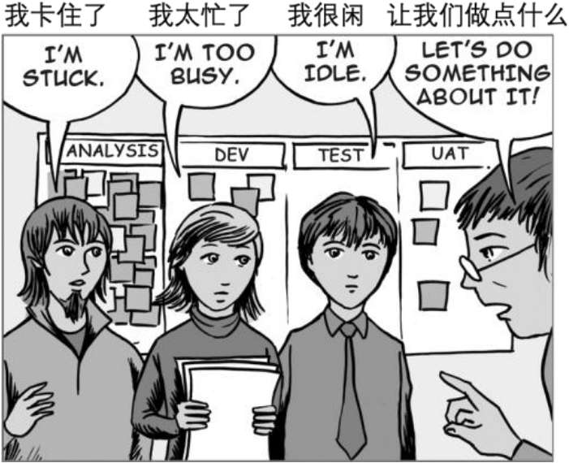
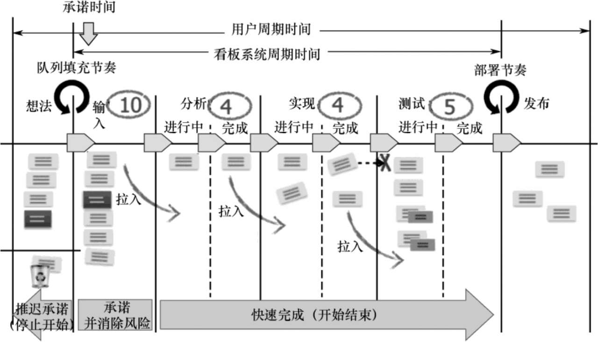
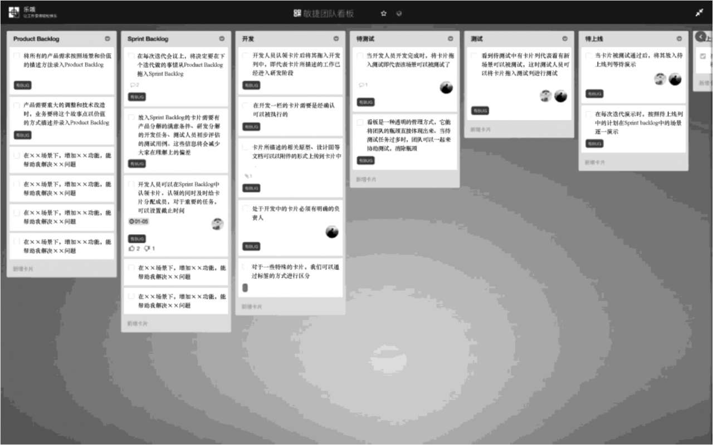
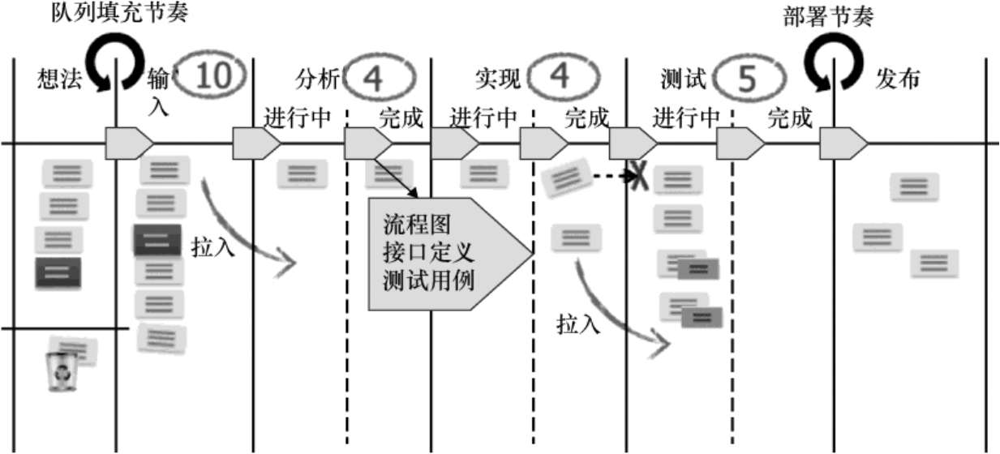
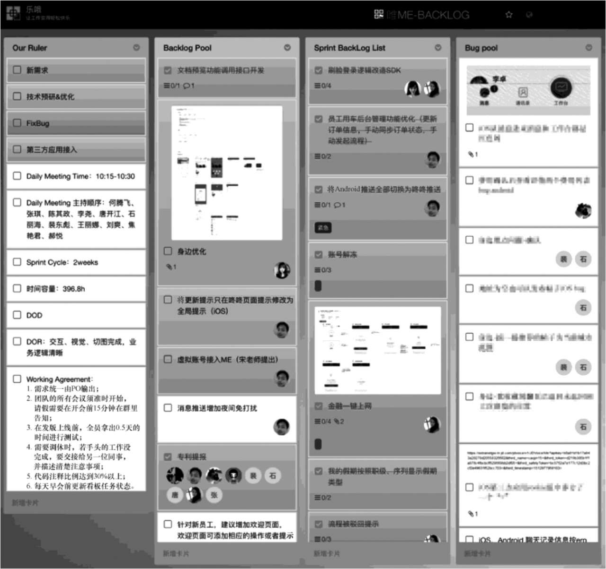
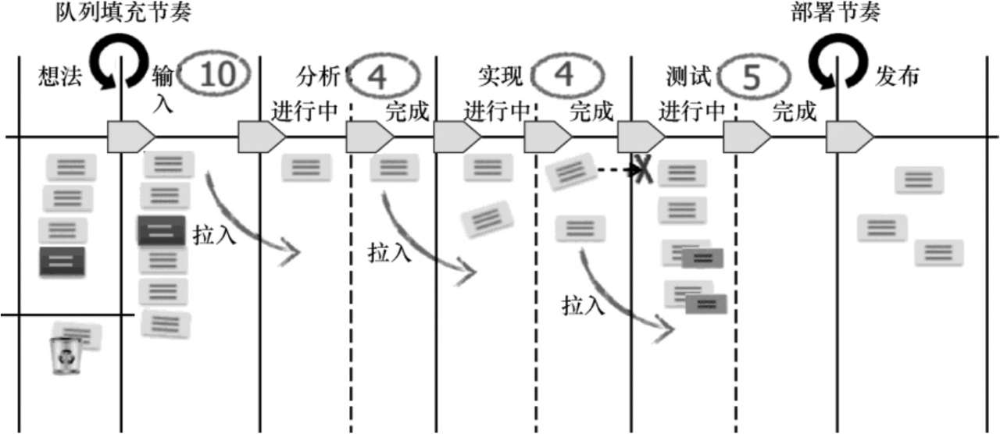
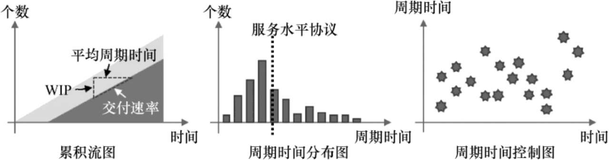
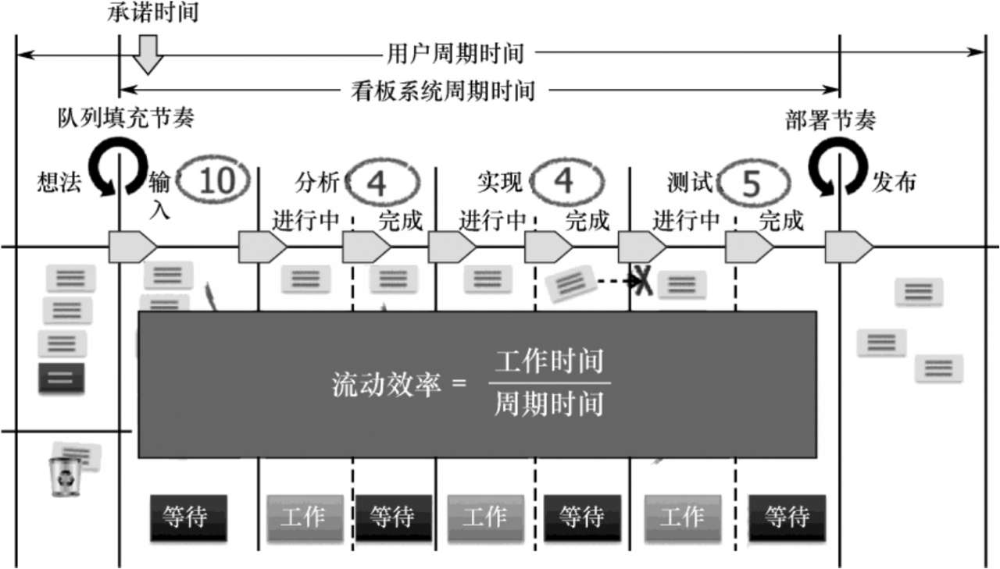

## Kanban（看板）

看板（Kanban）有以下两个含义：

（1）信号卡—Kanban一词来自日文，出自丰田生产系统（Toyota Production System，TPS），也就是后来的精益生产（Lean Production），本意是信号卡片。在一个生产线上，当下游工序需要上游工序生产的工件的时候，下游工序凭借信号卡片向上游领取需要数量和种类的工件。通过“看板”这个信号卡片向上游传递信息流，拉动了从上游向下游的物料流，最终交付用户的价值，而拉动生产的源头是用户的需求，这就形成了拉动式生产系统。

（2）可视化的板（Kanban Board）—本质上是一个板子，通常是白板或者物理墙面，也称作看板墙，将任何需要关注的重要信息可视化出来，如价值观、规章制度、团队成员画像、项目计划、开发流程、工作项状态、软件架构、业务流程图等。

借用丰田生产系统的看板和拉动系统的概念，看板方法将其应用在软件开发中，定义了一个增量和渐进的改变技术开发和组织运营的方法。它的核心机制是限制在制品数量的拉动系统，通过它暴露系统运作或流程中的问题，并激发协作以改进系统。看板方法激发协作改进系统如图：

看板的设计是跟团队的协作流程息息相关的。通常，一个典型的产品研发团队看板如下图所示，将一切可视化，同时对在做的事项数量加以限制。

## 看板方法六项基本原则

（1）从现有工作方式开始（Understand）—看板方法比较容易启动的就是这一点，在任何实质的变革之前，首先从既有的流程开始，通过将隐藏在大脑中的流程可视化出来，再在协作中发现问题，也就是变革的契机。同时，尊重现有的角色、职责和头衔，对事不对人，尊重团队可以聚焦问题解决和价值交付。

（2）对追求渐进式变革达成共识（Agreement）—为了降低变革带来的阻力，设定变革是渐进式的，统一利益相关者的认知和目标，同意持续、迭代、渐进、增量的变化，形成变革的动力，促进变革的发生。

（3）鼓励各层级的领导力（Leadership）—没有特定的领导者，鼓励团队自我管理，每个人积极、主动关心改善，通过发挥个体领导力，代替指定的负责人在各层面自动自发、主动出现改进推动者。同时，领导者必须以身作则，并创造容忍失败的实验文化。

（4）聚焦客户（Value）—理解客户是谁，他们要求我们提供什么，以及他们对服务水平的期望。以客户为中心，满足他们的需求和期望，为客户创造价值。

（5）管理工作，让人们围绕它自组织（Flow）—围绕价值的流动，将无形的工作进行可视化管理，专注于客户，而不是管理可见的人和时间，知识工作者可以自我组织更高效地完成工作。

（6）演进规则改进客户和业务成果（Improve）—流程可以简化为这样一种概念，即它们只是一套规则。规则决定了服务交付系统的特征。演进规则以提高客户满意度和业务成果。

### 看板方法六大实践

（1）可视化工作和流程—采用价值流图（ValueStream Mapping，VSM）的流程活动图（Process Activity Mapping），识别团队现有流程。确定看板的范围，例如，从想法创意开始到上线结束，在看板墙上从左到右可视化工作的流程步骤及状态、工作项类型及其负责人、优先级、开始日期、结束日期、障碍、服务类别、工作项卡片颜色等信息。

（2）显示化规则—将整个流程流转的规则显示化出来，如不同的服务类型、加速泳道、拉动的标准、完成的定义、队列填充的节奏、部署的节奏、不同角色或者不同团队协作的机制、流程的每个步骤的输入和输出规则、在制品限制（圈中数字）等。

（3）限制在制品/进行中的工作（Work InProgress，WIP）—根据利特尔法则，平均等待时间=WIP÷交付速率，为了减少等待时间，需要设置在制品限制。在流程中的每个步骤，设定团队最多可以并行处理的工作项的数量，这样限制在制品将把存在的问题暴露出来。通过暴露问题并解决流动中的瓶颈（如工作项移动缓慢、某列中有很多报事贴、阻塞或等待较长时间等），同时也可以避免超载的发生，保证团队的专注，聚焦在价值从左边到右边的快速流动。看板中每列使用数字限制在制品如下图。

（4）度量和管理流动—采用累积流图（Cumulative Flow Diagram，CFD）、周期时间分布图（Lead Time Distribution Chart）、周期时间控制图/散点图（Lead Time Control Chart）等工具来度量看板系统的数据，通过统计工作项的平均周期时间、交付速率（WIP÷平均周期时间）、吞吐量（完成条目的数量），以及流动效率（增值工作时间÷周期时间）来帮助管理看板系统的流动性。累积流图、周期时间分布图及周期时间控制图如图。

（5）建立反馈环—持续改进需要实现反馈闭环，来理解实际和期望的差距。反馈环实践包含：  
①每日站立会议—每天对产品/服务进展反馈。  
②服务交付评审—每2周对产品/服务、工作方式进行反馈。  
③运营回顾—每个月/季度的运营反馈，如客户满意度调查、产品最新进展、工具、环境、组织结构、度量数据等。  
④及时会议—对工作方式反馈，看板系统能力的回顾和评估。

（6）在协作和试验中持续演进（引入模型和科学方法）—有了反馈之后，经过分析，制订改进试验，落地具体的改进行动，再持续这个循环，来持续演进工作方式。通过引入约束理论（移除瓶颈）、精益思想（消除浪费、加速价值流动）、戴明博士的统计过程控制（Statistical ProcessControl，SPC）（降低变异性）等模型及科学方法（假说—试验—结论），可以更系统性、更高效地演进工作方式。