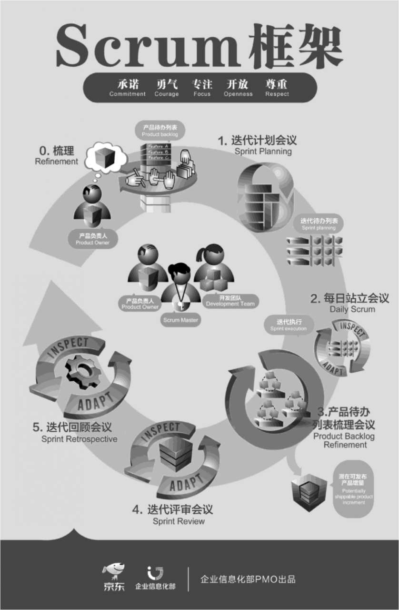
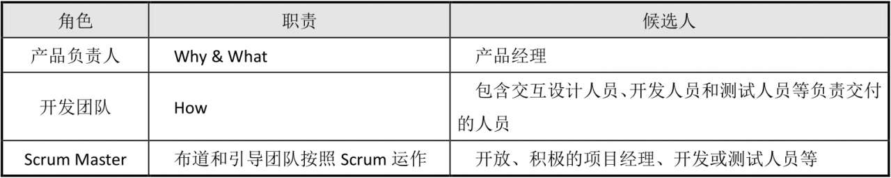
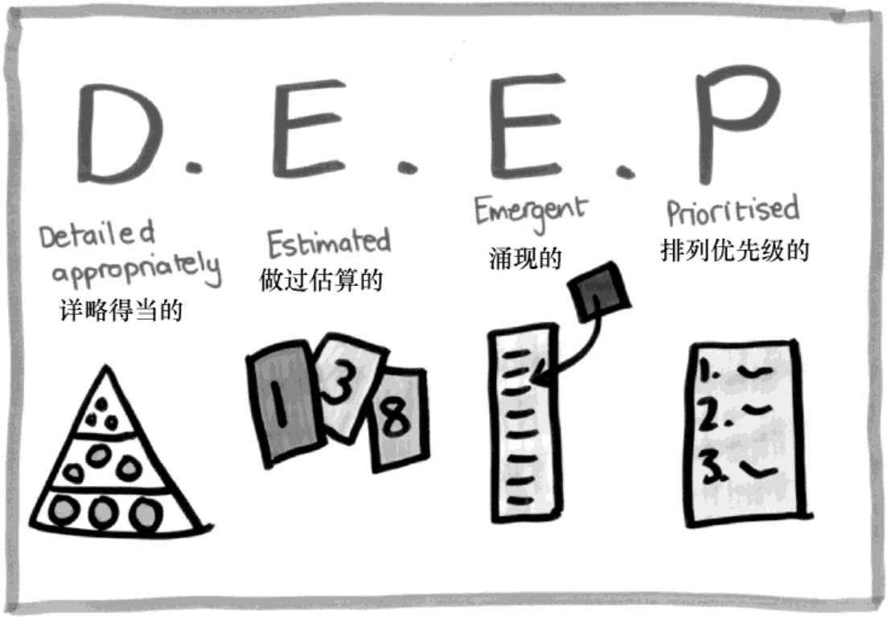
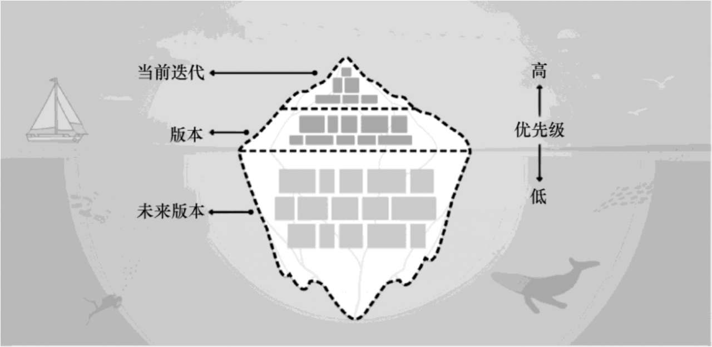
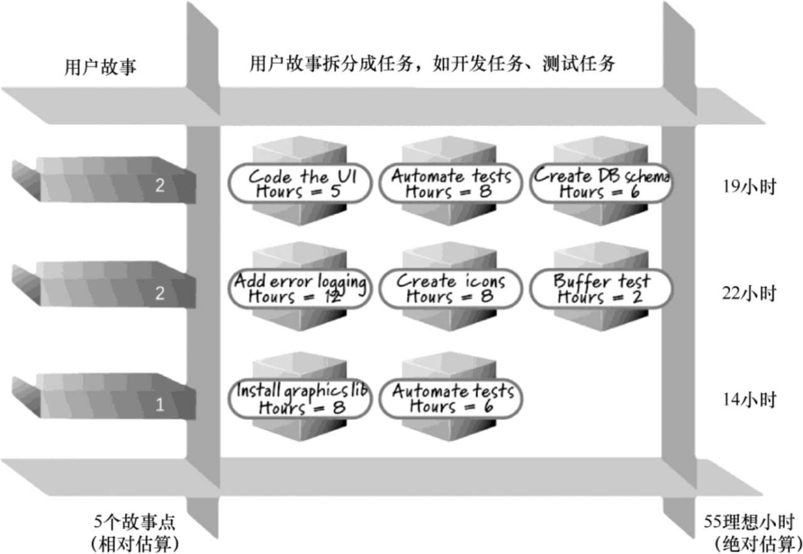
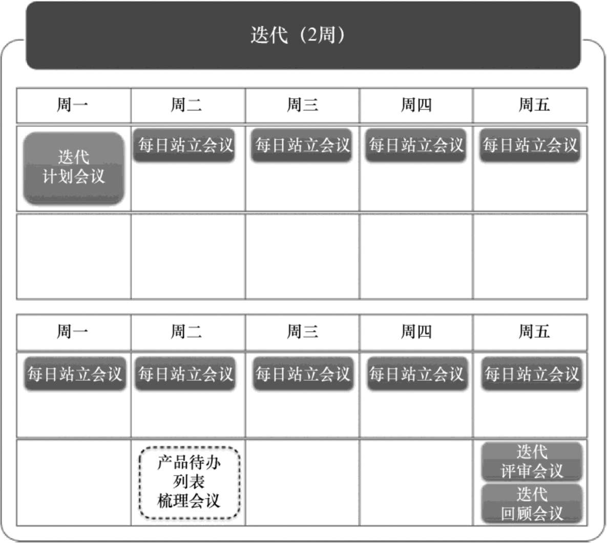
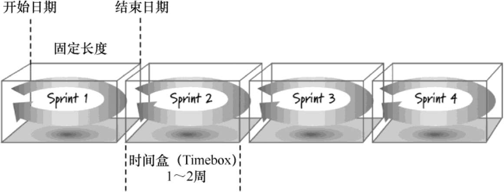
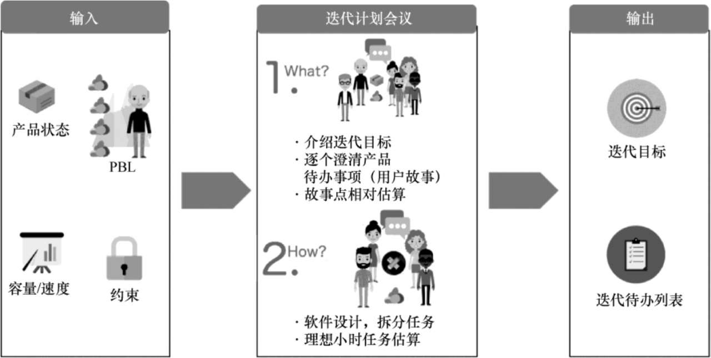
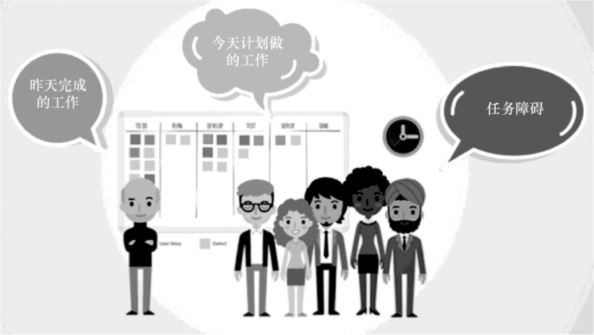
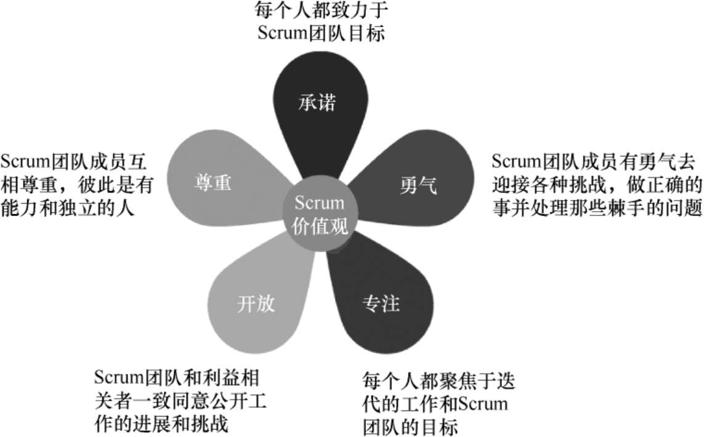

## Scrum

Scrum一词来源于英式橄榄球，是争球的一种方式，Scrum框架借用这个词比喻产品开发团队是一个整体协作的团队，共同进行冲刺，达成团队目标。

Scrum框架包含:

* 3个角色:
    * 产品负责人（Product Owner，PO)
    * 开发团队（DevelopmentTeam）
    * Scrum Master

* 3个工件（Artifact，或交付物）
    - 产品待办列表（Product Backlog，PBL）
    - 迭代待办列表（Sprint Backlog，SBL）
    - 潜在可发布产品增量（PotentialShippable Product Increment，PSPI）
    
* 5个事件（Event，或活动）
    - 迭代（在Scrum中称为Sprint，冲刺）
    - 迭代计划会议（Sprint Planning）
    - 每日站立会议（Daily Scrum）
    - 迭代评审会议（Sprint Review）
    - 迭代回顾会议（SprintRetrospective）

* 5个价值观         
    - 承诺
    - 勇气
    - 专注
    - 开放
    - 尊重

 在日常实践中，为了帮助团队梳理产品待办列表，为下一个迭代做好准备，通常会在迭代过程中加入一个会议，即产品待办列表梳理会议（Product Backlog Refinement）   

### Scrum的3个角色

Scrum团队由产品负责人、开发团队和ScrumMaster组成。Scrum团队是面对面同地办公、跨职能的自组织团队。自组织团队自己选择如何以最好的方式完成工作，而不是由团队之外的人来指导。跨职能团队拥有完成工作所需的全部职能、技能，不需要依赖团队之外的人。

产品负责人负责最大化产品价值和投资回报率（Return On Investment，ROI），具有产品的决策权。从为什么开始，建立产品愿景和路线图，是产品待办列表的唯一负责人，持续增加、删除、修改或细化产品待办事项，并根据业务、用户反馈，为最好地实现业务目标，将产品待办列表排定优先顺序。决定版本发布日期和内容，接受或退回工作成果。回答产品的“为什么（Why）”和“是什么（What）”问题，确保做出正确的产品。

开发团队负责在每个迭代结束时交付潜在可发布并且真正“完成”的产品增量（经过测试的、可运行的代码）。开发团队由5～9人组成，他们是面对面同地办公的，同时是全职的、自组织的，成员是跨职能的，包括具备交付产品所需的各种技能（如视觉交互设计技能、前端技能、后端技能、测试技能等）的专业人士。他们决定工作量、迭代的容量及迭代交付的产品增量，同时持续自我改进，回答产品“如何开发和构建（How）”问题，确保正确、高效地交付产品。

Scrum Master负责将所有相关角色的思维方式顺利转变成敏捷思维，并确保按照Scrum框架顺利运作。Scrum Master是一个服务型领导（ServantLeader），为团队提供培训、辅导、引导、教练等服务并以此来布道，并保护团队迭代过程不受干扰从而专注迭代交付目标，帮助团队暴露、移除障碍和浪费，引导团队形成迭代回顾的习惯，推动团队持续改进。

### Scrum的3个工件

为了使Scrum团队有效进行迭代，需要提前准备好迭代的输入，以利于在迭代开始前决定即将进行的迭代内容，最后在迭代结束的时候交付计划的内容（潜在可发布的产品增量）。迭代前的输入是Scrum的第一个工件，即产品待办列表；迭代计划要开发的内容是Scrum的第二个工件，即迭代待办列表；迭代的产出效果是第三个工件，即产品增量（Increment）。

**1. 产品待办列表**

产品待办列表动态包含符合产品愿景的各种功能和对用户有价值的其他工作（如探索、基础设施、架构、重构、缺陷等）。开发团队要完成的任何工作都会体现在产品待办列表中，并由产品负责人全权负责。这些工作项/条目，称为产品待办事项（Product Backlog Item，PBI），通常PBI以用户视角，采用用户故事（User Story）格式进行描述。一个好的产品待办列表应符合DEEP原则，包括以下几点:

(1) 详略得当的（Detailed Appropriately）—将接下来在迭代中要完成的用户故事放在列表顶部，其工作量小（开发+测试少于1～2周），并且足够确定和详细。而不着急开发的、优先顺序次之的，也就是在未来的迭代中要完成的用户故事，其工作量较大，内容粗略，放在列表中下部。

(2) 做过估算的（Estimated）—产品待办列表不仅仅是一份工作列表，还是一个用于规划的列表，未来任何一个版本的条目都需要估算，这可以帮助产品负责人根据“ROI=价值/规模”进行排序。估算是粗粒度的，通常采用相对估算，单位是故事点（Story Point），对于排在列表顶部、优先级高的估算要比较准确，排在之后的不必过于精确，而排在未来版本之后，靠近列表下部的可能规模非常大，可以不必估算。

(3) 涌现的（Emergent）—产品待办列表不是静止的。随着对用户、问题、方案假设等的反馈和了解的深入，产品待办列表中的用户故事会增加、减少或重新调整优先级，产品本身也在持续打磨和演进。

(4) 排列优先级的（Prioritized）—产品待办列表应该按照条目的价值或者ROI，由上至下、从高到低排序。优先级不仅仅是“高、中、低”，而是在列表中一个挨着一个排成一列。团队应根据顺序依次进行开发，从而使正在开发的产品或系统尽早实现客户价值，以此最大化价值交付。

**2．迭代待办列表**

迭代待办列表是一组为当前迭代选出的产品待办事项/用户故事，同时加上交付产品增量和实现迭代目标的计划。其是团队如何完成迭代的预测，包括迭代目标、选择的用户故事，以及如何完成用户故事的任务（如开发前端任务、开发业务逻辑任务、设计和修改数据库任务、编写测试用例任务、执行测试任务等）。任务需要被估算成理想小时，最好为一天以内，通常为2～6小时。迭代待办列表使开发团队用来达成迭代目标的所有工作变得清晰可见。为了确保持续改进，一般至少包括一项在先前迭代回顾会议中确定下来的高优先级改进事项。

迭代待办列表存活于当前迭代中，是团队承诺要完成的。承诺的用户故事列表在迭代期间不可以更改，但从用户故事拆分而来的具体任务，则是不断涌现的，可以增减或者修改，该列表由开发团队全权负责。

**3. 产品增量**

产品增量是迭代完成的所有待办事项的总和，以及之前所有迭代所产生的增量的价值总和。在迭代的最后，新的增量必须是“完成”的，这意味着它必须可用并且达到了Scrum团队“完成”的定义的标准。

产品增量是迈向愿景或目标的一步，所以又被称为潜在可发布产品增量。潜在可发布是关于软件质量的陈述，而不是关于软件价值或可销售性的陈述。当产品可能要发布时，意味着一旦产品负责人根据业务需要进行业务决策后，决定将产品上线，那么这个增量就可以上线。

通常发布是和迭代解耦的，可以在迭代边界发布产品增量，也可以在迭代中间，产品负责人根据业务决策发布已经“完成”的部分迭代待办列表事项。

### Scrum的5个事件

Scrum使用固定的事件来产生规律性，将不可预测的、不确定的事件，变成规律性的、预定义好的事件，从而提高透明性、减少开销和提高效率。所有事件都是有时间盒限定的（Time-boxed），也就是说将每个事件限制在最长的时间范围内。时间到了，事件就结束。

Scrum的5个经典事件包含迭代、迭代计划会议、每日站立会议、迭代评审会议、迭代回顾会议。除此之外，如前文提到的，在实践落地过程中，还有一个产品待办事项列表梳理会议。各会议的时间以迭代日历的形式可视化，如图：

迭代除了本身作为一个事件，还是其他所有事件的容器。对于一个迭代时间盒，迭代执行前需要规划迭代要完成什么，即迭代计划会议；迭代执行过程中需要跟踪进度、处理风险以便检视和调整，即每日站立会议；迭代执行结束后需要对产品增量进行检视和调整，即迭代评审会议；对团队工作方式进行检视和调整，即迭代回顾会议。

**1. 迭代**

为了表达整个团队全力以赴完成有价值（Outcome）而不是有产出的（Output）的迭代目标，Scrum将迭代称为冲刺。迭代是Scrum的核心，其长度（持续时间）为1～3周，在这段时间内构建一个“完成”的、可用的和潜在可发布的产品增量。在前一个迭代结束后，下一个迭代紧接着立即开始。迭代时间盒如图:

团队在持续迭代开发产品时，不能一次迭代2周、一次迭代1周、一次迭代3周等，迭代的长度需要保持一致，这样才能保证迭代的步调和节奏，使团队的开发有可持续性，并且在做迭代计划时，可以参考过去的迭代速率。

在迭代期间，不能做出有害于迭代目标的改变，不能降低目标的质量；另外，随着掌握的信息量的增加，产品负责人与开发团队之间对迭代范围内要做的事可能会重新协商。

迭代目标是当前迭代通过实现产品待办列表要达到的目的。它为开发团队提供指引，使得团队明确为什么要构建产品增量。迭代目标在迭代计划会议中确定。开发团队必须在工作中时刻谨记迭代目标。为了达成迭代目标，需要实现相应的功能和实施所需的技术。如果所需工作和预期的不同，开发团队需要与产品负责人沟通协商产品待办列表的范围。

**2．迭代计划会议**

在迭代计划会议中，计划在迭代中要做的工作。这份工作计划是由整个Scrum团队共同协作完成的。迭代计划会议是限时的，一周迭代计划会议最多2小时，两周迭代计划会议最多4小时。ScrumMaster要确保会议顺利举行，并且每个参会者都理解会议的目的。Scrum Master要引导Scrum团队遵守时间盒的规则。

迭代计划会议回答以下问题：

（1）What——接下来的迭代交付的产品增量中要包含什么内容？

（2）How——要如何完成交付增量所需的工作？

所以，迭代计划会议按照这两个问题分成两部分，如图:

（1）迭代计划会议第一部分：这次迭代能做什么？

开发团队预测在这次迭代中要开发的功能。产品负责人讲解迭代目标，以及达成该目标所需完成的产品待办列表项。整个Scrum团队协同工作来理解迭代的工作。迭代计划会议的输入是产品待办列表、最新的产品增量、开发团队在这个迭代中时间容量的预测，以及开发团队的以往迭代速度。开发团队自己决定选择多少产品待办列表项。只有开发团队可以评估接下来的迭代可以完成多少工作。在迭代计划会议中，Scrum团队还草拟一个迭代目标。迭代目标是这个迭代通过实现产品待办列表项要达到的目的，同时它也为开发团队提供指引，使得开发团队明确开发产品增量的目的。开发团队在进行估算的时候，通常采用的是敏捷估算，它是一种相对估算方式，即故事点的方式。

（2）迭代计划会议第二部分：如何完成所选的工作？

在设定了迭代目标并选出这个迭代要完成的产品待办列表项之后，开发团队将决定如何在迭代中把这些功能构建成“完成”的产品增量。这个迭代中所选出的产品待办列表项，加上交付它们的计划，就形成了迭代计划之后的工件，即迭代待办列表。开发团队通常从产品设计开始，将用户故事分解成任务。任务有不同的大小，或者不同的预估工作量。开发团队在进行估算的时候，通常采用的是理想小时方式，即某个任务在不考虑打断、依赖、障碍的时候，全身心投入完成任务所需的小时数。

在迭代计划会议的最后，开发团队规划出在迭代内所要做的工作（通常以一天或更短时间为一个单位）。开发团队自组织地领取迭代待办列表中的任务，领取任务在迭代计划会议和迭代期间按需进行。

**3．每日站立会议**

每日站立会议增进交流沟通，发现开发过程中需要移除的障碍，凸显并促进快速地做决策，提高开发团队的认知程度。这是一个进行检视与适应的关键会议。

每日站立会议是开发团队的一个以15分钟为时间盒的事件。在每日站立会议上，开发团队为接下来的24小时的工作制订计划。通过检视上次每日站立会议以来的工作，预测即将到来的迭代工作来优化团队协作和效能。每日站立会议在同一时间、同一地点面对面举行，以便降低复杂性。每日站立会议如图：

开发团队通过每日站立会议来检视完成迭代目标的进度，并检视完成迭代待办列表的工作进度趋势。每日站立会议优化了开发团队达成迭代目标的可能性。每天，开发团队应该知道如何以自组织方式协同工作以达成迭代目标，并在迭代结束时开发出预期中的产品增量。

会议的结构由开发团队设定。如果会议专注于达成迭代目标的进展，开发团队可以采用不同的方式进行。有些开发团队会以问题为导向来开会，有些开发团队会基于更多的讨论来开会。以下为示例：  
（1）昨天，我为帮助开发团队达成迭代目标完成了什么？  
（2）今天，我为帮助开发团队达成迭代目标计划准备做什么？  
（3）是否有任何障碍在阻碍我或开发团队达成迭代目标？

开发团队或者开发团队成员通常会在每日站立会议后立即聚到一起进行更详细的讨论，或者为迭代中剩余的工作进行调整或重新计划。

**4．迭代评审会议**

迭代评审会议是一个不需要准备PPT、不需要花多少准备时间的非正式会议，它发生在迭代结束的时候，团队将集成过的、经过测试的产品增量在测试环境（甚至预生产/类生产环境）演示给产品负责人和业务方，用来检视所交付的产品增量，产品负责人接受或拒绝完成的成果，同时根据业务方和产品负责人对产品增量的反馈，按需调整产品待办列表。迭代评审会议如图:

即使每个用户故事已经在迭代期间被产品负责人验收过，或者部分用户故事在迭代期间已经上线，仍然需要举行迭代评审会议，不过目的已经转变成团队对产品增量的整体和系统性的认知和反馈，以及团队对迭代交付成果的庆祝。当然，从时间上来说，花费的时间可能大大缩短。

**5．迭代回顾会议**

迭代回顾会议是Scrum团队检视自身工作方式并创建下一个迭代改进行动计划的机会。迭代回顾会议发生在迭代评审会议结束之后、下个迭代计划会议之前。迭代回顾会议如图：

在迭代回顾会议中，Scrum团队对当前迭代的工作方式，包括敏捷实践、Scrum框架、团队的个体、人与人之间的关系、与其他团队的协作、过程、工具等，进行回顾，保持做得好的方式，停止或避免不好的方式，以及对需要改进提升的方面提出下一个迭代可落地的改进行动计划，作为改进故事放入产品待办列表。

Scrum团队能否真正敏捷起来，真正可以依赖的抓手就是迭代回顾会议。团队要确保此会议的持续发生，那么无论是Doing Agile还是Being Agile，团队都有机会通过自己践行Scrum的心得体会，持续改进。通常遵循先僵化（严格遵守Scrum框架及其他敏捷实践）、后优化（在基本框架范围内进行各种微调、组合和尝试）、再突破（融会贯通之后，形成适合团队自己的工作方式）的模式。

### Scrum的5个价值观

Scrum价值观如图:

当承诺、勇气、专注、开放和尊重五大价值观为Scrum团队所践行与内化时，Scrum透明（Transparency）、检查（Inspection）和调整（Adaptation）三大支柱成为现实，并且在每个人之间构建了信任。Scrum团队成员通过Scrum的角色、事件和工件来学习和探索这些价值观。

（1）承诺（Commitment）—团队在迭代开始的时候做出承诺，并在迭代期间尽全力履行承诺。一旦发现未预测到的障碍有可能影响目标的达成，团队需要立即公开透明上报升级问题。  

（2）勇气（Courage）—Scrum团队成员有勇气去迎接各种挑战，做正确的事并处理那些棘手的问题。 

（3）专注（Focus）—一段时间内只专注于少数几件事情。Stop Starting，Start Finishing（未开始的工作暂缓开始，已经开始的工作聚焦完成）。团队的能力（精力）是有限的，在有限能力和有限时间范围内，专注于最有价值的事情，以取得更好的成果，完成迭代工作，达成迭代目标。  

（4）开放（Openness）—在团队中公开工作的进展和挑战，即可视化、透明，这样可以很容易地暴露风险问题和障碍。另外，透明也是尊重、信任的基础。  

（5）尊重（Respect）—Scrum团队成员相互尊重，彼此是有能力和独立的人。他们是坐在一起的、长期稳定的，这有助于加深彼此的尊重和了解。