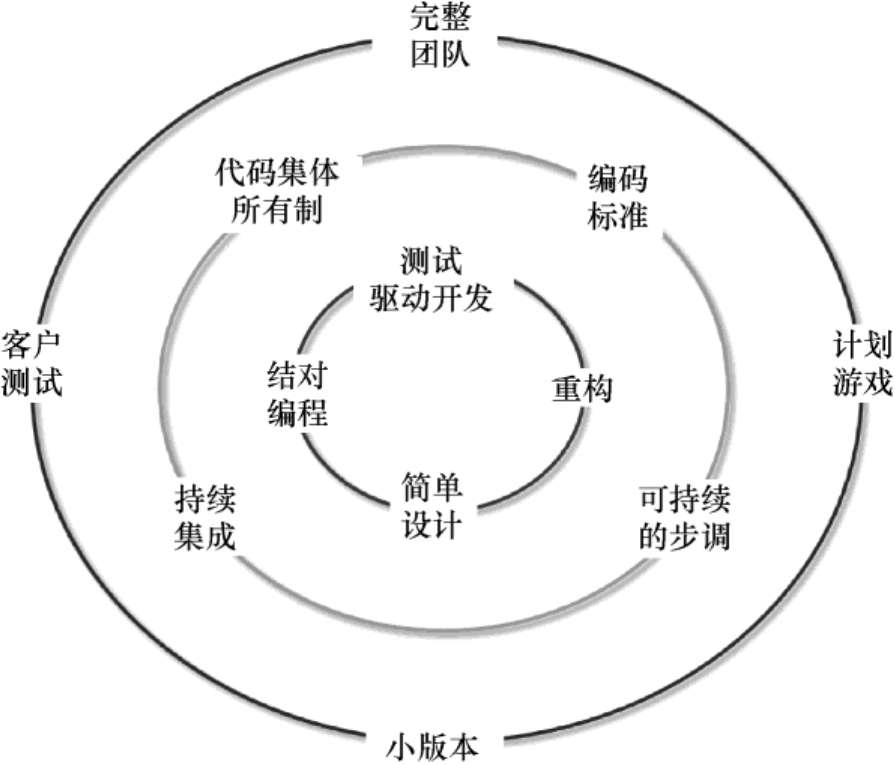

## XP

极限编程（Extreme Programming，XP）是一个敏捷软件开发框架，旨在开发更高质量的软件，专注编程技术、清晰沟通还有团队协作的实践。XP是关于软件开发工程实践的最具体的敏捷框架。XP中极限的含义是尽力而为，然后处理结果。它将常识性的原理和实践应用到了极致，如以下几点。

（1）如果代码评审是好的，那么我们会持续评审代码（结对编程）。  
（2）如果测试是好的，那么所有人都应该始终进行测试（单元测试），甚至包含客户验收测试。  
（3）如果设计是好的，那么我们将把它当作每个人的日常事务的一部分（重构）。  
（4）如果简单是好的，那么我们将始终把系统保持为支持其当前功能的最简单的设计（简单设计）。   
（5）如果集成测试重要，那么我们将在一天内多次集成并测试（持续集成）。  
（6）如果迭代周期短些好，那么我们将使迭代时间非常非常短—秒、小时，而不是周、月或年。

### XP价值观

（1）沟通（Communication）—软件开发本质上是一项团队运动，它依靠沟通将知识从一个团队成员转移到团队中的其他人。XP强调了恰当的沟通方式的重要性，例如，借助白板或其他绘图机制进行面对面的讨论。

（2）简单（Simplicity）—简单意味着“什么是最简单的工作？”这样做的目的是避免浪费，只做一些绝对必要的事情，例如，尽可能简化系统的设计，以便更容易维护、支持和修改。简单性也意味着只满足所了解的要求；不要试图预测未来。因为今天做得简单一些，明天在需要的时候再多花些时间改进，要比今天做得很复杂，但以后再也用不到好很多。

（3）反馈（Feedback）—通过不断反馈之前的工作，团队可以确定需要改进的领域并修改他们的实践。反馈也支持简单设计，团队会构建一些功能，收集有关的设计和实施的反馈，然后再调整产品。XP团队致力于在尽可能快的情况下，产生尽可能多的反馈。尽量将反馈的周期缩短为分钟或小时，而不是周或月。越早知道，就可以越早调整。

（4）勇气（Courage）—是面对恐惧时的有效行动。勇气表现为基于其他价值观的行动偏好，因此其结果对团队是无害的。例如，如果你知道问题是什么，那你就去做吧；需要有勇气提出降低团队效率的组织问题；需要有勇气停止做一些不起作用的事情，并尝试其他的做法。即使很难接受，你也需要有勇气接受反馈并采取行动。

（5）尊重（Respect）—团队成员需要相互尊重，以便彼此沟通、提供和接受反馈，并共同确定简单设计和解决方案。团队成员关心彼此、关心项目和产品，每个人对团队的贡献都应该得到尊重，每个人都是重要的。

### XP实践

XP实践包含三个闭环的圈，如下图所示，最里面的环围绕个人如何编码和设计；中间的环围绕作为团队如何协作编码和集成；最外围的环面对客户如何协作、计划和交付。

（1）完整团队（Whole Team）—XP团队是一个跨职能团队，拥有项目或产品成功所必需的各种技能和视角的人，包括现场客户（On-siteCustomer）或者真实用户（Real CustomerInvolvement）、开发人员和测试人员等。如果客户不能和团队天天工作在一起，那么需要客户定期参与计划会议，同时需要业务代表（BusinessRepresentative）来代表客户，也被称为产品经理（Product Manager），统称为客户（Customer）。客户负责提供和编写需求（用户故事）、排定需求优先级、调整需求范围等以此掌控产品方向。团队面对面地坐在一起办公（SitTogether）；为了促进透明的面对面沟通，会建立信息化工作空间（Informative Workspace），通常采用可视化或者信息雷达的方式将产品、架构、计划、进度等展示出来；团队每周工作40小时，充满活力地工作（Energized Work）。

（2）计划游戏（Planning Game）—XP团队按每周周期（Weekly Cycle）进行迭代计划会议（Iteration Planning），同时按照季度周期（Quarterly Cycle）进行发布计划会议（ReleasePlanning）。发布计划是当前对发布内容及日期的快照，当计划赶不上变化的时候，就更新这个计划，以便反映客户最新的期望。使用故事（Story）作为客户或用户可见、有意义的功能单元进行计划，故事也被称为用户故事（UserStory），这些故事旨在从用户视角简要描述用户希望能够使用产品及与产品交互的功能及目标，并在团队实现特定故事时，提醒团队进行更详细的对话。

（3）小版本（Small Releases）—每个版本都应尽可能小，包含最有价值的业务需求，并且通过增量部署（Incremental Deployment），甚至每日部署（Daily Deployment）来尽可能地频繁发布到终端用户手中，这意味着需要在每个迭代结束后交付给客户经过测试的、可以运行的软件，以便客户进行评估或者发布给用户。

（4）客户测试（Customer Tests）—作为呈现每个所需功能的一部分，XP客户针对每个用户故事定义了一个或多个验收测试（AcceptanceTest），以判断该功能是否能正常运行。团队构建这些验收测试用例的脚本，并使用它们向自己和客户证明该功能是否正确实现。自动化非常重要，因为在时间紧迫的情况下，会跳过手动测试。

（5）简单设计（Simple Design）—XP团队使他们的设计尽可能简单，仅仅关注本次迭代中要完成的用户故事，团队更愿意在迭代中不断地演进系统的设计，甚至每天都考虑系统设计来进行增量设计（Incremental Design），力求使得系统设计适应当天的系统需求。XP中的设计不是一次性的事情，也不是一个前瞻性的事情，它是一个永远持续的事情。同时，XP团队对他们根据未来需求调整设计的能力充满自信。良好的设计至关重要，这就是为什么在整个开发过程中如此关注设计。

（6）结对编程（Pair Programming）—所有的代码都是由两个程序员并排坐在一起，使用同一台机器、同一个键盘和同一个鼠标编写的。这种做法是确保使用键盘和鼠标的程序员思考编码的最佳途径，另一名程序员偏重于从战略性的角度思考并评审所有代码，从而实现更好的设计、更好的测试和更好的代码。结对的关系要经常变换，每天至少要改变一次，从而结对编程还可以极大促进知识在团队中的传播。

（7）测试驱动开发（Test DrivenDevelopment）—也叫作测试先行编程（Test-First Programming），在改变任何产品代码之前先编写一个自动化测试代码。极限编程痴迷于反馈，在软件开发中，良好的反馈需要良好的测试。首先编写一段单元测试代码，由于它要测试的产品功能代码还不存在，所以它会运行失败；然后编写产品功能代码使测试通过。

（8）重构（Refactoring）—就是在不改变代码外部行为的前提下，对其进行一系列小的改造，消除重复代码，保持代码的高内聚和低耦合，使得产品功能代码更简单，未来添加新的代码更简单，从而达到防止代码腐化、支持简单设计的目的。同时，应用测试驱动开发，确保每次产品功能代码的改动，其对应的单元测试脚本都得以通过，并且随着设计的发展，没有功能被破坏掉。

（9）持续集成（Continuous Integration）—团队的成员经常集成他们的工作，通常每个成员每天至少集成一次，这导致每天发生多次集成。每次集成都通过自动化的构建（包括测试）来验证，从而尽快地检测出集成错误。XP团队提倡一旦代码发生改变就签入单个代码库（Single CodeBase），也就是一个主干，并立刻触发自动化的测试，并应用十分钟构建（Ten-Minute Build），即在十分钟之内自动地构建整个系统和运行所有的测试。

（10）代码集体所有制（Collective Ownership）—团队中的任何人都可以随时改进系统的任何部分、任何代码。如果系统出了问题，修复它并没有超出我现在所做的范围，我应该继续修复它。这意味着所有代码都可以获得许多人的关注，从而提高代码质量并减少缺陷。这也意味着所有的代码都是共享的代码（Shared Code）。

（11）编码标准（Coding Standard）—XP团队遵循通用的编码标准，因此系统中的所有代码看起来都像由一个非常称职的人编写的。标准的细节并不重要，重要的是所有代码看起来都很熟悉，以支持代码集体所有制。

（12）可持续的步调（Sustainable Pace）—也称为团队可持续性（Team Continuity），团队长期、持久地参与产品开发中，能够以长期、可持续的速度努力工作。可持续就像马拉松赛跑，这样可以保持一定程度的松弛（Slack）。在任何计划中，都要包括一些小任务，如果你落后了，这些任务就可以取消，但不影响最初的承诺，毕竟，履行你的承诺在任何时候都是很重要的。而相反的是全速赛跑，因为死亡行军（Death March）既没有生产力也没有高质量的代码，也不能兑现承诺。