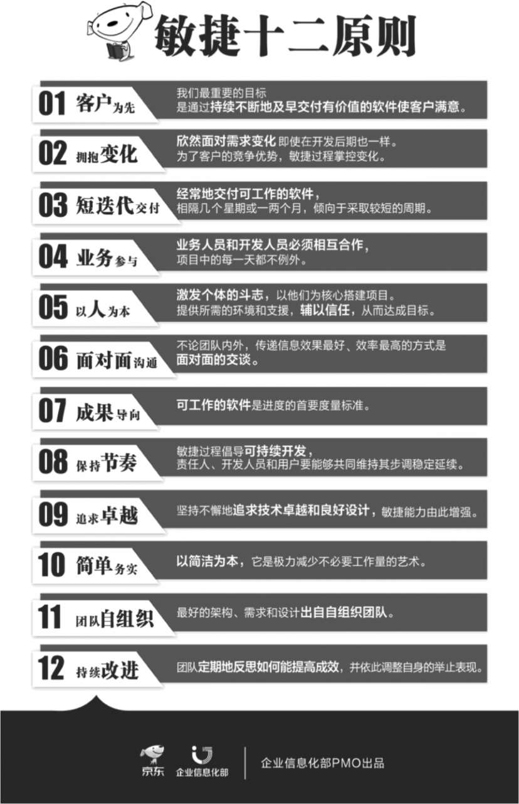

在敏捷中，我们并未否定流程、工具、文档、约定、计划的重要性，我们依然要有流程，只是希望不要完全依赖流程与工具；不是不写文档，而是只写有用的文档，只写够用的文档；不要只关注文档，而要更加关注最终交付物是否能为客户带来价值，能为客户解决问题；不是不做约定与谈判，而是要更注重双赢；不是不做计划，只是要做小的计划；不做一成不变的计划，计划要能及时响应外部变化。

开发周期和发布周期完全不同。无论发布周期多长，但我们的目标是短开发周期。发布周期的长度依赖于业务决策，并且和客户的期望紧密相关

业务人员和产品管理人员需要知道市场状况、客户需求和客户的价值，开发团队需要知道产品和技术可行性。如何将这两方面有机结合？这需要我们每天都相互合作，一起做出睿智的决策。

为了激发每个知识工作者的斗志和创造力，在目标及边界框定的情况下，自由发挥聪明才智才是最重要因素。要让角色去适应人而不是让人去适应角色，采取任何需要的行动来达成目标。

瀑布开发模式下的阶段性进度，体现的仅仅是工作活动推进的进展，没有体现成果（可工作的软件）的进展。因为客户是为可工作的软件付费的，而不会为工作活动或者阶段买单。

## 敏捷方法

