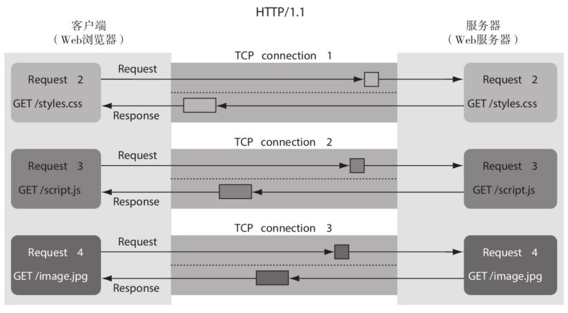
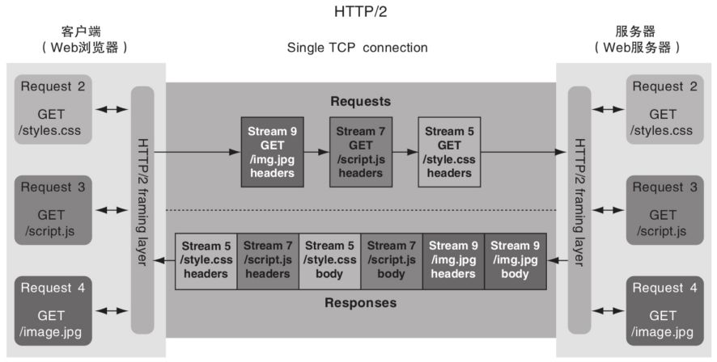
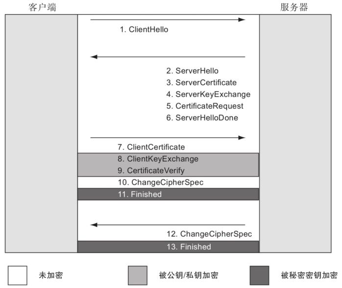
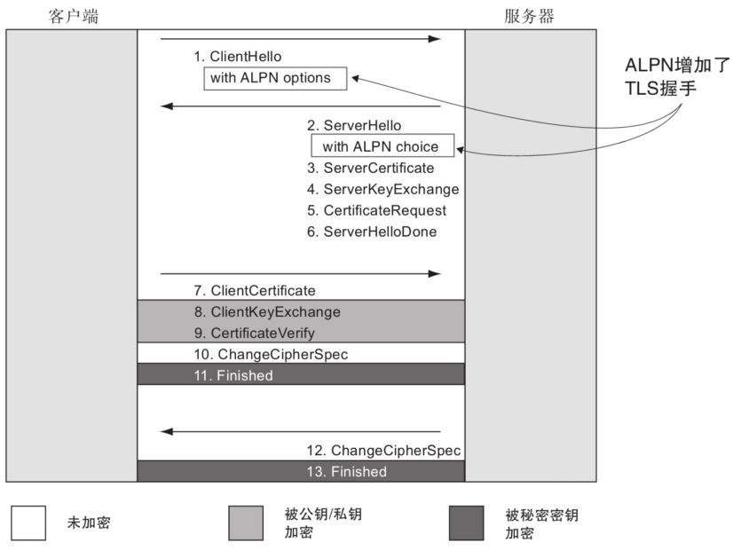
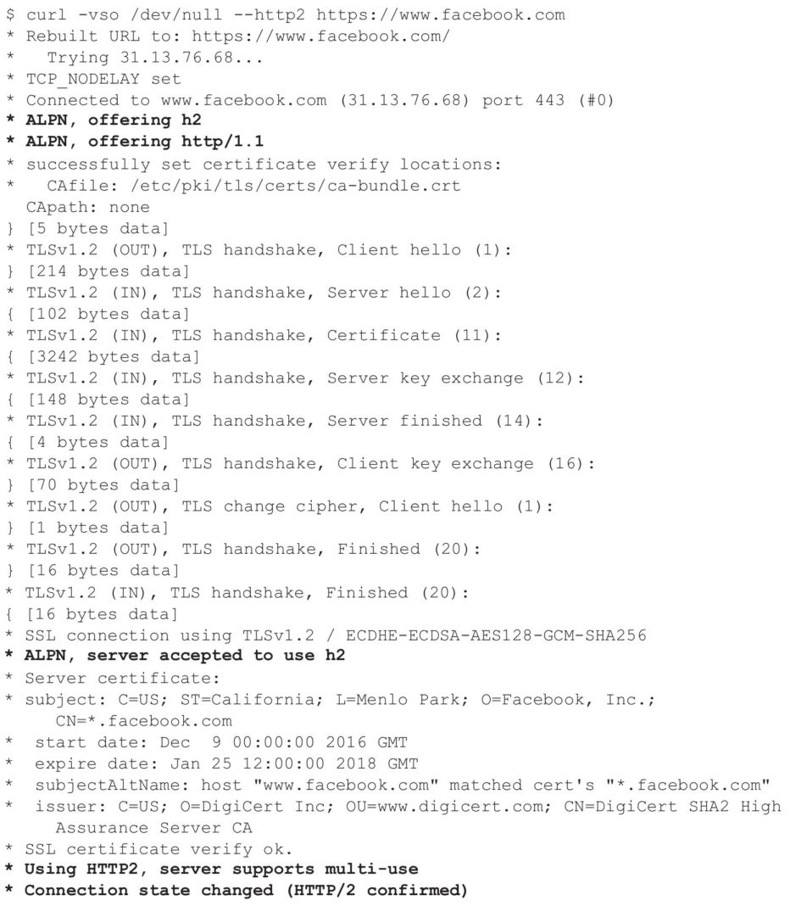

# http2

SPDY基于HTTP构建，没有从根本上改变协议。就像HTTPS封装了HTTP，但是不改变它的底层机制。HTTP方法（GET、POST等）和HTTP首部的概念在SPDY中依然存在。SPDY工作在更低的层面，并且对开发者、服务器管理员和（最重要的）用户来说，SPDY几乎是透明的。所有的HTTP请求简单地被转换为SPDY请求，发向服务器，然后再转换回来。对于更高层的应用（像JavaScript应用）来说，SPDY请求和其他的HTTP请求一样。另外，SPDY的实现只基于加密的HTTP（即HTTPS）。

SPDY的主要目标是解决HTTP/1.1的性能问题。它引入了一些关键的概念来解决HTTP/1.1的问题：

* 流多路利用 — 请求和响应使用单个TCP连接传输数据，它们被分成不同的数据包，以流的方式分组。
* 请求优先级 — 在同时发送所有请求时，为了避免引入新的性能问题，引入了请求优先级的概念。
* HTTP首部压缩 — HTTP体早就可以压缩了，现在首部也可以压缩了。

如果像HTTP一样，SPDY是一个基于文本的请求-响应协议，这些功能就不可能实现，所以SPDY变成了一个二进制协议。

SPDY证明了一件事，HTTP/1.1可以优化，这不仅仅是理论上的证明，而且有现实中大型网站的案例。2012年，IETF的HTTP工作组注意到SPDY的成功，并开始征集下一版本HTTP的提案。SPDY自然成为了下一版本的基础。

浏览器仅支持基于HTTPS的HTTP/2。

在2015年5月，HTTP/2被批准成为正式标准。

为了能够使用HTTP/2，浏览器和服务器都必须支持HTTP/2。但是，如果用户使用代理，把一个HTTP连接变成两个，且这个代理不支持HTTP/2，那HTTP/2还是不能启用。

HTTP/2主要用来解决HTTP/1的性能问题。新版本的协议与原来的协议有很大的不同，新增了如下概念：

* 二进制协议
* 多路复用
* 流量控制功能
* 数据流优先级
* 首部压缩
* 服务端推送

### 二进制格式替换文本格式

HTTP/1和HTTP/2的主要区别之一是，HTTP/2是一个二进制的、基于数据包的协议，而HTTP/1是完全基于文本的。基于文本的协议方便人类阅读，但是机器解析起来比较困难。使用基于文本的协议，要先发完请求，并接收完响应之后，才能开始下一个请求。HTTP/2变成了一个完全的二进制协议，HTTP消息被分成清晰定义的数据帧发送。这里的帧和支撑HTTP连接的TCP数据包类似。当收到所有的数据帧后，可以将它们组合为完整的HTTP消息。

### 多路复用

HTTP/2允许在单个连接上同时执行多个请求，每个HTTP请求或响应使用不同的流。通过使用二进制分帧层，给每个帧分配一个流标识符，以支持同时发出多个独立请求。当接收到该流的所有帧时，接收方可以将帧组合成完整消息。帧是同时发送多个消息的关键。每个帧都有标签表明它属于哪个消息（流），这样在一个连接上就可以同时有两个、三个甚至上百个消息。服务器发送响应的顺序完全取决于服务器，但客户端可以指定优先级。如果可以发送多个响应，则服务器可以进行优先级排序，先发送重要资源。

每个请求都有一个新的、自增的流ID。返回响应时使用相同的流ID，也就是说和HTTP连接一样，流是往返的。响应完成后，流将被关闭。在这一点上HTTP/2流和HTTP/1.1连接又有所不同。因为HTTP/2中流会被丢弃而且不能重用，而HTTP/1.1保持连接打开，并且可以重新用它来发送另一个请求。

为了防止流ID冲突，客户端发起的请求使用奇数流ID，服务器发起的请求使用偶数流ID。

### 流的优先级

在HTTP/2之前，HTTP是单独的请求-响应协议，因此没有在协议中进行优先级排序的必要。客户端（通常是Web浏览器）在HTTP之外就决定了请求的优先级，因为同时只能发送有限数量（通常为6个）的HTTP/1请求。这种优先级通常需要先请求关键资源（HTML、影响渲染的CSS和JavaScript），然后再请求非阻塞的内容（如图像和异步JavaScript）。请求会进入队列，等待可用的HTTP/1连接，而队列的优先级由浏览器管理。

现在HTTP/2对并发的请求数量的限制放宽了很多（在许多实现中，默认情况下允许同时存在100个活跃的流），因此许多请求不再需要浏览器来排队，可以立即发送它们。这可能导致带宽浪费在较低优先级的资源（例如图像）上，从而导致在HTTP/2下页面的加载速度变慢。所以需要控制流的优先级，使用更高的优先级发送最关键的资源。流的优先级控制是通过这种方式实现的：当数据帧在排队时，服务器会给高优先级的请求发送更多的帧。

### 流量控制

流量控制是在同一个连接上使用多个流的另一种方式。如果接收方处理消息的速度慢于发送方，就会存在积压，需要将数据放入缓冲区。而当缓冲区满时会导致丢包，需要重新发送。在连接层，TCP支持限流，但HTTP/2要在流的层面实现流量控制。以视频网页为例。如果用户暂停视频，可以仅暂停视频流，允许加载网站的其他资源，这是更好的选择。

### 首部压缩

### 服务端推送

## 创建一个HTTP/2连接

考虑到HTTP/2和HTTP/1在连接层的巨大差异，客户端Web浏览器和服务端都需要支持HTTP/2，才可以正常使用。

HTTP/2规范文档提供了三种建立HTTP/2连接的方法：

* 使用HTTPS协商
* 使用HTTP Upgrade首部
* 和之前的连接保持一致

理论上，HTTP/2支持基于未加密的HTTP（也就是h2c）创建连接，也支持基于加密的HTTPS（即h2）创建连接。实际上，所有的Web浏览器仅支持基于HTTPS（h2）建立HTTP/2连接，所以浏览器使用第一个方法来协商HTTP/2。服务器之间的HTTP/2连接可以基于未加密的HTTP（h2c）或者HTTPS（h2）。

### 使用HTTPS协商

HTTPS需要经过一个协议协商阶段来建立连接，在建立连接并交换HTTP消息之前，它们需要协商SSL/TLS协议、加密的密码，以及其他的设置。这个过程比较灵活，可以引入新的HTTPS协议和密码，只要客户端和服务端都支持就行。在HTTPS握手的过程中，可以同时完成HTTP/2协商，这就不需要在建立连接时增加一次跳转。

#### HTTPS握手(TLSv1.2) 

#### ALPN
ALPN给ClientHello和ServerHello消息添加了功能扩展，客户端可以用它来声明应用层协议支持（“嗨，我支持h2和http/1，你用哪个都行。”），服务端可以用它来确认在HTTPS协商之后所使用的应用层协议（“好的，我们用h2吧”）。

ALPN很简单，它可以在现有的HTTPS协商消息中协商HTTP/2支持，不会引入额外的消息往返、跳转，或者其他的升级延迟。ALPN唯一的问题是，它还相对较新，没获得广泛支持，特别是在服务端，有很多服务器都在使用旧版本的TLS库。如果未支持ALPN，服务器通常认为客户端不支持HTTP/2，并使用HTTP/1.1。

### 使用HTTP Upgrade首部

通过发送Upgrade首部，客户端可以请求将现有的HTTP/1.1连接升级为HTTP/2。这个首部应该只用于未加密的HTTP连接（h2c）。基于加密的HTTPS连接的HTTP/2（h2）不得使用此方法进行HTTP/2协商，它必须使用ALPN。如果你在浏览器以外的场景（例如API）应用HTTP/2，会对这个过程感兴趣。

客户端什么时候发送Upgrade首部完全取决于客户端本身。这个首部可以随着每一个请求发送，可以只在第一个请求中发送，也可以只在服务端在HTTP应用中用Upgrade首部声明自己支持HTTP/2之后发送。

#### 客户端请求升级

升级失败的响应

升级成功的响应

支持HTTP/2的服务器可以返回一个HTTP/1.1 101响应以表明它将切换协议，而不是忽略升级请求。

#### 服务端请求建议

一个支持HTTP/2的服务端可以返回一个200响应，但是在响应首部中添加Upgrade来说明自己支持HTTP/2。这个时候，它是一个升级建议，而不是升级请求，因为只有客户端才发起升级请求。如下是一个服务端宣告支持h2（基于HTTPS的HTTP/2）和h2c（基于纯文本的HTTP/2）的示例：

客户端可以利用这个信息来完成协议升级，并在下一个请求中发送一个Upgrade首部。

### 使用先验知识

HTTP/2规范描述的第3个（也是最后一个）客户端使用HTTP/2的方法是，看它是否已经知道服务器支持HTTP/2。如果它知道，则可以马上开始使用HTTP/2，不需要任何升级请求。

## HTTP/2帧

### 查看HTTP/2帧

通过`chrome://net-export/`到处log文件，在https://netlog-viewer.appspot.com中查看 

`nghttp -v https://www.facebook.com`

