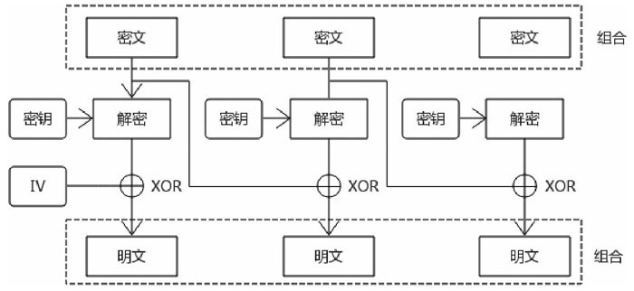

# 密码学

密码学原理是公开的，在工程上需要实现各种算法，最著名的就是OpenSSL项目，包括了底层密码库和命令行工具，大部分Linux发行版都预装了OpenSSL库。

查看版本 `openssl version`

查看支持的命令 `openssl help`

查看具体子命令的帮助 `openssl rsa --help`

在最底层，使用密码加密依赖于各种加密基元（cryptographicprimitive）。每种基元都着眼于某个特定功能而设计。比如，我们会使用某个基元加密，使用另外一个基元进行完整性检查。单个基元本身的作用并不大，但是我们可以将它们组合成方案（scheme）和协议（protocol），从而提供可靠的安全性。


## 随机数


* 效率

  在软件或者密码学应用中需要大量的随机数，必须在很短的时间内生成随机数
* 随机性

  生成的随机数只要不存在统计学偏差，那么这个随机数就具备随机性
* 不可预测性

  有些随机数看上去很随机，但是这些随机数之间可能存在一定的关联，比如通过以前的随机数可以推断出后续的随机数，这种随机数就不具备不可预测性
* 不可重现性

  所谓不可重现性,就是不管经过多长时间，不会产生完全相同的随机数。在软件层面不可能生成完全不一样的随机数，在一定周期内，密码学随机数算法最终会生成两个完全相同的随机数，只是周期长短的问题。在密码学中应该尽量使用周期相对长的随机数，为了实现真正不可重现性的随机数，必须基于物理设备或者物理现象。

  不管是真正的随机数生成器TRNG（True RandomNumber Generator），伪随机数生成器PRNG（Preudo Random Number Generator），还是密码学伪随机数生成器CPRNG（Cryptographysecure Preudo Random Number Generator），内部工作原理是一样的，CPRNG是PRNG随机数生成器中的一种。

  随机数生成器内部会维护一个状态（internalstate），对于TRNG来说，内部状态的数值来自外部设备，称为熵（entrory），比如动态的时间、变化的温度、声音的变化、鼠标位置。而对于PRNG来说，内部状态的数值来自于模拟的数值，称为种子（seed）。随机数生成器每次生成随机数的时候，内部状态的值都会变化，这样才能产生不一样的随机数，如果每次熵和种子是一样的，生成的随机数也是相同的，所以熵和种子对于随机数生成器非常重要。

> 如果随机数使用了操作系统产生的熵，如果此时熵不够，会阻塞操作。[Linux随机数](../os/linux/随机数.md)

## Hash算法

密码学Hash算法和普通的Hash算法不是同一个概念，密码学Hash算法有Hash算法的所有特性，但从安全的角度考虑，密码学Hash算法还有其他的一些特性

随机数生成器算法和密码学Hash算法都是密码学中的基础算法，很多其他的密码学算法选择这两个算法作为加密基元（CryptographicPrimitives）。

大部分算法完成的功能是单一的，很少有某个算法能够解决密码学中的所有问题。加密基元就是一些基础的密码学算法，通过它们才能够构建更多的密码学算法、协议、应用程序。加密基元类似于房屋的内部材料（砖头、水泥），基于材料搭建出房屋，才真正对人类有用。

摘要/散列值/指纹=hash（消息）

由于Hash算法有很多功能，所以Hash算法有多种称呼，比如摘要算法（Message Digest Algorithms）、单向散列函数（Cryptographic One-way Hash Functions）。输出值也有多种称呼，比如摘要值、散列、指纹

 密码学Hash算法的分类：

 * MD5

    MD5是一种比较常用的Hash算法，摘要值长度固定是128比特，MD5算法目前被证明已经不安全了
 * SHA

    SHA（Secure Hash Algorithms）算法是美国国家标准与技术研究院（NIST）指定的算法，SHA算法不是一个算法，而是一组算法，主要分为三类算法。

    * SHA-1

        SHA-1算法类似于MD5算法，输出的长度固定是160比特。目前SHA-1算法在严谨的加密学中已经被证明是不安全的。
    * SHA-2

        SHA-2算法是目前建议使用的Hash算法，截至目前是安全的，主要有四种算法，分别是SHA-256、SHA-512、SHA-224、SHA-384，输出的长度分别是256比特、512比特、224比特、384比特。
    * SHA-3

        SHA-3算法并不是为了取代SHA-2算法，而是一种在设计上和SHA-2完全不同的算法，主要有四种算法，分别是SHA3-256、SHA3-512、SHA3-224、SHA3-384，输出的长度分别是256比特、512比特、224比特、384比特。


## 对称加密算法

在密码学中，用于数据加密的算法主要有两种，分别是对称加密算法（Symmetric-key Algorithms）和非对称加密算法（AsymmetricalCryptography）


对称加密算法有两种类型，分别是块密码算法（block ciphers）和流密码算法（stream ciphers）

常用的块密码算法：


常用的流密码算法：


美国国家标准与技术研究院（National Institute of Standards andTechnology, NIST）对众多的对称加密算法进行了考核，从安全性和效率进行了多方面评测，最终选取Rijndael算法作为对称加密算法的标准。以Rijndael算法为原型，创建了AES（Advanced EncryptionStandard）算法，AES就是最终的对称加密算法标准。Rijndael算法和AES算法略微不同，但在理解的时候可以认为是相同的算法。


块密码算法在运算（加密或者解密）的时候，不是一次性完成的，每次对固定长度的数据块（block）进行处理，也就是说完成一次加密或者解密可能要经过多次运算，最终得到的密文长度和明文长度是一样的。

数据块的长度就称为分组长度（block size），由于大部分明文的长度远远大于分组长度，所有要经过多次迭代运算才能得到最终的密文或明文，块密码算法有多种迭代模式（Block cipher modes ofoperation），迭代模式也可以称为分组模式。

块密码算法常用迭代模式：

* ECB模式

    ECB模式（Electronic Codebook）是最简单的一种迭代模式，这种迭代模式是存在安全问题的，一般不建议使用。

    

    

    ECB模式最大的特点就是每个迭代过程都是独立的，是可以并行处理的，能够加快运算速度。由于固定的明文和密钥每次运算的结果都是相同的，这会造成很多的安全问题。

* CBC模式

    CBC模式（Cipher Block Chaining）是比较常见的一种迭代模式，解决了ECB模式的安全问题。

     

     

     CBC模式引入了初始化向量的概念，初始化向量是一个随机数，长度等于分组长度。
     
     初始化向量必须每次都不一样，有了随机的初始化向量，同样的明文和密钥最终得到的密文是不一样的，解决了ECB模式存在的安全问题。

     迭代运算数据块不能并行处理，只有处理完第n个数据块，才能继续处理第n+1个数据块

* CTR模式

    CTR模式（counter）在迭代的时候，相当于是一个流密码的运行模式。每次迭代运算的时候要生成一个密钥流（keystream），生成密钥流的方法可以是任意的，但是各个密钥流之间是有关系的，最简单的方式就是密钥流不断递增，所以才叫作计数器模式。

    

    将明文拆分成多个数据块，和CBC迭代不一样的是不需要进行填充处理。

    将密文拆分成多个数据块，和CBC迭代不一样的是不需要进行填充处理。根据第n个密钥流可以得到第n+1个密钥流，最简单的方式就是密钥流每次递增加一。

    第一个密钥流的获取方式也很简单，就是生成一个随机值（Nonce），Nonce和IV可以等同理解，一个不容易推导出来的随机值。

    


### 填充标准

对于对称加密算法来说，明文长度必须是分组长度的倍数，如果不是倍数，必须有一种填充的机制，填充某些数据保证明文长度是分组长度的倍数。

PKCS#7填充标准：

如果填充的字节长度是N字节,则填充N个n字节,即nnnnn...n,最后一个字节n即代表填充的字节长度。

PKCS#5和PKCS#7处理填充机制的方式其实是一样的，只是PKCS#5处理的分组长度只能是8字节，而PKCS#7处理的分组长度可以是1到255任意字节，从这个角度看，可以认为PKCS#5是PKCS#7标准的子集。AES算法中分组长度没有8字节，所以AES算法使用PKCS#7标准。


## 消息验证码(Message Authentication Code, MAC)

Hash算法不能解决中间人攻击问题


如何确保消息是特定人发送的呢？在通信双方可以维护同一个密钥，只有拥有密钥的通信双方才能生成和验证消息验证码，消息验证码算法需要一个密钥，这和对称加密算法是一样的，通信双方在消息传递之前需要获得同样的密钥。

MAC值=mac（消息，密钥）


MAC算法有两种形式：

* CBC-MAC算法

    CBC-MAC算法从块密码算法的CBC分组模式演变而来，简单地说就是最后一个密文分组的值就是MAC值

* HMAC算法
  
    HMAC（Hash-based Message Authentication Code）算法使用Hash算法作为加密基元，HMAC结合Hash算法有多种变种，比如HMAC-SHA-1、HMAC-SHA256、HMAC-SHA512。


讲完对称加密算法和MAC算法后，必须将这两种算法放在一起描述，核心的观点就是加密算法不能提供完整性，加密的同时必须引入MAC算法避免消息被篡改。

加密算法能够解决机密性的问题，比如攻击者虽然能够截获加密数据，但如果没有密钥，则无法得到原文。完整性的意思是消息没有被篡改，仅仅加密数据是无法保证数据完整性的，初听起来可能觉得很奇怪。攻击者如果没有密钥就无法破解原文，也就无法篡改，数据必然是完整的。遗憾的是攻击者虽然无法破解数据，但是可以修改密文的部分数据，然后发送给接收者，接收者通过密钥发现能够解密，但是解密出来的值实际上不是原文，消息已经被修改了，也就是说加密操作不能提供完整性。

使用者结合对称加密算法和MAC算法，提供机密性和完整性的模式也叫作Authenticated Encryption（AE）加密模式，主要有三种:

* Encrypt-and-MAC (E&M)

    对消息分别进行加密运算和MAC运算，然后将两个运算结果结合起来发送给接收方。

    

* MAC-then-Encrypt (MtE)

    先对消息进行MAC计算，然后将消息和MAC值组合在一起再进行加密，最终的加密值再发送给接收方。在HTTPS中，一般使用这种模式进行处理，比如AES-128-CBC#PKCS7-HMAC-SHA256模式。

    

* Encrypt-then-MAC (EtM)

    先对消息进行加密得到密文，然后对密文再计算MAC值，最终将密文和MAC值组合在一起再发送给接收方。

     

AEAD（Authenticated Encryption with Associated Data）是AE加密模式的一种变体，AE模式需要使用者单独处理加密运算和MAC运算，一旦使用不当，就很容易出现安全问题。

AEAD加密模式在底层组合了加密算法和MAC算法，能够同时保证数据机密性和完整性，减轻了使用者的负担，主要有三种模式：

* CCM模式

    CCM（Counter with CBC-MAC）模式也是一种AEAD模式，不过在HTTPS中使用得比较少。这种模式使用CBC-MAC（一种MAC算法）算法保证完整性，使用块密码AES算法CTR模式的一种变种进行加密运算，底层采用的是MAC-then-Encrypt模式。

* GCM模式

    GCM（Galois/Counter Mode）是目前比较流行的AEAD模式。在GCM内部，采用GHASH算法（一种MAC算法）进行MAC运算，使用块密码AES算法CTR模式的一种变种进行加密运算，在效率和性能上，GCM都是非常不错的。

* ChaCha20-Poly1305

    ChaCha20-Poly1305是谷歌发明的一种算法，使用ChaCha20流密码算法进行加密运算，使用Poly1305算法进行MAC运算。

## 公开密钥算法

公开密钥算法（PublicKey Cryptography），也称为非对称加密算法（AsymmetricalCryptography），公开密钥算法不是一个算法而是一组算法，如果公开密钥算法用于加密解密运算，习惯上称为非对称加密算法。

对称加密算法虽然有很多的算法和加密机制，但主要用于加密和解密。而公开密钥算法的功能比较多，可以进行加密解密、密钥协商、数字签名。

相比对称加密算法来说，公开密钥算法尤其是RSA算法运算非常缓慢，一般情况下，需要加密的明文数据都非常大，如果使用公开密钥算法进行加密，运算性能会惨不忍睹。公开密钥算法在密码学中一般进行密钥协商或者数字签名，因为这两者运算的数据相对较小。

### RSA

公开密钥算法最重要和最广泛使用的算法就是RSA算法，该算法是RonRivest、Adi Shamir、Leonard Adleman三个人创建的，以三个人名字的首字母命名。RSA算法是一个多用途的算法，可以进行加密解密、密钥协商、数字签名。

对称加密算法中的密钥是一串数字，没有太多的其他含义，而RSA算法中的公钥和私钥在生成的时候有很大的关系，公钥和私钥不只是一串数字，由很多参数组成，公钥和私钥一般以文件的形式提供。

加解和解密过程也需要密钥文件中的其它参数，在理解公开密钥算法的时候，首先要掌握密钥文件(包含公钥和私钥)的内部结构：

```
typedef struct rsa_st
{
    BIGNUM ＊p;
    BIGNUM ＊q;
    BIGNUM ＊n;
    BIGNUM ＊e;
    BIGNUM ＊d;
} RSA;
```

接下来看看如何生成密钥对：

1. 选取两个很大的质数p和q。

2. 求这两个数的乘积n。

3. 取一个公开指数e，这个数的值小于(p-1)(q-1), e对应的值和(p-1)(q-1)的值互质。

4. e和n组合起来就相当于公钥。n值的长度就相当于密钥对的长度。

5. 通过e、p、q能够计算出私钥d, d和n组合起来就是私钥。一旦计算出私钥，p和q这两个数就可以丢弃，这样更安全。如果不丢弃且和d一同保存在私钥文件中，则运算的时候效率更高。e和d之间存在互逆的关系。


和对称密钥算法一样，公开密钥算法也有使用标准，公开密钥算法的标准称为PKCS（Public Key Cryptography Standards），这个标准由很多的子标准组成，指导使用者正确地使用公开密钥算法。

PKCS标准的所有子标准:


### 填充标准

RSA加密常用的填充模式有三种：RSA_PKCS1_PADDING， RSA_PKCS1_OAEP_PADDING， RSA_NO_PADDING。

与对称加密算法DES，AES一样，RSA算法也是一个块加密算法（ block cipher algorithm），总是在一个固定长度的块上进行操作。但跟AES等不同的是，block length是跟key length有关的。每次RSA加密的明文的长度是受RSA填充模式限制的，但是RSA每次加密的块长度就是key length。

 
## 密钥

密钥最重要的属性就是密钥的长度，密钥长度决定了密钥空间的大小，如果密钥长度过短，很容易受到暴力攻击。

在密码学中，为了生成密钥，一般采用两种方法：

* 基于伪随机生成器生成密钥。
* 基于口令的加密（Password-based Encryption，简称PBE）算法产生密钥。


口令（password或者passphrase）也可以认为是一种密钥，都需要保密，不能泄露。口令和密钥最大的区别在于口令更容易生成、更容易记忆，一般情况下口令记录在人脑中，口令可以认为是一种弱密钥，由固定的字母、数字、符号组成，长度也有一定的限制。

在密码学中，存在一种密码衍生算法（Key Derivation Function,KDF），该算法可以简单理解为通过某些值可以生成任意长度的一个（多个）密钥，常见的KDF算法有很多，比如PBKDF2、bcrypt、scrypt等。

基于口令的加密算法（PBE）可以认为是KDF算法的一种具体应用。

PBKDF2算法

PBKDF2算法：

`DK=PBKDF2(PRF,Password,Salt,c,dkLen)`

◎PRF是一个伪随机函数，可以简单地理解为摘要算法  
◎Password表示口令  
◎Salt表示盐值，一个随机数  
◎c表示迭代次数  
◎dkLen表示最后输出的密钥长度


## 密钥协商算法

公开密钥算法的另外一种算法就是密钥协商算法。

### RSA密钥协商算法

通过一个例子看看RSA密钥协商算法如何工作的：

1. 客户端初始化连接服务器端，服务器发送RSA密钥对的公钥给客户端。

2. 客户端生成一个随机值，这个值必须是随机的，不能被攻击者猜出，这个值就是会话密钥。

3. 客户端使用服务器RSA密钥对的公钥加密会话密钥，并发送给服务器端，由于攻击者没有服务器的私钥，所以无法解密会话密钥。

4. 服务器端用它的私钥解密出会话密钥。

5. 至此双方完成连接，接下来服务器端和客户端可以使用对称加密算法和会话密钥加密解密数据。

RSA密钥协商算法有几个优点：

1. 每次连接阶段的会话密钥是不同的，无须存储到设备中，连接关闭后会话密钥就会消失。

2. 每次连接中的会话密钥是不同的，避免了烦琐的会话密钥分配问题。

3. 虽然RSA运算很慢，但由于会话密钥长度相对很小，计算的是数据量并不大，所以性能消耗相对可控。

RSA密钥协商算法也有缺点：

1. 获取会话密钥过程其实并不能称为协商，完全是由客户端决定的，只能称为密钥传输。如果客户端生成会话密钥没有使用标准的算法，可能会带来安全隐患。比如说客户端每次随机从26个字母中选取4个字母作为会话密钥，那么很容易受到暴力攻击。攻击者不会去破解RSA加密算法的私钥，直接暴力破解会话密钥就能反解出明文。

2. 最大的问题就是不能提供前向安全性

> 前向安全性:

### DH密钥协商算法

Diffie-Hellman算法，简称DH算法，是Whitfield Diffie和MartinHellman在1976年公布的一个公开密钥算法，它的历史比RSA公开密钥算法更悠久。使用RSA密钥协商算法传输会话密钥的时候，会话密钥完全由客户端控制，并没有服务器的参与，所以叫作密钥传输。

而DH算法确切地说，实现的是密钥交换或者密钥协商，DH算法在进行密钥协商的时候，通信双方的任何一方无法独自计算出一个会话密钥，通信双方各自保留一部分关键信息，再将另外一部分信息告诉对方，双方有了全部信息才能共同计算出相同的会话密钥。

客户端和服务器端协商会话密钥的时候，需要互相传递消息，消息即使被挟持，攻击者也无法计算出会话密钥，因为攻击者没有足够的信息（通信双方各自保留的信息）计算出同样的会话密钥。

1. 参数文件

    在使用DH算法之前，先要生成一些公共参数，这些参数是公开的，无须担心攻击者能够看到这些参数值，这些参数可以由客户端或者服务器端生成，一般由服务器端生成。参数在协商密钥之前必须发给对端。
    ```
        typedef struct dh_st
        {
            BIGNUM ＊p;
            BIGNUM ＊g;
            BIGNUM ＊pub_key;
            BIGNUM ＊priv_key;
        } DH;
    ```
    参数有两个，分别是p和g, p是一个很大的质数，建议长度在1024比特以上，这个长度也决定了DH算法的安全程度，g表示为一个生成器，这个值很小，可以是2或者5。通过参数，服务器端和客户端会生各自生成一个DH密钥对，私钥需要保密。

2. DH算法处理过程

    

* 通信双方的任何一方可以生成公共参数p和g，这两个数是公开的，被截获了也没有任何关系，一般情况下由通信双方的服务器端计算。

* 客户端连接服务器端，服务器端将参数发送给客户端。

* 客户端根据公开参数生成一个随机数a，这个随机数是私钥，只有客户端知道，且不会进行发送，然后计算Yc = (g ^ a) mod p, Yc就是公钥，需要发送给服务器端。

* 服务器端根据公开参数生成一个随机数b，这个随机数是私钥，需要服务器端保密，然后计算Ys = (g ^ b) mod p, Ys是公钥，需要发送给客户端。

* 客户端发送Yc数值给服务器端，服务器端计算Z = (Yc ^ b) modp。

* 服务器端发送Ys数值给发送方，客户端计算Z = (Ys ^ a) mod p。

* 服务器端和客户端生成的Z就是会话密钥，协商完成。

DH算法分为两种类型，分别是静态DH算法和临时DH算法。

静态DH算法（DH算法）：p和g两个参数永远是固定的，而且服务器的公钥（Ys）也是固定的。和RSA密钥协商算法一样，一旦服务器对应的DH私钥泄露，就不能提供前向安全性。静态DH算法的好处就是避免在初始化连接时服务器频繁生成参数p和g，因为该过程是非常消耗CPU运算的。

临时DH算法（EDH算法）：在每次初始化连接的时候，服务器都会重新生成DH密钥对，DH密钥对仅仅保存在内存中，不像RSA那样私钥是保存在磁盘中的，攻击者即使从内存中破解了私钥，也仅仅影响本次通信，因为每次初始化的时候密钥对是动态变化的。更安全的是，协商出会话密钥后，a和b两个私钥可以丢弃，进一步提升了安全性，在有限的时间、有效的空间生成了密钥对。

接下来使用OpenSSL命令行演示一个完整的DH密钥协商例子：

```
# 通信双方的任何一方生成DH的参数文件，可以对外公开
$ openssl genpkey -genparam -algorithm DH -out dhp.pem
# 查看参数文件的内容，包括p和g等参数
$ openssl pkeyparam -in dhp.pem -text

# 发送方A基于参数文件生成一个密钥对
$ openssl genpkey -paramfile dhp.pem -out akey.pem
# 查看密钥对内容
$ openssl pkey -in akey.pem -text -noout

# 发送方B基于参数文件生成一个密钥对
$ openssl genpkey -paramfile dhp.pem -out bkey.pem
# 查看密钥对内容
openssl pkey -in bkey.pem -text -noout

# 发送方A拆出公钥文件akey_pub.pem，私钥自己保存
$ openssl pkey -in akey.pem -pubout -out akey_pub.pem

# 发送方B拆出公钥文件bkey_pub.pem，私钥自己保存
$ openssl pkey -in bkey.pem -pubout -out bkey_pub.pem

# 发送方A收到B发送过来的公钥，将协商出的密钥保存到data_a.txt文件
openssl  pkeyutl  -derive  -inkey  akey.pem  -peerkey  bkey_pub.pem  -out data_a.txt

# 发送方B收到A发送过来的公钥，将协商出的密钥保存到data_b.txt文件
openssl  pkeyutl  -derive  -inkey  bkey.pem  -peerkey  akey_pub.pem  -out data_b.txt
```

最终会发现data_a.txt和data_b.txt两个二进制文件是相同的，表示协商出同一个会话密钥。


## 椭圆曲线密码学

为了保证DH的密钥对不被破解，提升安全性的主要手段就是增加密钥对的长度，但是长度越长，性能越低。公开密钥算法是一个O(n)操作，n就是密钥对的长度，n越小，操作越快。为了解决性能问题，需要了解下椭圆曲线密码学（Elliptic Curve Cryptography），简称为ECC。

ECC是新一代的公开密钥算法，主要的优点就是安全性，极短的密钥能够提供很大的安全性。比如224比特的ECC密钥和2048比特的RSA密钥可以达到同样的安全水平，由于ECC密钥具有很短的长度，运算速度非常快。ECC基于非常复杂的算法，到目前位置，对于ECC进行逆操作还是很难的，数学上被证明是不可破解的，ECC算法的优势就是性能和安全性非常高。

ECC由方程式、基点（G）、质数（P）组成，当然还有a、b这样的方程式参数。理论上方程式和各种参数组合可以是任意的，但是在密码学中，为了安全，系统预先定义了一系列的曲线，称为命名曲线（name curve），比如secp256k1就是一个命名曲线。对于读者来说，在使用ECC密码学的时候，就是选择具体的命名曲线，需要重点关注命名曲线。


### ECDH协商算法

ECC可以结合公开密钥算法，比如DH算法结合ECC可以组成为ECDH算法，接下来看看如何结合。在DH算法中，客户端和服务器端分别生成密钥对，生成密钥对依赖于参数文件中的p和g，在DH中，生成的随机数称为私钥，然后对私钥进行“G^私钥mod p”运算得到公钥。在ECDH中首先取得一个随机数（k），称之为私钥，kg的结果就是公钥，g是椭圆曲线上的基点，公钥也是椭圆曲线上的一个点，对于ECC密码学来说，通过公钥很难破解私钥。

基于ECDH算法进行演示：

```
# 生成参数文件
$ openssl ecparam -name secp256k1-out secp256k1.pem

# A和B各自生成一个ECDH私钥对文件
$ openssl genpkey -paramfile secp256k1.pem  -out akey.pem
$ openssl genpkey -paramfile secp256k1.pem  -out bkey.pem

# A和B分解出公钥，将公钥发送给对方
$ openssl pkey -in akey.pem -pubout -out akey_pub.pem
$ openssl pkey -in bkey.pem -pubout -out bkey_pub.pem

# A和B计算出同样的会话密钥
$  openssl  pkeyutl  -derive  -inkey  akey.pem  -peerkey  bkey_pub.pem  -out data_a.txt
$  openssl  pkeyutl  -derive  -inkey  bkey.pem  -peerkey  akey_pub.pem  -out data_b.txt
```

最终data_a.txt、data_b.txt包含的值是相同的。


## 数字签名

公开密钥算法的另外一种用途就是数字签名技术。RSA签名算法和DSA签名算法都可以实现数字签名。

数字签名技术有以下几个特点：

* 防篡改：数据不会被修改，MAC算法也有这个特点。

* 防抵赖：消息签署者不能抵赖。

* 防伪造：发送的消息不能够伪造，MAC算法也有这个特点。

数字签名技术能够进行身份验证。MAC算法能保证传递的消息是经过验证的，但不能对消息发送者的身份进行验证，原因就在于消息发送方和接收方拥有同样的密钥，所以双方可以抵赖，否认消息是他发送的，读者在理解的时候一定要区分消息验证和身份验证。

### RSA数字签名算法

RSA算法的用途非常广泛，可以进行数字签名。和RSA加密算法相似，不同的是，RSA加密算法是公钥加密，私钥解密；RSA签名算法是私钥签名，公钥验证签名。

和RSA加密填充一样，RSA签名算法也有填充机制，分别是RSASSA-PKCS1-v1_5和RSASSA-PSS。对于同样的输入值和密钥对，使用RSASSA-PKCS1-v1_5标准生成的签名值是固定不变的，而对于RSASSA-PSS标准来说，生成的签名值每次都是变化的，所以安全性更好一点。


```
# 生成一个RSA密钥对，密钥长度 1024 比特
$ openssl genrsa -out rsaprivatekey.pem 1024

# 从密钥对中分离出公钥
$ openssl rsa -in rsaprivatekey.pem -pubout -out rsapublickey.pem

# 对plain.txt文件使用sha256 Hash算法和签名算法生成签名文件signature.txt
$ echo "hello" >>plain.txt
$ openssl dgst -sha256  -sign rsaprivatekey.pem -out  signature.txt plain.txt

# 用相同的摘要算法和签名算法校验签名文件，需要对比签名文件和原始文件
$ openssl dgst -sha256  -verify rsapublickey.pem  -signature signature.txt plain.txt
```

### DSA数字签名算法

非对称加密算法有很多算法，标准算法是RSA机密算法，数字签名技术也有一个标准DSS（Digital Signature Standard），其标准算法就是DSA签名算法（Digital Signature Algorithm），它是美国国家标准技术研究所（NIST）在1991年提出的签名算法，只能进行签名，不能进行加密解密。


和理解DH算法一样，理解DSA算法主要了解其参数文件，通过参数文件生成密钥对。

```
typedef struct dsa_st
{
    BIGNUM ＊p;
    BIGNUM ＊q;
    BIGNUM ＊g;
    BIGNUM ＊pub_key;
    BIGNUM ＊priv_key;
} DSA;
```

p、q、g是公共参数，通过参数会生成密钥对，DSA的公共参数和DH的公共参数很像，通过公共参数能够生成无数个密钥对，这是一个很重要的特性。

p是一个很大的质数，这个值的长度很关键，可以是512到1024比特之间的数（必须是64比特的倍数），这个数的长度建议大于等于1024比特，p-1必须是q的倍数，q的长度必须是160比特。而g是一个数学表达式的结果，数值来自p和q。DSA的密钥对生成就取决于这三个公共参数，计算签名和验证签名也要依赖参数文件。

```
# 生成参数文件，类似于DH参数文件
$ openssl dsaparam -out dsaparam.pem 1024

# 通过参数文件生成密钥对dsaprivatekey.pem
$ openssl gendsa -out dsaprivatekey.pem dsaparam.pem

# 对私钥对文件使用des3 算法进行加密
$ openssl gendsa -out dsaprivatekey2.pem -des3 dsaparam.pem

# 通过密钥对文件拆分出公钥
$ openssl dsa -in dsaprivatekey.pem -pubout -out dsapublickey.pem


$ echo "hello" >plain.txt
# 进行签名，查看signature.txt可以发现有原始信息hello
$ openssl dgst -sha256-sign dsaprivatekey.pem -out signature.txt plain.txt 
# 验证签名
$ openssl dgst -sha256-verify dsapublickey.pem -signature signature.txt plain.txt 

```

### ECDSA算法

就像DH算法结合ECC一样，DSA算法也能结合ECC，称为ECDSA数字签名算法，相比DSA算法，ECDSA的安全和性能更有保障。