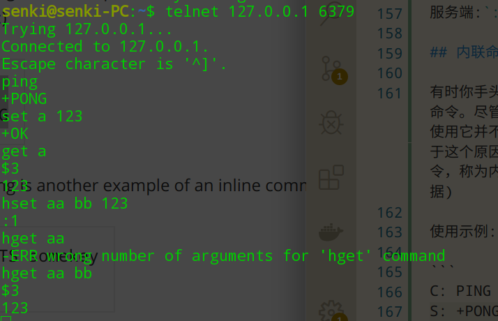

# Redis协议规范

Redis客户端与服务端的通信使用`RESP`(REdis Serialization Protocol)协议。虽然该协议是专门为Redis设计的，但它可以用于其它CS结构的项目。

RESP是以下方面的折衷:

* 实现简单
* 解析快
* 易读

RESP可以序列化不同的类型，如，整数、字符串、数组。还有一种特定类型的错误。请求作为字符串数组从客户端发送到Redis服务器，表示要执行的命令的参数。Redis使用命令特定的数据类型应答。

RESP是二进制安全的，不需要处理从一个进程传输到另一个进程的大容量数据，因为它使用前缀长度来传输大容量数据。

注意：此处概述的协议仅用于客户端-服务短通信。Redis集群使用不同的二进制协议在节点之间交换消息。

## 网络层

客户端创建tcp连接到Redis服务端的6379端口

虽然RESP在技术上不是特定于TCP的，但在Redis的上下文中，该协议仅用于TCP连接(或类似于Unix套接字的面向流的连接)。

## 请求-响应模型

Redis接受不同参数组成的命令，接收到命令后进行处理，并将响应发送回客户端。

有两种特殊情况:

* Redis支持pipelining，所以客户端可以能一次发送多个命令，然后等待响应
* 当客户端订阅了channel，语义发生了变换，变成了一个推送协议

除了这两种情况，Redis协议就是一个简单的请求-响应模型

## RESP协议描述

RESP协议是在Redis 1.2中引入的，在Redis 2.0中成为了与Redis服务器通信的标准方式。Redis客户端需要实现该协议。

RESP是一个序列化协议，支持这些数据类型:简单字符串、错误、整数、批量字符串和数组。

RESP在Redis中用作请求-响应协议的方式如下：

* 客户端将命令作为RESP字符串发送到服务端
* 服务端根据命令实现使用RESP对应类型进行响应。

RESP协议中，数据类型依赖于第一个字节:

* 简单字符串，第一个字节是"+"
* 错误，第一个字节是"-"
* 整数，第一个字节是":"
* 批量字符串，第一个字节是"$"
* 数组，第一个字节是"*"

此外，RESP还可以使用稍后提到的批量字符串或数组的特殊变体来表示空值。

RESP的不同部分，使用"\r\n"进行结尾。

## RESP简单字符串(RESP Simple Strings)

简单字符串由"+"字符和不包含CR或LF的字符串组成。

简单字符串用于以最小的开销传输非二进制安全字符串。如，许多redis命令在成功时仅会返回"OK"。  

`+OK\r\n`

为了发送二进制安全的字符串，需要使用批量字符串。

当Redis用一个简单的字符串应答时，客户端库应该返回给调用者一个字符串，该字符串由“+”后面的字符组成，直到字符串的末尾，不包括最后的CRLF字节。


## RESP错误(RESP Errors)

RESP有一个用于表示错误的类型，和简单字符串很像，仅仅是第一个字符换成了'-'。真正的区别在于，错误会被客户端当做异常，错误类型中的字符串会被当做错误消息。

`-Error message\r\n`

下面是一些代表错误类型响应的示例"

```
-ERR unknown command 'foobar'
-WRONGTYPE Operation against a key holding the wrong kind of value
```
“-”后面的第一个字符到第一个空格或换行之前的字符串，代表返回的错误类型，这仅仅是Redis的约定并不是RESP错误类型格式的一部分。

像上面的例子，ERR代表一个通用错误，WRONGTYPE代表一个特殊的错误，这种方式称为`Error Prefix`。通过这种方式，可以让客户端不依赖额外的信息来理解服务端返回的错误类型。随着时间的推移可能会变换

这种特性不是很有用，应该返回一个通过的错误条件，如false。

## RESP整数(RESP Integers)

格式:`:1000\r\n`，INCR等指令会返回

## RESP大容量字符串(RESP Bulk Strings)

大容量字符串用于表示长度高达512MB的二进制安全字符串。

批量字符串的编码方式如下：

* "$"字符后跟代表字符串长度的数字,\r\n结尾
* 实际字符串
* \r\n

按照规则"foobar"被编码如下:

`$6\r\nfoobar\r\n`

空字符串如下:

`$0\r\n\r\n`

不存在(Null Bulk String)的表示:

`$-1\r\n`

当服务端返回了Null Bulk String,客户端应该返回代表不存在的对象，如 nil,null等根据语言而定，而不是返回空字符串。

RESP数组

格式:

* 第一个字符是"*",紧跟着一个数字代表数组中元素的数量，在后面是\r\n
* 数组中每个RESP类型的元素

空数组表示:

`*0\r\n`

由2个RESP大容量字符串组成的数组:

`*2\r\n$3\r\nfoo\r\n$3\r\nbar\r\n`

混合类型构成的数组:

`*5\r\n:1\r\n:2\r\n:3\r\n:4\r\n$6\r\nfoobar\r\n`

不存在数组(Null Array)

`×-1\r\n`

数组中的元素是2个数组

`*2\r\n*3\r\n:1\r\n:2\r\n:3\r\n*2\r\n+Foo\r\n-Bar\r\n`

数组中包括null值

`*3\r\n$3\r\nfoo\r\n$-1\r\n$3\r\nbar\r\n`

## 发送命令到Redis服务端

现在看下客户端与服务端是如何工作的:

* 客户端发送大容量字符串构成的数组到服务端
* 服务端响应有效的RESP数据类型到客户端

举个例子，客户端发送`LLEN mylist`命令获取列表的长度，服务端响应一个整数:

客户端:`*2\r\n$4\r\nLLEN\r\n$6\r\nmylist\r\n`  
服务端:`:48293\r\n`

## 内联命令

有时你手头只有telnet，你需要向Redis服务器发送一个命令。尽管Redis协议实现起来很简单，但在交互式会话中使用它并不理想，而且redis-cli可能并不总是可用的。出于这个原因，Redis还以一种为人类设计的特殊方式接受命令，称为内联命令格式。

使用示例:



基本上，只需在telnet会话中编写空格分隔的参数，由于请求协议中没有以*开头的命令，Redis能够检测到这种情况并解析命令。