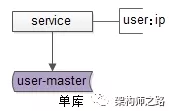
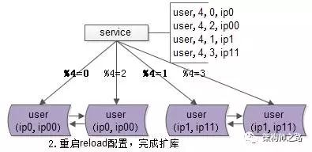

# 亿级数据DB秒级平滑扩容

[原文](https://mp.weixin.qq.com/s?__biz=MjM5ODYxMDA5OQ==&mid=2651962231&idx=1&sn=1b51d042c243f0b3ce0b748ddbcff865&chksm=bd2d0eab8a5a87bdcbe7dd08fb4c969ad76fa0ea00b2c78645db8561fd2a78d813d7b8bef2ac&scene=21#wechat_redirect)

## 一般来说，并发量大，吞吐量大的互联网分层架构是怎么样的？

数据库上层都有一个微服务，服务层记录“业务库”与“数据库实例配置”的映射关系，通过数据库连接池向数据库路由sql语句。

如上图所示，服务层配置用户库user对应的数据库实例ip。
 

## 该分层架构，如何应对数据库的高可用？

数据库高可用，很常见的一种方式，使用双主同步+keepalived+虚ip的方式进行。

如上图所示，两个相互同步的主库使用相同的虚ip。

当主库挂掉的时候，虚ip自动漂移到另一个主库，整个过程对调用方透明，通过这种方式保证数据库的高可用。

## 该分层架构，如何应对数据量的暴增？

随着数据量的增大，数据库要进行水平切分，分库后将数据分布到不同的数据库实例（甚至物理机器）上，以达到降低数据量，增强性能的扩容目的。

如上图所示，用户库user分布在两个实例上，ip0和ip1，服务层通过用户标识uid取模的方式进行寻库路由，模2余0的访问ip0上的user库，模2余1的访问ip1上的user库。 

综上三点所述，大数据量，高可用的互联网微服务分层的架构如下：

既有水平切分，又保证高可用。

## 如果数据量持续增大，2个库性能扛不住了，该怎么办呢？

此时，需要继续水平拆分，拆成更多的库，降低单库数据量，增加库主库实例（机器）数量，提高性能。

新的问题来了，分成n个库后，随着数据量的增加，要增加到2*n个库，数据库如何扩容，数据能否平滑迁移，能够持续对外提供服务，保证服务的可用性？ 

### 停服扩容，是最容易想到的方案？

在讨论秒级平滑扩容方案之前，先简要说明下停服务扩容的方案的步骤：

（1）站点挂一个公告“为了为广大用户提供更好的服务，本站点/游戏将在今晚00:00-2:00之间升级，届时将不能登录，用户周知”； 

（2）微服务停止服务，数据库不再有流量写入；

（3）新建2*n个新库，并做好高可用；

（4）写一个小脚本进行数据迁移，把数据从n个库里select出来，insert到2*n个库里；

（5）修改微服务的数据库路由配置，模n变为模2*n；

（6）微服务重启，连接新库重新对外提供服务；

整个过程中，最耗时的是第四步数据迁移。 

如果出现问题，如何进行回滚？

如果数据迁移失败，或者迁移后测试失败，则将配置改回旧库，恢复服务即可。 

### 停服方案有什么优劣？

优点：简单。

缺点：

（1）需要停止服务，方案不高可用；

（2）技术同学压力大，所有工作要在规定时间内完成，根据经验，压力越大约容易出错；

（3）如果有问题第一时间没检查出来，启动了服务，运行一段时间后再发现有问题，则难以回滚，如果回档会丢失一部分数据；

## 有没有秒级实施、更平滑、更帅气的方案呢？

再次看一眼扩容前的架构，分两个库，假设每个库1亿数据量，如何平滑扩容，增加实例数，降低单库数据量呢？三个简单步骤搞定。 

### 步骤一：修改配置。

主要修改两处：

* 数据库实例所在的机器做双虚ip：

（1）原%2=0的库是虚ip0，现增加一个虚ip00；

（2）原%2=1的库是虚ip1，现增加一个虚ip11；

* 修改服务的配置，将2个库的数据库配置，改为4个库的数据库配置，修改的时候要注意旧库与新库的映射关系：

（1）%2=0的库，会变为%4=0与%4=2；

（2）%2=1的部分，会变为%4=1与%4=3；

画外音：这样能够保证，依然路由到正确的数据。

 

### 步骤二：reload配置，实例扩容。

服务层reload配置，reload可能是这么几种方式：

（a）比较原始的，重启服务，读新的配置文件；

（b）高级一点的，配置中心给服务发信号，重读配置文件，重新初始化数据库连接池；

不管哪种方式，reload之后，数据库的实例扩容就完成了，原来是2个数据库实例提供服务，现在变为4个数据库实例提供服务，这个过程一般可以在秒级完成。

整个过程可以逐步重启，对服务的正确性和可用性完全没有影响：

（a）即使%2寻库和%4寻库同时存在，也不影响数据的正确性，因为此时仍然是双主数据同步的；

（b）即使%4=0与%4=2的寻库落到同一个数据库实例上，也不影响数据的正确性，因为此时仍然是双主数据同步的；

 

完成了实例的扩展，会发现每个数据库的数据量依然没有下降，所以第三个步骤还要做一些收尾工作。

画外音：这一步，数据库实例个数加倍了。 

### 步骤三：收尾工作，数据收缩。

有这些一些收尾工作：

（a）把双虚ip修改回单虚ip；

（b）解除旧的双主同步，让成对库的数据不再同步增加；

（c）增加新的双主同步，保证高可用；

（d）删除掉冗余数据，例如：ip0里%4=2的数据全部删除，只为%4=0的数据提供服务；

画外音：这一步，数据库单实例数据量减半了。 

## 总结

互联网大数据量，高吞吐量，高可用微服务分层架构，数据库实现秒级平滑扩容的三个步骤为：

（1）修改配置（双虚ip，微服务数据库路由）；

（2）reload配置，实例增倍完成；

（3）删除冗余数据等收尾工作，数据量减半完成