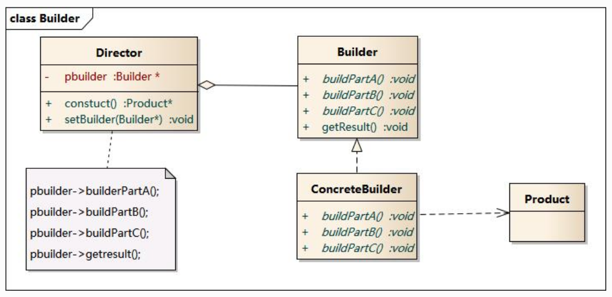

## 建造者模式(Builder)

同一个对象通过不同的或不同顺序的组装方式生成不同的实例

建造者模式包含如下角色：

* Builder：抽象建造者，罗列出不同的建造方法
* ConcreteBuilder：具体建造者
* Director：指挥者,确定使用哪个builder和以怎样的顺序使用builder中的方法
* Product：产品角色




建造者模式有一种常用的简化形式，将Direct与builder融合进入具体的Product中，外部调用Product中不同的build方法来构造对象的实例。

```java
public class Computer { 
    private String cpu; 
    private String screen; 
    private String memory;   
    public Computer(String cpu, String screen, String memory) { 
        this.cpu = cpu; 
        this.screen = screen; 
        this.memory = memory;      
    } 

    public static final class Builder { 
        private String cpu; 
        private String screen; 
        private String memory;      
    
    public Builder cpu(String val) { 
        cpu = val; 
        return this; 
    } 
    public Builder screen(String val) { 
        screen = val; 
        return this; 
    } 
    public Builder memory(String val) { 
        memory = val; 
        return this; 
    }    
    public Computer build() {
        return new  Computer(this.cpu,this.screen,this.memory);} 
    } 
}  
```
