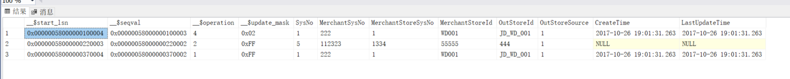

## 开启cdc

```sql
use 目标数据库

-- 数据库启用cdc功能
exec sys.sp_cdc_enable_db;

-- 对指定表开启cdc，还有很多其它参数参见官方文档
exec sys.sp_cdc_enable_table @source_schema = N'dbo', @source_name = N'Store_Mapping', @role_name = NULL;

-- 查看启用cdc功能的数据库
select * from sys.databases where is_cdc_enabled = 1

-- 查看表是否启用cdc功能
select name, is_tracked_by_cdc from sys.tables where object_id = OBJECT_ID('dbo.Store_Mapping') 
```

## 查看数据变换

```sql
-- 查看一段时间内的变换
DECLARE @from_lsn BINARY(10),@end_lsn BINARY(10)  
DECLARE @start_time DATETIME = '2020-4-10 00:00:00' 
DECLARE @end_time DATETIME ='2020-4-29 00:00:00' 
SELECT @from_lsn=sys.fn_cdc_map_time_to_lsn('smallest greater than',@start_time)  
SELECT @end_lsn=sys.fn_cdc_map_time_to_lsn('largest less than or equal',@end_time)  
SELECT * FROM cdc.fn_cdc_get_all_changes_dbo_Store_Mapping(@from_lsn,@end_lsn,'all') 
```



__$start_lsn:日志序列号(LSN),数据变化时间

__$operation:操作类型

* 1 删除的数据
* 2 新增的数据
* 3 更新前的数据
* 4 更新后的数据

fn_cdc_get_all_changes_:查询所有变换，还有其它方法可以参见官方文档