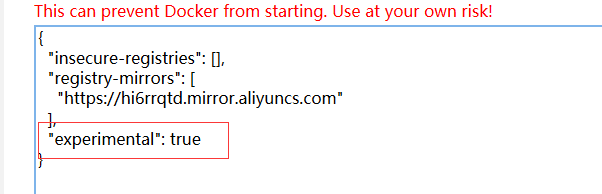
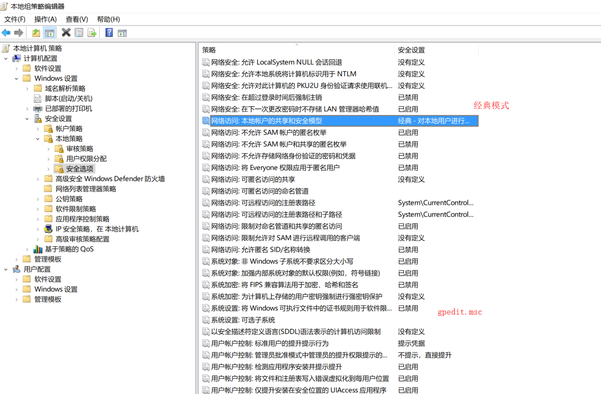

1.执行docker pull时

>no matching manifest for unknown in the manifest list entrie

2.无法共享磁盘

使用gpedit.msc命令修改，如图

3.端口映射时报错  重启解决

>Error starting userland proxy: mkdir /port/tcp:0.0.0.0:22:tcp:172.17.0.2:22: input/output error.

