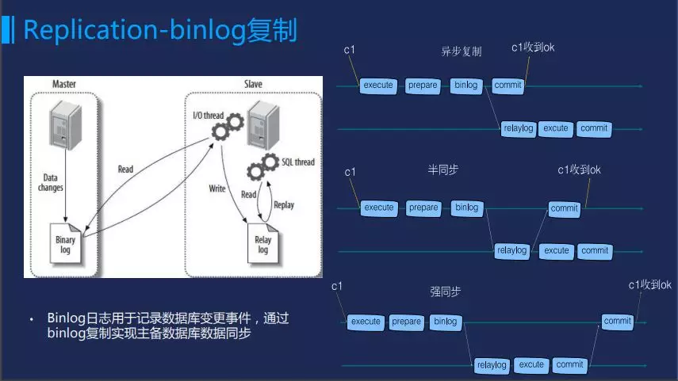

Master通过dump线程将binlog落盘，在Slave上会有两个线程，分别是IO线程和SQL线程。IO线程接受来自Master的binlog并落地形成Relaylog，SQL线程并行读取relaylog中的sql信息，执行回放动作。

一般来说， 复制分三种：异步复制、半同步、强同步。这三者的区别在于何时将sql执行的结果反馈给客户端。异步复制，Master不管Slave，Master执行sql完毕后立即返回给客户端，这种方式性能最好，但是存在数据不一致的可能；强同步呢，Master完全关心Slave，等待Slave将relaylog回放后才返回给客户端，这种方式能够保证数据强一致，但是其性能有一定损耗；半同步则是Master部分关心Slave，认为只要binlog传输到Slave侧，落为relaylog后，即可以返回给客户端了。半同步是一种兼顾的实现，一方面保证数据一致性，另一方面兼顾了数据库的性能。

 https://www.jianshu.com/p/a7c7d5c42417