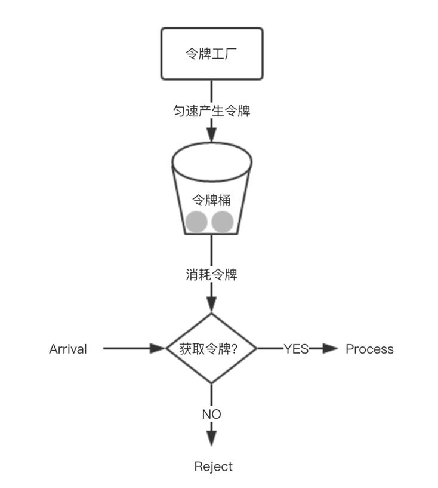

## 单机限流

漏桶算法

请求堆积在桶中，如果桶满了则拒绝服务，以固定的速度从桶中取出请求进行处理。可用于流量整形(traffic shaping)，将突发的流量以均匀的速度向后传递

令牌桶算法

以一定的速度发放令牌到桶中，如果桶中的令牌满了则会丢弃令牌。请求从桶中申请令牌，如果获取到了令牌则放行，否则拒绝。

漏桶算法与令牌桶算法的区别在于，漏桶算法能够强行限制数据的传输速率，令牌桶算法能够在限制数据的平均传输速率的同时还允许某种程度的突发传输(桶中积累的令牌)。

由于每秒生成的令牌是固定的，所以可以通过距离上次生成token的时间，计算出过去的这段时间生成了多少token