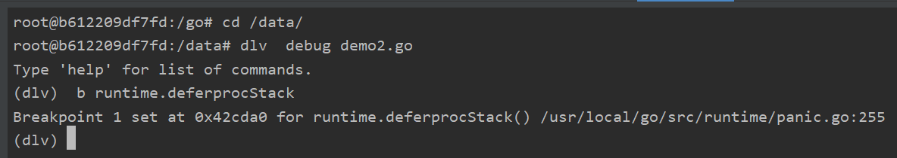

首先我们先通过下面这段代码来看下defer汇编后的大概形式，下面的汇编代码只保留了关键部分。

    func main() {
        defer func() {
            fmt.Println(123)
        }()
    }

    go tool compile -N -S -l demo.go

    0x001d 00029 (demo2.go:6)	MOVL	$0, ""..autotmp_1+8(SP)
	0x0025 00037 (demo2.go:6)	PCDATA	$0, $1
	//defer定义的方法
	0x0025 00037 (demo2.go:6)	LEAQ	"".main.func1·f(SB), AX
	0x002c 00044 (demo2.go:6)	PCDATA	$0, $0
	0x002c 00044 (demo2.go:6)	MOVQ	AX, ""..autotmp_1+32(SP)
	0x0031 00049 (demo2.go:6)	PCDATA	$0, $1
	0x0031 00049 (demo2.go:6)	LEAQ	""..autotmp_1+8(SP), AX
	0x0036 00054 (demo2.go:6)	PCDATA	$0, $0
	0x0036 00054 (demo2.go:6)	MOVQ	AX, (SP)
	//将定义的defer方法压入到栈上
	0x003a 00058 (demo2.go:6)	CALL	runtime.deferprocStack(SB)
	//判断返回值 0跳转到85，非0跳转到69
	0x003f 00063 (demo2.go:6)	TESTL	AX, AX
	0x0041 00065 (demo2.go:6)	JNE	85
	0x0043 00067 (demo2.go:6)	JMP	69
	0x0045 00069 (demo2.go:9)	XCHGL	AX, AX
	//执行定义的defer方法
	0x0046 00070 (demo2.go:9)	CALL	runtime.deferreturn(SB)
	0x004b 00075 (demo2.go:9)	MOVQ	64(SP), BP
	0x0050 00080 (demo2.go:9)	ADDQ	$72, SP
	0x0054 00084 (demo2.go:9)	RET
	0x0055 00085 (demo2.go:6)	XCHGL	AX, AX
	0x0056 00086 (demo2.go:6)	CALL	runtime.deferreturn(SB)
	0x005b 00091 (demo2.go:6)	MOVQ	64(SP), BP
	0x0060 00096 (demo2.go:6)	ADDQ	$72, SP
	0x0064 00100 (demo2.go:6)	RET
	0x0065 00101 (demo2.go:6)	NOP
	0x0065 00101 (demo2.go:5)	PCDATA	$1, $-1
	0x0065 00101 (demo2.go:5)	PCDATA	$0, $-1
	0x0065 00101 (demo2.go:5)	CALL	runtime.morestack_noctxt(SB)

  
  通过上边的汇编可以看到，关键部分是 **runtime.deferprocStack**与**runtime.deferreturn**,我们也发现runtime.deferreturn出现了多次(根据不用的返回值跳转到不用的位置),下面我们来具体来看下每个方法的实现。

  defer的源码在runtime/panic.go中(通过dlv调试,下断点b runtime.deferprocStack就可以找到)

 

 编译时逃逸分析后决定是分配在堆上还是栈上,详细信息可以参考[git修改记录](https://github.com/golang/go/commit/fff4f599fe1c21e411a99de5c9b3777d06ce0ce6)

 ## runtime.deferprocStack ## 

  defer分配在栈上  

    
    // 将新的defer加入LIFO队列    
    //go:nosplit
    func deferprocStack(d *_defer) {
        gp := getg()
        if gp.m.curg != gp {
            // go code on the system stack can't defer
            throw("defer on system stack")
        }
        // siz and fn are already set.
        // The other fields are junk on entry to deferprocStack and
        // are initialized here.
        d.started = false
        d.heap = false
        d.sp = getcallersp()
        d.pc = getcallerpc()

        //构建链表，当前g上保存defer
        *(*uintptr)(unsafe.Pointer(&d._panic)) = 0
        *(*uintptr)(unsafe.Pointer(&d.link)) = uintptr(unsafe.Pointer(gp._defer))
        *(*uintptr)(unsafe.Pointer(&gp._defer)) = uintptr(unsafe.Pointer(d))

        //  0x0036 00054 (demo2.go:6)	MOVQ	AX, (SP)
        //	0x003a 00058 (demo2.go:6)	CALL	runtime.deferprocStack(SB)
        //	0x003f 00063 (demo2.go:6)	TESTL	AX, AX
        //	0x0041 00065 (demo2.go:6)	JNE	85
        //	0x0043 00067 (demo2.go:6)	JMP	69
        //	0x0045 00069 (demo2.go:9)	XCHGL	AX, AX
        //	0x0046 00070 (demo2.go:9)	CALL	runtime.deferreturn(SB)
        //	0x004b 00075 (demo2.go:9)	MOVQ	64(SP), BP
        //	0x0050 00080 (demo2.go:9)	ADDQ	$72, SP
        //	0x0054 00084 (demo2.go:9)	RET
        //	0x0055 00085 (demo2.go:6)	XCHGL	AX, AX
        //	0x0056 00086 (demo2.go:6)	CALL	runtime.deferreturn(SB)
        //	0x005b 00091 (demo2.go:6)	MOVQ	64(SP), BP
        //	0x0060 00096 (demo2.go:6)	ADDQ	$72, SP
        //	0x0064 00100 (demo2.go:6)	RET
        //	0x0065 00101 (demo2.go:6)	NOP

        //隐式返回0  编译器生产的代码会插入判断，当程序发生 panic 之后会返回非0
        return0()
        // No code can go here - the C return register has
        // been set and must not be clobbered.
    }

     //runtime/runtime2.go
    // defer数据结构 结构需要与编译器中的对应结构一致    
    type _defer struct {
        //函数的参数总大小包括返回值
        siz     int32 // includes both arguments and results
        //是否已经执行
        started bool
        //defer分配在堆上还是栈上
        heap    bool
        // 存储调用 defer 函数的函数的 sp 寄存器值
        sp      uintptr // sp at time of defer
        //存储 call deferproc 的下一条汇编指令的指令地址
        pc      uintptr
        //指向需要执行的匿名函数
        fn      *funcval
        //panic信息
        _panic  *_panic // panic that is running defer
        //下一个需要执行的defer
        link    *_defer
    }

## runtime.deferproc ##

defer分配在堆上
 
    //go:nosplit
    func deferproc(siz int32, fn *funcval) { // arguments of fn follow fn
        if getg().m.curg != getg() {
            // go code on the system stack can't defer
            throw("defer on system stack")
        }     
        sp := getcallersp()
        argp := uintptr(unsafe.Pointer(&fn)) + unsafe.Sizeof(fn)
        callerpc := getcallerpc()

        //创建defer
        d := newdefer(siz)
        if d._panic != nil {
            throw("deferproc: d.panic != nil after newdefer")
        }
        d.fn = fn
        d.pc = callerpc
        d.sp = sp
        switch siz {
        case 0:
            // Do nothing.
        case sys.PtrSize:
            *(*uintptr)(deferArgs(d)) = *(*uintptr)(unsafe.Pointer(argp))
        default:
            memmove(deferArgs(d), unsafe.Pointer(argp), uintptr(siz))
        }
        
        // deferproc returns 0 normally.
        // a deferred func that stops a panic
        // makes the deferproc return 1.
        // the code the compiler generates always
        // checks the return value and jumps to the
        // end of the function if deferproc returns != 0.
        return0()
        // No code can go here - the C return register has
        // been set and must not be clobbered.
    }

    //创建一个defer
    func newdefer(siz int32) *_defer {
	var d *_defer
	sc := deferclass(uintptr(siz))
	gp := getg()
	//deferpool    [5][]*_defer
	//如果参数大小<5使用缓存
	if sc < uintptr(len(p{}.deferpool)) {
		pp := gp.m.p.ptr()
		//如果P上没有deferpool缓存，则从全局sched.deferpool转移一部分到P上
		if len(pp.deferpool[sc]) == 0 && sched.deferpool[sc] != nil {
			// Take the slow path on the system stack so
			// we don't grow newdefer's stack.
			systemstack(func() {
				lock(&sched.deferlock)
				//最多转移一半
				for len(pp.deferpool[sc]) < cap(pp.deferpool[sc])/2 && sched.deferpool[sc] != nil {
					d := sched.deferpool[sc]
					sched.deferpool[sc] = d.link
					d.link = nil
					pp.deferpool[sc] = append(pp.deferpool[sc], d)
				}
				unlock(&sched.deferlock)
			})
		}
		if n := len(pp.deferpool[sc]); n > 0 {
			d = pp.deferpool[sc][n-1]
			pp.deferpool[sc][n-1] = nil
			pp.deferpool[sc] = pp.deferpool[sc][:n-1]
		}
	}
	//参数大小大于>=5直接分配内存
	if d == nil {
		// Allocate new defer+args.
		systemstack(func() {
			total := roundupsize(totaldefersize(uintptr(siz)))
			d = (*_defer)(mallocgc(total, deferType, true))
		})
		if debugCachedWork {
			// Duplicate the tail below so if there's a
			// crash in checkPut we can tell if d was just
			// allocated or came from the pool.
			d.siz = siz
			d.link = gp._defer
			gp._defer = d
			return d
		}
	}
	d.siz = siz
	//分配在堆上
	d.heap = true
	d.link = gp._defer
	//defer保存到g上
	gp._defer = d
	return d
}

## runtime.deferreturn ##

执行方法

    func deferreturn(arg0 uintptr) {
        gp := getg()
        d := gp._defer
        if d == nil {
            return
        }
        sp := getcallersp()
        if d.sp != sp {
            return
        }

        // Moving arguments around.
        //
        // Everything called after this point must be recursively
        // nosplit because the garbage collector won't know the form
        // of the arguments until the jmpdefer can flip the PC over to
        // fn.
        switch d.siz {
        case 0:
            // Do nothing.
        case sys.PtrSize:
            *(*uintptr)(unsafe.Pointer(&arg0)) = *(*uintptr)(deferArgs(d))
        default:
            memmove(unsafe.Pointer(&arg0), deferArgs(d), uintptr(d.siz))
        }
        fn := d.fn
        d.fn = nil
        gp._defer = d.link
        freedefer(d)
        //通过汇编实现调用fn并循环调用deferreturn直至结束
        jmpdefer(fn, uintptr(unsafe.Pointer(&arg0)))
    }

    // func jmpdefer(fv *funcval, argp uintptr)
    // argp is a caller SP.
    // called from deferreturn.
    // 1. pop the caller
    // 2. sub 5 bytes from the callers return
    // 3. jmp to the argument
    TEXT runtime·jmpdefer(SB), NOSPLIT, $0-16
        MOVQ	fv+0(FP), DX	// fn defer 的函数的地址
        MOVQ	argp+8(FP), BX	// caller sp
        LEAQ	-8(BX), SP	// caller sp after CALL
        MOVQ	-8(SP), BP	// restore BP as if deferreturn returned (harmless if framepointers not in use)
        SUBQ	$5, (SP)	// return to CALL again  call 指令长度为 5，因此通过将 ret addr 减 5，能够使 deferreturn 自动被反复调用
        MOVQ	0(DX), BX
        JMP	BX	// but first run the deferred function  执行函数fn

