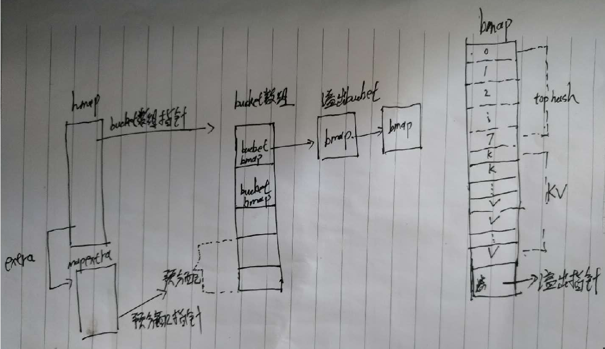

# map源码分析

本文主要看以下几方面的内容：

* map创建与使用的数据结构
* 创建bucket数组
* 赋值操作
* 创建溢出bucket
* 扩容
* bucket迁移
* 删除key
* 遍历

## map创建与使用的数据结构

```go
    // make(map[string]int, 3/*hint*/)
	var m = map[string]int{
		"banana1": 1,
		"banana2": 2,
		"banana3": 3,
	 
	}
	var m2 = make(map[string]int, 9/*hint*/)
```
编译器根据不同的条件使用不同的方式创建hmap:

* makemap_small

* makemap64

* makemap


```go
// hint不大于8时
func makemap_small() *hmap {
	h := new(hmap)
	h.hash0 = fastrand()
	return h
}
 
func makemap64(t *maptype, hint int64, h *hmap) *hmap {
	if int64(int(hint)) != hint {
		hint = 0
	}
	return makemap(t, int(hint), h)
}

// bucket数组是否创建根据情况而定
func makemap(t *maptype, hint int, h *hmap) *hmap {
    // hint*size(bucket)使用的字节 在指针返回内？？
	mem, overflow := math.MulUintptr(uintptr(hint), t.bucket.size)
	if overflow || mem > maxAlloc {
		hint = 0
	}

	// 未在栈上创建hmap结构
	if h == nil {
		h = new(hmap)
	}
	h.hash0 = fastrand()
 
	B := uint8(0)
	// 找到满足扩容条件的最小B值
	// 如果hit<=8||hit<=6.5*2^B 不需要扩容
	for overLoadFactor(hint, B) {
		B++
	}
	// B可能为0
	h.B = B
	
	// 如果B=0则在使用时在创建bucket数组
	if h.B != 0 {
		var nextOverflow *bmap
		h.buckets, nextOverflow = makeBucketArray(t, h.B, nil)
		if nextOverflow != nil {
			h.extra = new(mapextra)
			h.extra.nextOverflow = nextOverflow
		}
	}

	return h
}
```

通过以上方式编译器创建了map结构`hmap`，我们先看下它的结构：
```go
type hmap struct {	
	// map中的key数量
	count     int  
	//标记
	flags     uint8
	// hashtable中bucket数量2^B
	// 负载因子计算 loadFactor * 2^B
	B         uint8 
	// 溢出bucket大概数量
	// B<16时 每次分配溢出bucket都统计
	// B>=16时 不一定统计
	noverflow uint16  
	//hash种子 一个随机数
	hash0     uint32  
    // 指向bucket数组的指针
	buckets    unsafe.Pointer  
	// growing 时保存原buckets的指针
	oldbuckets unsafe.Pointer  
    // growing 时已迁移的个数 迁移进度
    nevacuate  uintptr
    // 保存一些扩展信息        
	extra *mapextra 
}
```
bucket的结构：
```go
type bmap struct {

	// top hash包含该bucket中每个键的hash值的高八位。
	// 如果tophash[0]小于mintophash，则tophash[0]为桶疏散状态
	// hash(key)的前8位
    tophash [bucketCnt]uint8
    
    // 后面是8个key和value 存储格式：k1k2...k8v1v2...v8, 避免了因为cpu要求固定长度读取，字节对齐，造成的空间浪费
    
	// 后边是一个overflow指针,指向当前bucket的溢出bucket	
	
}

```
mapextra
```go
type mapextra struct {	
	// 保存创建的溢出bucket
    overflow    *[]*bmap
    // 扩容时旧的溢出bucket
	oldoverflow *[]*bmap	 
    // 预分配的bucket的指针，
    // 指向创建bucket数组时预先多创建的部分
	nextOverflow *bmap
}
```

## 创建bucket数组

分配bucket时，根据情况的不同，可能会预创建一些bucket备用，减少bucket不足造成频繁创建的问题
```go
func makeBucketArray(t *maptype, b uint8, dirtyalloc unsafe.Pointer) (buckets unsafe.Pointer, nextOverflow *bmap) {
	//2^b
	// 期望的bucket数量
	base := bucketShift(b)
	// 实际创建的bucket数量
	nbuckets := base
	//对于小b，不太可能出现溢出桶。
	//避免计算的开销。
	if b >= 4 {		
		//加上估计的溢出桶数
		//插入元素的中位数
		//与此值b一起使用。
		nbuckets += bucketShift(b - 4)
		sz := t.bucket.size * nbuckets
		up := roundupsize(sz)
		if up != sz {
			nbuckets = up / t.bucket.size
		}
	}

	if dirtyalloc == nil {
		buckets = newarray(t.bucket, int(nbuckets))
	} else {		
		buckets = dirtyalloc
		size := t.bucket.size * nbuckets
		if t.bucket.ptrdata != 0 {
			memclrHasPointers(buckets, size)
		} else {
			memclrNoHeapPointers(buckets, size)
		}
	}

	// 预分配bucket
	if base != nbuckets {
		
		// 预分配bucket的起始位置
		nextOverflow = (*bmap)(add(buckets, base*uintptr(t.bucketsize)))
		// 预分配bucket的结束位置
		last := (*bmap)(add(buckets, (nbuckets-1)*uintptr(t.bucketsize)))
        //  预分配bucket的最后一个bucket的溢出指针指向当前bucket数组，
        // 即预分配的的最后一个bucket的溢出指针不等于null，后边会用到？？？
    
		last.setoverflow(t, (*bmap)(buckets))
	}
	return buckets, nextOverflow
}
```


## 赋值操作

编译器根据不同的类型调用不同的方法，主要有以下几种：

`mapassign_faststr`  
`mapassign_fast64`  
`mapassign_fast64ptr`  
`mapassign_fast32`  
`mapassign_fast32ptr`  
`mapassign`

赋值的大致流程：

* 是否并发写
* 计算key所属的bucket
* 如果当前bucket正在进行扩容，则先先将当前bucket迁移到新bucket
* 遍历bucket中的8个cell,比价tophash和key
* 如果找到key，则覆盖旧值
* 如果未找到，则找一个cell存储新的kv
* 根据条件判断是否需要扩容
* 如果bucket的cell已满，则先创建一个溢出bucket，在进行保存kv

以`mapassign_faststr`为例，具体看下赋值过程：

先计算hash(key)，找到key所属于的bucket,如果并发写直接panic。如果当前bucket正在扩容,则先完成bucket迁移在进行后续操作，则如下

```go
unc mapassign_faststr(t *maptype, h *hmap, s string) unsafe.Pointer {
	if h == nil {
		panic(plainError("assignment to entry in nil map"))
	}
	if raceenabled {
		callerpc := getcallerpc()
		racewritepc(unsafe.Pointer(h), callerpc, funcPC(mapassign_faststr))
	}
	if h.flags&hashWriting != 0 {
		throw("concurrent map writes")
	}
	key := stringStructOf(&s)
	// hash(key)
	hash := t.hasher(noescape(unsafe.Pointer(&s)), uintptr(h.hash0))
	
	h.flags ^= hashWriting

	if h.buckets == nil {
		h.buckets = newobject(t.bucket) // newarray(t.bucket, 1)
    }
again:
	// key所属的bucket
	bucket := hash & bucketMask(h.B)
	if h.growing() {
		growWork_faststr(t, h, bucket) //进行迁移
	}
	// key所属bucket的指针
	b := (*bmap)(unsafe.Pointer(uintptr(h.buckets) + bucket*uintptr(t.bucketsize)))
	top := tophash(hash)

	//保存key的bucket
	var insertb *bmap
	//key保存buccket中的哪个位置
	var inserti uintptr
	var insertk unsafe.Pointer
```
遍历bucket中的8个cell,先使用key的前8个字节进行快速比较，最终在当前bucket或溢出bucket中找到相等key的cell或找到一个空的cell,如下
```go
bucketloop:
	for {
		// 遍历bucket中的8个kv
		for i := uintptr(0); i < bucketCnt; i++ {
			// 比较高8位是否相等，用于快速判断
			if b.tophash[i] != top {
                // 找到一个空的cell备用(初始化或被标记为删除都认为是空),需要遍历所有的cell才能知道是否存在相等的key
				// 如果找不到相等的key，则使用这个cell
				if isEmpty(b.tophash[i]) && insertb == nil {
					insertb = b
					inserti = i
				}

                // emptyRest当前和后边cell中的key已经被删除，无需在遍历
				if b.tophash[i] == emptyRest {
					break bucketloop
				}
				continue
			}
			// 到这里说明在当前bucket找到了高8字节相同的条目了

			// dataOffset=8 hmap中kv偏移位置
			// 2*sys.PtrSize string类型占用的字节
			// bucket中对应项的key位置
			k := (*stringStruct)(add(unsafe.Pointer(b), dataOffset+i*2*sys.PtrSize))
			//高8字节相同的情况下，还要比较是否hash key是否完全一致
			if k.len != key.len {
				continue
			}
			if k.str != key.str && !memequal(k.str, key.str, uintptr(key.len)) {
				continue
			}		
			// 找到对应的key
			inserti = i
			insertb = b
			goto done
		}
		// 下一个溢出bucket位置
		ovf := b.overflow(t)
		if ovf == nil {
			break
		}
		b = ovf
	}


// hash key的高8位
func tophash(hash uintptr) uint8 {
	top := uint8(hash >> (sys.PtrSize*8 - 8))
	// 如果前8位值小于minTopHash
	if top < minTopHash {
		top += minTopHash
	}
	return top
}

 ```   
 
bucket和其溢出bucket遍历完成后，如果加上当前要新增的key满足扩容条件，则先进行扩容，等扩容完成后在重新寻找key的位置，如下

```go
	// 达到最大负载或bucket溢出超过阀值 但是还没开始扩容 则尝试扩容
	if !h.growing() && (overLoadFactor(h.count+1, h.B) || tooManyOverflowBuckets(h.noverflow, h.B)) {
		hashGrow(t, h)  // 扩容
		goto again
    }
```
如果遍历完bucket和bucket的溢出bucket，仍然没找到可以存储key的位置，则说明bucket已满，需要创建一个新的溢出bucket进行存储kv,当前bucket的溢出指针指向新创建的溢出bucket。计算kv存储的位置，map的数量+1，如下

```go

	// key对应的bucket和溢出bucket已满，则创建一个溢出bucet
	if insertb == nil {		
		// 创建一个溢出bucket
		insertb = h.newoverflow(t, b)
		inserti = 0
	}
	insertb.tophash[inserti&(bucketCnt-1)] = top

	insertk = add(unsafe.Pointer(insertb), dataOffset+inserti*2*sys.PtrSize)

	*((*stringStruct)(insertk)) = *key
	h.count++

done:
	// key对应的value保存位置
	// dataOffset:kv偏移位置
	// bucketCnt*2*sys.PtrSize:跳过k的位置
	// inserti*uintptr(t.elemsize):key对应的value位置
	elem := add(unsafe.Pointer(insertb), dataOffset+bucketCnt*2*sys.PtrSize+inserti*uintptr(t.elemsize))
	if h.flags&hashWriting == 0 {
		throw("concurrent map writes")
	}
	h.flags &^= hashWriting
	return elem
}
```

## 创建溢出bucket

如果存在预分配的bucket，则先从预分配的bucket中获取一个bucket,反之在创建一个bucket，统计溢出bucket数量，在extra上保存创建的bucket指针

```go
// 创建一个溢出bucket并关联到b上的溢出指针上
func (h *hmap) newoverflow(t *maptype, b *bmap) *bmap {
	var ovf *bmap
	if h.extra != nil && h.extra.nextOverflow != nil {		
		ovf = h.extra.nextOverflow
		// 预分配的bucket的末尾是不为nil的
		if ovf.overflow(t) == nil {		
            // 从预分配bucket中获取一个bucket
			h.extra.nextOverflow = (*bmap)(add(unsafe.Pointer(ovf), uintptr(t.bucketsize)))
		} else {	
            // 预分配的最后一个bucket，清空在创建bucket阶段设置的标记值		
			ovf.setoverflow(t, nil)
			h.extra.nextOverflow = nil
		}
	} else {
		ovf = (*bmap)(newobject(t.bucket))
	}
	// 统计溢出bucket数量
    h.incrnoverflow()
    // extra上记录溢出bucket位置
	if t.bucket.ptrdata == 0 {
		h.createOverflow()
		*h.extra.overflow = append(*h.extra.overflow, ovf)
	}
	b.setoverflow(t, ovf)
	return ovf
}
```

## 扩容过程

扩容条件
* (map中当前数量+1)>8且>6.5*bucket数量
* 溢出桶数量超过阀值2^15 
```go

func overLoadFactor(count int, B uint8) bool {
	return count > bucketCnt && uintptr(count) > loadFactorNum*(bucketShift(B)/loadFactorDen)
}


func tooManyOverflowBuckets(noverflow uint16, B uint8) bool {	 
	if B > 15 {
		B = 15
	}	 
	return noverflow >= uint16(1)<<(B&15)
}
```

判断是达到负载系数还是溢出bucket过多导致的扩容，如果是后者，则不会改变map的容量。
创建新的bucket数组和预分配的bucket用于扩容。这个过程并没有进行实际的kv的迁移，只进行了扩容所需bucket数组的准备操作。

```go
func hashGrow(t *maptype, h *hmap) {    
	bigger := uint8(1)
	if !overLoadFactor(h.count+1, h.B) {
		bigger = 0
		h.flags |= sameSizeGrow
	}
	oldbuckets := h.buckets
	// 创建新的bucket
	// nextOverflow：预分配的bucket
	newbuckets, nextOverflow := makeBucketArray(t, h.B+bigger, nil)  
	flags := h.flags &^ (iterator | oldIterator)
	if h.flags&iterator != 0 {
		flags |= oldIterator
	}	
	h.B += bigger
	h.flags = flags
	h.oldbuckets = oldbuckets
    h.buckets = newbuckets
    // 迁移的bucket数量
    h.nevacuate = 0
    // 溢出桶数量
	h.noverflow = 0

    // 保存旧的预分配bucket
	if h.extra != nil && h.extra.overflow != nil {	
		if h.extra.oldoverflow != nil {
			throw("oldoverflow is not nil")
		}
		h.extra.oldoverflow = h.extra.overflow
		h.extra.overflow = nil
    }
     // 保存新的预分配bucket
	if nextOverflow != nil {
		if h.extra == nil {
			h.extra = new(mapextra)
		}
		h.extra.nextOverflow = nextOverflow
	} 
}
```

##  bucket迁移

将属于当前bucket的kv从旧的bucket中迁移过来,完成后如果扩容过程还在进行，则在多迁移一个bucket

```go
func growWork_faststr(t *maptype, h *hmap, bucket uintptr) {
	
	evacuate_faststr(t, h, bucket&h.oldbucketmask())
	 
	if h.growing() {
		evacuate_faststr(t, h, h.nevacuate)
	}
}
```

在bucket数组扩容一倍后，旧的bucket中的key，会分裂成两部分，对应迁移到不同的bucket中，其中一部分key迁移到新的buket数组后，其所属的bucket序号不变(和在旧的bucket中的序号一致)，另一部分key迁移到了新的buket数组后，序号发生了变换。

旧的bucket和其溢出bucket迁移完成后，如果没有协程在使用旧bucket，就把旧bucket的kv和溢出指针清除掉，帮助gc，只保留bucket的top hash部分用于指示迁移状态。

满足被迁移的bucket序号等于迁移进度的条件，则更新迁移进度。根据这个条件基本上都是由于多进行一次迁移时触发的，因为第二次迁移时使用的bucket序号就是迁移进度。

```go
// 迁移bucket
func evacuate_faststr(t *maptype, h *hmap, oldbucket uintptr) {
	// key在旧的bucket数组中位置
	b := (*bmap)(add(h.oldbuckets, oldbucket*uintptr(t.bucketsize)))
	// 旧的bucket大小
	newbit := h.noldbuckets()
	//  bucket是否已经被迁移
	if !evacuated(b) {		
		// x用于bucket序号没有变的迁移
		// y用于bucket序号发生变化的迁移
		// 扩容2倍后，bucket中的key会被分裂2个新的bucket中
		var xy [2]evacDst
		x := &xy[0]
		// 旧的bucket迁移到新的bucket时 所在位置的指针
		x.b = (*bmap)(add(h.buckets, oldbucket*uintptr(t.bucketsize)))
		x.k = add(unsafe.Pointer(x.b), dataOffset)
		x.e = add(x.k, bucketCnt*2*sys.PtrSize)

		// 是否等量扩容
		if !h.sameSizeGrow() {		
			y := &xy[1]
			// 容量变化 需要重新计算搬迁到的新bucket位置
			y.b = (*bmap)(add(h.buckets, (oldbucket+newbit)*uintptr(t.bucketsize)))
			y.k = add(unsafe.Pointer(y.b), dataOffset)
			y.e = add(y.k, bucketCnt*2*sys.PtrSize)
		}

		// 遍历旧的bucket和它后边的溢出bucket
		for ; b != nil; b = b.overflow(t) {
			// 旧的bucket中的key
			k := add(unsafe.Pointer(b), dataOffset)
			// 旧的bucket中的value
			e := add(k, bucketCnt*2*sys.PtrSize)
			for i := 0; i < bucketCnt; i, k, e = i+1, add(k, 2*sys.PtrSize), add(e, uintptr(t.elemsize)) {
				top := b.tophash[i]
				//
				if isEmpty(top) {
					b.tophash[i] = evacuatedEmpty
					continue
				}
				if top < minTopHash {
					throw("bad map state")
				}
				var useY uint8
				if !h.sameSizeGrow() {				
					hash := t.hasher(k, uintptr(h.hash0))
					// 判断key的在新旧bucket中的序号是否改变，从而分流到不同的迁移位置
					if hash&newbit != 0 {
						useY = 1
					}
				}
                // 标记key的去向，迁移到新bucket的哪个部分
				b.tophash[i] = evacuatedX + useY // evacuatedX + 1 == evacuatedY, enforced in makemap
				// 迁移到的新bucket
				dst := &xy[useY]                 // evacuation destination

				// bucket已满 则新建一个溢出bucket
				if dst.i == bucketCnt {
					dst.b = h.newoverflow(t, dst.b)
					dst.i = 0
					dst.k = add(unsafe.Pointer(dst.b), dataOffset)
					dst.e = add(dst.k, bucketCnt*2*sys.PtrSize)
				}
				dst.b.tophash[dst.i&(bucketCnt-1)] = top 
				// Copy key.
				*(*string)(dst.k) = *(*string)(k)
                // 复制value到新的bucket
				typedmemmove(t.elem, dst.e, e)
				// 迁移数量+1
				dst.i++
				// 下一个key位置
				dst.k = add(dst.k, 2*sys.PtrSize)
				// 下一个value位置
				dst.e = add(dst.e, uintptr(t.elemsize))
			}
		}	
		// 旧的bucket迁移完成，如果没有协程在使用旧bucket，就把旧bucket清除掉，帮助gc
		if h.flags&oldIterator == 0 && t.bucket.ptrdata != 0 {
			b := add(h.oldbuckets, oldbucket*uintptr(t.bucketsize))
			// Preserve b.tophash because the evacuation
			// state is maintained there.
			//kv位置
			ptr := add(b, dataOffset)
			//kv部分所占字节
			n := uintptr(t.bucketsize) - dataOffset
			// 只清除bucket 的 key,value 部分，保留 top hash 部分，指示搬迁状态
			memclrHasPointers(ptr, n)
		}
	}

	// 如果此次搬迁的bucket等于当前进度
	// evacuate_faststr(t, h, h.nevacuate)触发	
	if oldbucket == h.nevacuate {
		advanceEvacuationMark(h, t, newbit)
	}
}
```

更新迁移的进度,当旧的bucket数组迁移完成后，清空数据

```go
// 更新迁移进度
// newbit：旧bucket数组大小
func advanceEvacuationMark(h *hmap, t *maptype, newbit uintptr) {
	// 迁移进度+1
	h.nevacuate++	 
	// 尝试看看后边的1024个bucket是否迁移完毕
	stop := h.nevacuate + 1024
	if stop > newbit {
		stop = newbit
	}

	// 遍历bucket 判断是否被迁移
	for h.nevacuate != stop && bucketEvacuated(t, h, h.nevacuate) {
		h.nevacuate++
	}
	// h.nevacuate 之前的 bucket 都被搬迁完毕

    //所有的bucket搬迁完毕
	if h.nevacuate == newbit {  	 
		h.oldbuckets = nil	 
		if h.extra != nil {
			h.extra.oldoverflow = nil
		}
		h.flags &^= sameSizeGrow
	}
}
```

## 删除key

key并没有被删除，只是进行了删除标记，后边就可以直接使用被删除key所在的cell了。

删除的大致过程如下：

* 找到key所属的bucket
* 如果map在扩容，则迁移找到的bucket
* 遍历bucket及其溢出bucket,找到key所处的cell
* 清空kv，并对当前cell的对应位置的top hash进行删除标记emptyOne 
* 删除的key位于最后一个cell处，如果当前bucket无溢出bucket或后边的已经被标记emptyRest，则从后往前进行emptyRest标记直到遇到未删除的key
* 如果key所属cell的下一个cell被标记了emptyRest,也会从后往前进行标记

emptyOne：标记当前cell被删除,后边可以使用了

emptyRest：标记当前cell和其它的cell(包括溢出bucket中的)都已经被删除，通过这个标记，在查找key时，就可以知道不用在向后边遍历了。

```go
func mapdelete_faststr(t *maptype, h *hmap, ky string) {
	if raceenabled && h != nil {
		callerpc := getcallerpc()
		racewritepc(unsafe.Pointer(h), callerpc, funcPC(mapdelete_faststr))
	}
	if h == nil || h.count == 0 {
		return
	}
	if h.flags&hashWriting != 0 {
		throw("concurrent map writes")
	}

	key := stringStructOf(&ky)
	hash := t.hasher(noescape(unsafe.Pointer(&ky)), uintptr(h.hash0))
	
	h.flags ^= hashWriting

	bucket := hash & bucketMask(h.B)
	if h.growing() {
		// 先进行迁移
		growWork_faststr(t, h, bucket)
	}
	b := (*bmap)(add(h.buckets, bucket*uintptr(t.bucketsize)))
	bOrig := b
	top := tophash(hash)
search:
	for ; b != nil; b = b.overflow(t) {
		for i, kptr := uintptr(0), b.keys(); i < bucketCnt; i, kptr = i+1, add(kptr, 2*sys.PtrSize) {
			k := (*stringStruct)(kptr)
			if k.len != key.len || b.tophash[i] != top {
				continue
			}
			if k.str != key.str && !memequal(k.str, key.str, uintptr(key.len)) {
				continue
			}
			// 清空k
			k.str = nil
			e := add(unsafe.Pointer(b), dataOffset+bucketCnt*2*sys.PtrSize+i*uintptr(t.elemsize))
			// 清空v
			if t.elem.ptrdata != 0 {
				memclrHasPointers(e, t.elem.size)
			} else {
				memclrNoHeapPointers(e, t.elem.size)
			}
			// 标记
			b.tophash[i] = emptyOne
		
			if i == bucketCnt-1 {
				if b.overflow(t) != nil && b.overflow(t).tophash[0] != emptyRest {
					goto notLast
				}
			} else {
				if b.tophash[i+1] != emptyRest {
					goto notLast
				}
			}
			// 到这里说明 bucket i处和其后边的所有cell和溢出bucket中的key都已经被标记删除
			// 从当前bucket的i处向前遍历直到遇到未被删除的key，这些被遍历的位置都可以标记为emptyRest(当前位置已经被删除且其后边也被删除了)
			for {
				b.tophash[i] = emptyRest
				if i == 0 {
					if b == bOrig {
						break 
					}					
					c := b
					// 找到当前bucket的前一个bucket
					for b = bOrig; b.overflow(t) != c; b = b.overflow(t) {
					}
					i = bucketCnt - 1
				} else {
					i--
				}
				if b.tophash[i] != emptyOne {
					break
				}
			}
		notLast:
			h.count--
			break search
		}
	}

	if h.flags&hashWriting == 0 {
		throw("concurrent map writes")
	}
	h.flags &^= hashWriting
}
```

## 遍历

遍历map时,需要借助`hiter`数据结构来保存一些需要的信息，具体如下:

```go
// 迭代器结构
type hiter struct {
	// key
	key         unsafe.Pointer 
	// value
	elem      
	// map类型
	t           *maptype
	// map对象指针
	h           *hmap
	// bucket数组
	buckets     unsafe.Pointer
	// 当前遍历到的bucket
	bptr        *bmap       
	overflow    *[]*bmap 
	oldoverflow *[]*bmap       
	// 指向遍历开始的bucket
	startBucket uintptr         
	// bucket中开始遍历的位置
	offset      uint8      
	// bucket遍历到了末尾了，从头开始遍历
	wrapped     bool         
	//
	B           uint8
	// bucket数组中当前遍历到的位置，相对于起始bucket的位置
	i           uint8
	// 当前遍历到bucket的指针
	bucket      uintptr
	checkBucket uintptr
}

```

遍历时，首先通过`mapiterinit`，随机选择开始的bucket和bucket中的哪个cell开始

```go
func mapiterinit(t *maptype, h *hmap, it *hiter) {
	if raceenabled && h != nil {
		callerpc := getcallerpc()
		racereadpc(unsafe.Pointer(h), callerpc, funcPC(mapiterinit))
	}

	if h == nil || h.count == 0 {
		return
	}

	if unsafe.Sizeof(hiter{})/sys.PtrSize != 12 {
		throw("hash_iter size incorrect")
	}
	it.t = t
	it.h = h
	it.B = h.B
	it.buckets = h.buckets
	if t.bucket.ptrdata == 0 {		
		h.createOverflow()
		it.overflow = h.extra.overflow
		it.oldoverflow = h.extra.oldoverflow
	}

	r := uintptr(fastrand())
	if h.B > 31-bucketCntBits {
		r += uintptr(fastrand()) << 31
	}
	// 随机确定遍历开始的位置
	it.startBucket = r & bucketMask(h.B)
	// 随机确定bucket中开始的位置
	it.offset = uint8(r >> h.B & (bucketCnt - 1))

	it.bucket = it.startBucket
	
	if old := h.flags; old&(iterator|oldIterator) != iterator|oldIterator {
		atomic.Or8(&h.flags, iterator|oldIterator)
	}

	mapiternext(it)
}

```

从随机选择的位置开始遍历，如果遍历时map的扩容还未完成且对应旧的bucket还未迁移完成，需要先去旧的bucket中找到应该迁移到新的bucket中的key，如果key还在迁移则从旧的bucket中访问，如果已经被迁移则从新的bucket中访问。

```go
func mapiternext(it *hiter) {
	h := it.h
	if raceenabled {
		callerpc := getcallerpc()
		racereadpc(unsafe.Pointer(h), callerpc, funcPC(mapiternext))
	}
	if h.flags&hashWriting != 0 {
		throw("concurrent map iteration and map write")
	}
	// map类型
	t := it.t
	// 当前遍历到bucket的指针
	bucket := it.bucket
	// 当前遍历到的bucket
	b := it.bptr
	i := it.i
	// 如果遍历的是旧的bucket则指向对应的新的bucket
	// 旧bucket中的kv会迁移到2个新bucket中
	checkBucket := it.checkBucket

next:
	if b == nil {  //第一次遍历 或 遍历新bucket
		if bucket == it.startBucket && it.wrapped {
			// end of iteration
			it.key = nil
			it.elem = nil
			return
		}
		if h.growing() && it.B == h.B {		

			// 迭代器是在扩容过程中启动的，尚未完成扩容。
			oldbucket := bucket & it.h.oldbucketmask()
			b = (*bmap)(add(h.oldbuckets, oldbucket*uintptr(t.bucketsize)))
			// 旧的bucket是否已被迁移
			if !evacuated(b) {
				checkBucket = bucket
			} else {
				// 迁移完成 直接遍历新的bucket
				b = (*bmap)(add(it.buckets, bucket*uintptr(t.bucketsize)))
				checkBucket = noCheck
			}
		} else {
			// 当前指针指向的bucket
			b = (*bmap)(add(it.buckets, bucket*uintptr(t.bucketsize)))
			checkBucket = noCheck
		}
		// 下一个bucket
		bucket++
		// bucket指针遍历到了数组末尾,重新从头开始
		if bucket == bucketShift(it.B) {
			bucket = 0
			it.wrapped = true
		}
		i = 0
	}
	// 遍历当前bucket中的kv
	for ; i < bucketCnt; i++ {
		// key偏移
		offi := (i + it.offset) & (bucketCnt - 1)
		// 此处单元格空或已经迁移走
		if isEmpty(b.tophash[offi]) || b.tophash[offi] == evacuatedEmpty {
			// TODO: emptyRest is hard to use here, as we start iterating
			// in the middle of a bucket. It's feasible, just tricky.
			continue
		}
		// key
		k := add(unsafe.Pointer(b), dataOffset+uintptr(offi)*uintptr(t.keysize))
		if t.indirectkey() {
			k = *((*unsafe.Pointer)(k))
		}
		//value
		e := add(unsafe.Pointer(b), dataOffset+bucketCnt*uintptr(t.keysize)+uintptr(offi)*uintptr(t.elemsize))
		if checkBucket != noCheck && !h.sameSizeGrow() {		
			if t.reflexivekey() || t.key.equal(k, k) {			
				hash := t.hasher(k, uintptr(h.hash0))
				// 旧bucket中的kv会迁移到2个新的bucket中
				// 此处判断当前旧bucket中的key是否应该迁移到这个新bucket中
				if hash&bucketMask(it.B) != checkBucket {
					continue
				}
			} else {				
				if checkBucket>>(it.B-1) != uintptr(b.tophash[offi]&1) {
					continue
				}
			}
		}
		// 还未被迁移
		if (b.tophash[offi] != evacuatedX && b.tophash[offi] != evacuatedY) ||
			!(t.reflexivekey() || t.key.equal(k, k)) {			
			it.key = k
			if t.indirectelem() {
				e = *((*unsafe.Pointer)(e))
			}
			it.elem = e
		} else {	
			// 从新的bucket访问kv		
			rk, re := mapaccessK(t, h, k)
			if rk == nil {
				continue
			}
			it.key = rk
			it.elem = re
		}
		it.bucket = bucket
		if it.bptr != b { 
			it.bptr = b
		}
		it.i = i + 1
		it.checkBucket = checkBucket
		return
	}
	// 溢出bucket
	b = b.overflow(t)
	i = 0
	goto next
}
```

## 总结

每次创建bucket数组时，都会预分配一些bucket，供创建溢出bucket时直接使用。

每个bucket都是一个bmap结构，每个bucket只能存储8个kv，bmap的前8位存储key的高8位称为top hash，用于快速判断key是否相等，后边是8个k1..k8和v1..v8以及一个溢出指针，top hash还用作标识位，标识key是否被删除、被迁移等状态。

map扩容分为2种：扩容2倍和容量大小不变的扩容，后者主要用于清理被标记删除的key所占的空间;双倍扩容时，旧bucket中的key会分流到不同的2个新bucket中。

当删除末尾bucket中的最后一个key或删除key的下一位被标记了emptyRest,则会从后往前标记被删除的key为emptyRest直到遇到未被删除的key为止。

遍历map时会随机选择一个bucket和bucket中的位置开始，如果遍历时扩容还未完成，那么遍历bucket时需要判断对应旧的bucket是否迁移完成，如果还未迁移完成，则需要去旧的bucket中遍历会迁移到当前bucket中的key,如果key已经被迁移则从新的bucket中获取，否则从旧的bucket中获取。