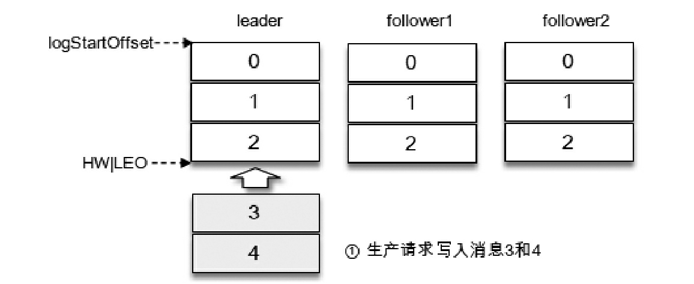
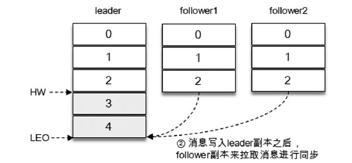
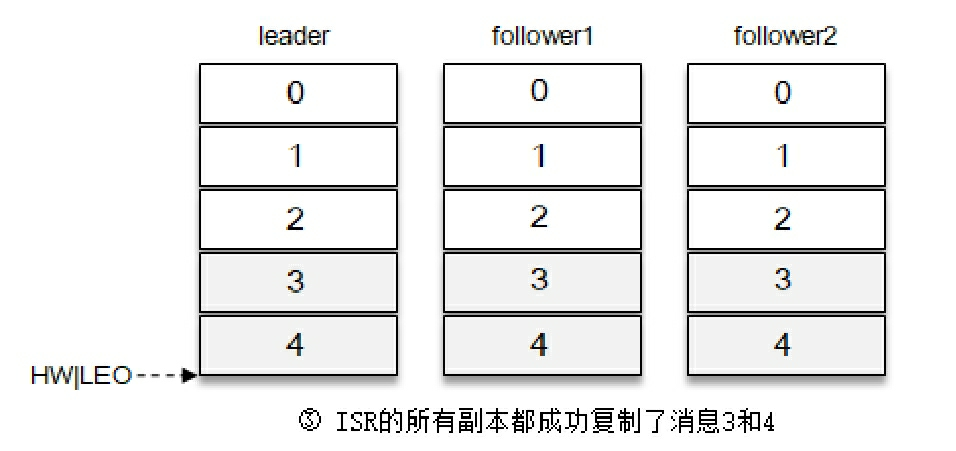
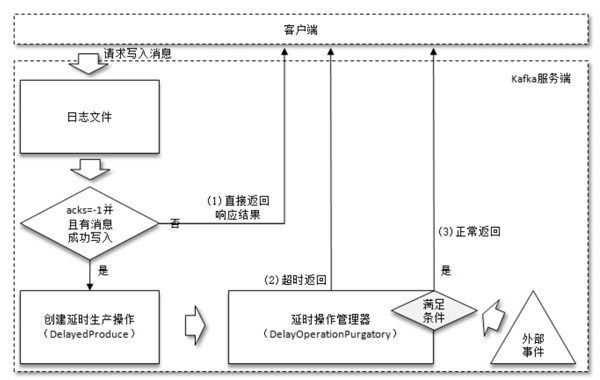
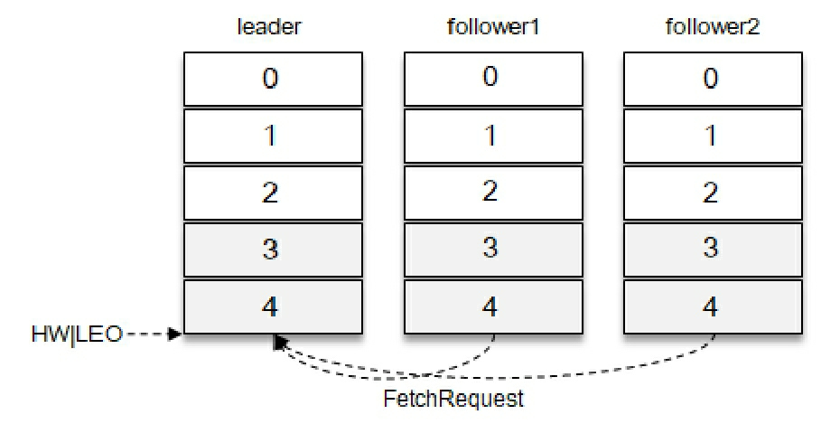

## 延迟操作

假设某个分区有3个副本：leader、follower1和follower2，它们都在分区的ISR集合中。为了简化说明，这里我们不考虑ISR集合伸缩的情况。Kafka在收到客户端的生产请求（ProduceRequest）后，将消息3和消息4写入leader副本的本地日志文件。由于客户端设置了acks为-1，那么需要等到follower1和follower2两个副本都收到消息3和消息4后才能告知客户端正确地接收了所发送的消息。如果在一定的时间内，follower1副本或follower2副本没能够完全拉取到消息3和消息4，那么就需要返回超时异常给客户端。生产请求的超时时间由参数request.timeout.ms配置，默认值为30000，即30s。

那么这里等待消息3和消息4写入follower1副本和follower2副本，并返回相应的响应结果给客户端的动作是由谁来执行的呢？在将消息写入 leader副本的本地日志文件之后，Kafka会创建一个延时的生产操作（DelayedProduce），用来处理消息正常写入所有副本或超时的情况，以返回相应的响应结果给客户端。

在Kafka中有多种延时操作，比如前面提及的延时生产，还有延时拉取（DelayedFetch）、延时数据删除（DelayedDeleteRecords）等。延时操作需要延时返回响应的结果，首先它必须有一个超时时间（delayMs），如果在这个超时时间内没有完成既定的任务，那么就需要强制完成以返回响应结果给客户端。其次，延时操作不同于定时操作，定时操作是指在特定时间之后执行的操作，而延时操作可以在所设定的超时时间之前完成，所以延时操作能够支持外部事件的触发。就延时生产操作而言，它的外部事件是所要写入消息的某个分区的 HW（高水位）发生增长。也就是说，随着follower副本不断地与leader副本进行消息同步，进而促使HW进一步增长，HW 每增长一次都会检测是否能够完成此次延时生产操作，如果可以就执行以此返回响应结果给客户端；如果在超时时间内始终无法完成，则强制执行。

有延时生产就有延时拉取。以图6-13为例，两个follower副本都已经拉取到了leader副本的最新位置，此时又向leader副本发送拉取请求，而leader副本并没有新的消息写入，那么此时leader副本该如何处理呢？可以直接返回空的拉取结果给follower副本，不过在leader副本一直没有新消息写入的情况下，follower副本会一直发送拉取请求，并且总收到空的拉取结果，这样徒耗资源，显然不太合理。

延时拉取Kafka选择了延时操作来处理这种情况。Kafka在处理拉取请求时，会先读取一次日志文件，如果收集不到足够多（fetchMinBytes，由参数fetch.min.bytes配置，默认值为1）的消息，那么就会创建一个延时拉取操作（DelayedFetch）以等待拉取到足够数量的消息。当延时拉取操作执行时，会再读取一次日志文件，然后将拉取结果返回给 follower 副本。延时拉取操作也会有一个专门的延时操作管理器负责管理，大体的脉络与延时生产操作相同，不再赘述。如果拉取进度一直没有追赶上leader副本，那么在拉取leader副本的消息时一般拉取的消息大小都会不小于fetchMinBytes，这样Kafka也就不会创建相应的延时拉取操作，而是立即返回拉取结果。

延时拉取操作同样是由超时触发或外部事件触发而被执行的。超时触发很好理解，就是等到超时时间之后触发第二次读取日志文件的操作。外部事件触发就稍复杂了一些，因为拉取请求不单单由 follower 副本发起，也可以由消费者客户端发起，两种情况所对应的外部事件也是不同的。如果是follower副本的延时拉取，它的外部事件就是消息追加到了leader副本的本地日志文件中；如果是消费者客户端的延时拉取，它的外部事件可以简单地理解为HW的增长。