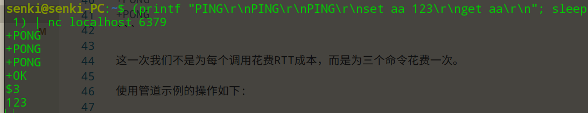

# 使用管道加速redis查询

## 请求/响应协议和RTT

Redis是一个使用client-server模式和请求/响应协议的tcp服务器。

这意味着请求通常通过以下步骤完成:

* client发送查询到server,然后以阻塞的方式从套接字读取服务器响应
* server处理命令并发送响应到clinet

例如，四个命令的顺序如下：

* Client: INCR X
* Server: 1
* Client: INCR X
* Server: 2
* Client: INCR X
* Server: 3
* Client: INCR X
* Server: 4

客户端和服务端通过网络连接，有的连接建立很快有的可能很慢。无论网络延迟是什么，数据包都有一段时间从客户端传输到服务端，然后携带应答从服务端返回到客户端。

这个时间被称为往返时间RTT(Round Trip Time)。当客户端连续发送多个请求时，可以看到这会影响性能。例如，一个RTT时间是250毫秒，服务端每秒可以处理100k的请求，那么每秒我们最多能处理4个请求。

幸运的是，有一种方法可以改进这种情况。

## Redis管道(pipelining)

服务端实现了在客户端还没有读取旧的响应时继续处理新的请求。这样就可以向服务端发送多个命令，而无需等待回复，只需最后一步就读取回复。

这种方式被称为管道或流水线，是一种几十年来广泛使用的技术。

Redis很早之前就支持管道这种方式，所以无论运行什么版本的redis,都能使用。下面是一个使用ntecat发送批量命令的例子:

```shell
~$ (printf "PING\r\nPING\r\nPING\r\nset aa 123\r\nget aa\r\n"; sleep 1) | nc localhost 6379
```


这一次我们不是为每个调用花费RTT成本，而是为三个命令花费一次。

使用管道示例的操作如下:

* Client: INCR X
* Client: INCR X
* Client: INCR X
* Client: INCR X
* Server: 1
* Server: 2
* Server: 3
* Server: 4

**重要提示：**当client使用pipelining发送命令时，服务端将会使用内存对响应进行排队。因此，如果需要使用管道发送大量命令，最好将它们分成合适数量的批次发送，如发送10k个命令，读取响应，在发送10k个命令等等。

### 这不仅仅是RTT的问题

管道不仅仅是为了减少由于往返时间而造成的延迟成本，它实际上大大提高了在给定的Redis服务器上每秒可以执行的总操作数。这是因为，如果不使用管道，从访问数据结构和生成应答的角度来看，为每个命令提供服务是非常廉价的，但是从socket I/O角度来看，代价是非常昂贵的。这包括调用read()和write()系统调用，这意味着从用户区转到内核区，上下文的切换是一个巨大的速度惩罚。  

当使用了管道，通过一次read()系统调用读取多个命令，并通过一次write()系统调用输出响应。

## 管道和脚本

使用Redis脚本(在Redis2.6或更高版本中可用)可以在在服务端执行大量工作所需的脚本,更有效地处理一些用于管道的用例。脚本的一大优势是它能够以最小的延迟同时读取和写入数据，使读、计算、写等操作非常快(在这种情况下，管道无法提供帮助，因为客户端在调用write命令之前需要read命令的应答)

## 附录：为什么在回环接口上繁忙的循环也很慢？

即使本文中介绍了所有的背景知识，您仍然可能想知道，当服务器和客户端在同一台物理机上运行时，为什么在环回接口中执行的Redis基准测试（伪代码）会很慢：
```
FOR-ONE-SECOND:
    Redis.SET("foo","bar")
END
```
如果Redis进程和基准测试都在同一个台机器上运行,难道不是仅仅将消息通过内存从一个地方复制到另一个地方，而不涉及任何实际的延迟和实际的网络吗？

原因是系统中的进程并不总是在运行，实际上是内核调度器让进程运行，所以发生的情况是，例如，基准测试被允许运行，从Redis服务器读取应答，并写入一个新的命令。该命令现在位于回环接口缓冲区中，但是为了让redis服务器读取，内核要调度服务器进程（当前在系统调用中被阻止）运行，以此类推。因此，由于内核调度器的工作方式，回环接口仍然涉及类似网络的延迟。
