# 100亿数据，非“双倍”扩容，如何不影响服务，数据平滑迁移？

[原文](https://mp.weixin.qq.com/s?__biz=MjM5ODYxMDA5OQ==&mid=2651962270&idx=1&sn=3131888f29d0d137d02703a6dc91fa56&chksm=bd2d0e428a5a87547dfc6a0a292a7746ad50b74a078e29b4b8024633fa42db6ccc5f47435063&token=1329107604&lang=zh_CN#rd)

## 适用什么场景？

互联网有很多“数据量较大，并发量较大，业务复杂度较高”的业务场景，其典型系统分层架构如下：

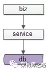

（1）上游是业务层biz，实现个性化的业务逻辑；

（2）中游是服务层service，封装数据访问；

（3）下游是数据层db，存储固化的业务数据； 

服务化分层架构的好处是，服务层屏蔽下游数据层的复杂性，例如缓存、分库分表、存储引擎等存储细节不需要向调用方暴露，而只向上游提供方便的RPC访问接口，当有一些数据层变化的时候，所有的调用方也不需要升级，只需要服务层升级即可。 

互联网架构，很多时候面临着这样一些需求：

（1）底层表结构变更：数据量非常大的情况下，数据表增加了一些属性，删除了一些属性，修改了一些属性。

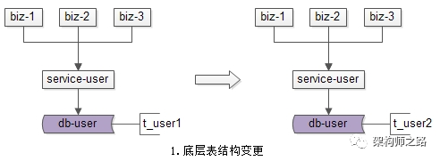

（2）分库个数变化：由于数据量的持续增加，底层分库个数非成倍增加。

 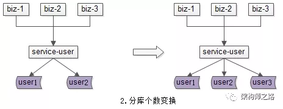

（3）底层存储介质变化：底层存储引擎由一个数据库换为另一个数据库。

  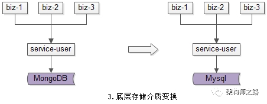

种种需求，都需要进行数据迁移，如何平滑迁移数据，迁移过程不停机，保证系统持续服务，是文本将要讨论的问题。
 
## 方案二：追日志方案

追日志方案，是一个高可用的平滑迁移方案，这个方案主要分为五个步骤。

  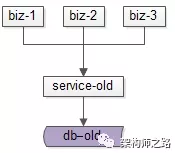

数据迁移前，上游业务应用通过旧的服务访问旧的数据。

   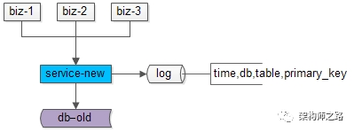

步骤一：服务进行升级，记录“对旧库上的数据修改”的日志（这里的修改，为数据的insert, delete, update），这个日志不需要记录详细数据，主要记录：

（1）被修改的库；

（2）被修改的表；

（3）被修改的唯一主键；

具体新增了什么行，修改后的数据格式是什么，不需要详细记录。这样的好处是，不管业务细节如何变化，日志的格式是固定的，这样能保证方案的通用性。

 

这个服务升级风险较小：

（1）写接口是少数接口，改动点较少；

（2）升级只是增加了一些日志，对业务功能没有任何影响；
 
  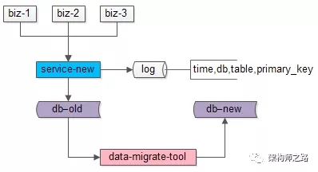

步骤二：研发一个数据迁移工具，进行数据迁移。这个数据迁移工具和离线迁移工具一样，把旧库中的数据转移到新库中来。 

这个小工具的风险较小：

（1）整个过程依然是旧库对线上提供服务；

（2）小工具的复杂度较低；

（3）任何时间发现问题，都可以把新库中的数据干掉重来；

（4）可以限速慢慢迁移，技术同学没有时间压力；

### 数据迁移完成之后，就能够切到新库提供服务了么？

答案是否定的，在数据迁移的过程中，旧库依然对线上提供着服务，库中的数据随时可能变化，这个变化并没有反映到新库中来，于是旧库和新库的数据并不一致，所以不能直接切库，需要将数据追平。

 

哪些数据发生了变化呢？

步骤一中日志里记录的，正是变化的数据。
 
   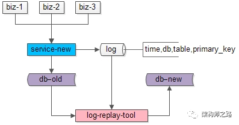

步骤三：研发一个读取日志并迁移数据的小工具，要把步骤二迁移数据过程中产生的差异数据追平。这个小工具需要做的是：

（1）读取日志，得到哪个库、哪个表、哪个主键发生了变化；

（2）把旧库中对应主键的记录读取出来；

（3）把新库中对应主键的记录替换掉；

无论如何，原则是数据以旧库为准。 

这个小工具的风险也很小：

（1）整个过程依然是旧库对线上提供服务；

（2）小工具的复杂度较低；

（3）任何时间发现问题，大不了从步骤二开始重来；

（4）可以限速慢慢重放日志，技术同学没有时间压力； 

### 日志重放之后，就能够切到新库提供服务了么？

答案依然是否定的，在日志重放的过程中，旧库中又可能有数据发生了变化，导致数据不一致，所以还是不能切库，需要进一步读取日志，追平记录。可以看到，重放日志追平数据的程序是一个while(1)的程序，新库与旧库中的数据追平也会是一个“无限逼近”的过程。 

### 什么时候数据会完全一致呢？

   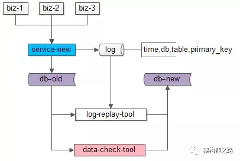

步骤四：在持续重放日志，追平数据的过程中，研发一个数据校验的小工具，将旧库和新库中的数据进行比对，直到数据完全一致。 

这个小工具的风险依旧很小：

（1）整个过程依然是旧库对线上提供服务；

（2）小工具的复杂度较低；

（3）任何时间发现问题，大不了从步骤二开始重来；

（4）可以限速慢慢比对数据，技术同学没有时间压力；

 
  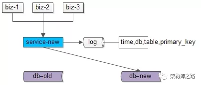

步骤五：在数据比对完全一致之后，将流量迁移到新库，新库提供服务，完成迁移。 

如果步骤四数据一直是99.9%的一致，不能完全一致，也是正常的，可以做一个秒级的旧库readonly，等日志重放程序完全追上数据后，再进行切库切流量。 

至此，升级完毕，整个过程能够持续对线上提供服务，不影响服务的可用性。
 

## 方案三：双写方案

双写方案，也是一个高可用的平滑迁移方案，这个方案主要分为四个步骤。

 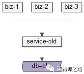

数据迁移前，上游业务应用通过旧的服务访问旧的数据。

  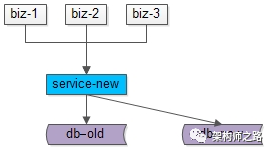

步骤一：服务进行升级，对“对旧库上的数据修改”（这里的修改，为数据的insert, delete, update），在新库上进行相同的修改操作，这就是所谓的“双写”，主要修改操作包括：

（1）旧库与新库的同时insert；

（2）旧库与新库的同时delete；

（3）旧库与新库的同时update；

由于新库中此时是没有数据的，所以双写旧库与新库中的affect rows可能不一样，不过这完全不影响业务功能，只要不切库，依然是旧库提供业务服务。

 

这个服务升级风险较小：

（1）写接口是少数接口，改动点较少；

（2）新库的写操作执行成功与否，对业务功能没有任何影响；
 
  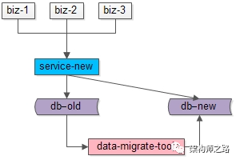

步骤二：研发一个数据迁移工具，进行数据迁移。这个数据迁移工具在本文中已经出现第三次了，把旧库中的数据转移到新库中来。 

这个小工具的风险较小：

（1）整个过程依然是旧库对线上提供服务；

（2）小工具的复杂度较低；

（3）任何时间发现问题，都可以把新库中的数据干掉重来；

（4）可以限速慢慢迁移，技术同学没有时间压力； 

数据迁移完成之后，就能够切到新库提供服务了么？

答案是肯定的，因为前置步骤进行了双写，所以理论上数据迁移完之后，新库与旧库的数据应该完全一致。

由于迁移数据的过程中，旧库新库双写操作在同时进行，怎么证明数据迁移完成之后数据就完全一致了呢？
 
  

如上图所示：

（1）左侧是旧库中的数据，右侧是新库中的数据；

（2）按照primary key从min到max的顺序，分段，限速进行数据的迁移，假设已经迁移到now这个数据段，数据迁移过程中的修改操作分别讨论：

假设迁移过程中进行了一个双insert操作，旧库新库都插入了数据，数据一致性没有被破坏

假设迁移过程中进行了一个双delete操作，这又分为两种情况

情况一：假设这delete的数据属于[min,now]范围，即已经完成迁移，则旧库新库都删除了数据，数据一致性没有被破坏；

情况二：假设这delete的数据属于[now,max]范围，即未完成迁移，则旧库中删除操作的affect rows为1，新库中删除操作的affect rows为0，但是数据迁移工具在后续数据迁移中，并不会将这条旧库中被删除的数据迁移到新库中，所以数据一致性仍没有被破坏；

假设迁移过程中进行了一个双update操作，可以认为update操作是一个delete加一个insert操作的复合操作，所以数据仍然是一致的

 

除非，在一种非常极限的情况下：

（1）date-migrate-tool刚好从旧库中将某一条数据X取出；

（2）在X插入到新库中之前，旧库与新库中刚好对X进行了双delete操作；

（3）date-migrate-tool再将X插入到新库中；

这样，会出现新库比旧库多出一条数据X。

 

但无论如何，为了保证数据的一致性，切库之前，还是需要进行数据校验的。

 
  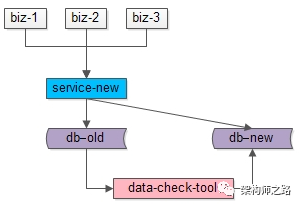

步骤三：在数据迁移完成之后，需要使用数据校验的小工具，将旧库和新库中的数据进行比对，完全一致则符合预期，如果出现步骤二中的极限不一致情况，则以旧库中的数据为准。 

这个小工具的风险依旧很小：

（1）整个过程依然是旧库对线上提供服务；

（2）小工具的复杂度较低；

（3）任何时间发现问题，大不了从步骤二开始重来；

（4）可以限速慢慢比对数据，技术同学没有时间压力；
 
  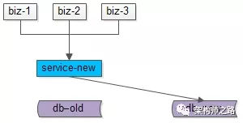

步骤四：数据完全一致之后，将流量切到新库，完成平滑数据迁移。 

至此，升级完毕，整个过程能够持续对线上提供服务，不影响服务的可用性。 

## 总结

针对互联网很多“数据量较大，并发量较大，业务复杂度较高”的业务场景，在：

（1）底层表结构变更；

（2）分库个数变化；

（3）底层存储介质变化；

的众多需求下，需要进行数据迁移，完成“平滑迁移数据，迁移过程不停机，保证系统持续服务”有两种常见的解决方案。

### 追日志方案，五个步骤：

（1）服务进行升级，记录“对旧库上的数据修改”的日志；

（2）研发一个数据迁移小工具，进行数据迁移；

（3）研发一个读取日志小工具，追平数据差异；

（4）研发一个数据比对小工具，校验数据一致性；

（5）流量切到新库，完成平滑迁移； 

### 双写方案，四个步骤：

（1）服务进行升级，记录“对旧库上的数据修改”进行新库的双写；

（2）研发一个数据迁移小工具，进行数据迁移；

（3）研发一个数据比对小工具，校验数据一致性；

（4）流量切到新库，完成平滑迁移；
