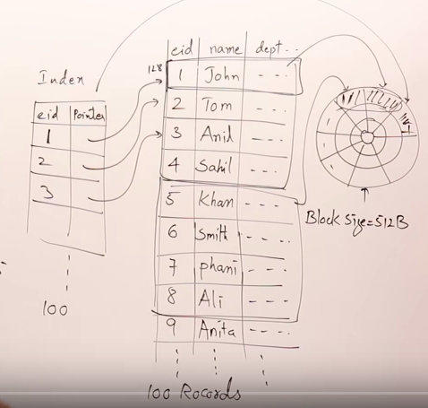

[原文](https://juejin.im/post/5c5bdd896fb9a049e93d2f20)

# [译]从磁盘结构到B+树

本篇文章来自Youtube上的一个视频，觉得讲得相对不错。链接如下：[www.youtube.com/watch?v=aZj…](https://www.youtube.com/watch?v=aZjYr87r1b8)

# 目录

1.  disk 结构
2.  disk是如何存储数据的
3.  什么是索引
4.  什么是多级索引
5.  m-way搜索树
6.  B树：m-way搜索树 + 规则
7.  B树中的插入操作
8.  B+树

# disk结构

简单来说：按照时钟方向分，disk由很多个sector组成，编号为0-N。按照从外到内分，disk又由多个track组成，编号为0-N。sector和track交叉的地方，叫做block，每个block有自己的address，可以用(track_no,sector_no)表示。每个block的大小是一样的，具体的大小要看实际情况，在这里，我们假设一个block的大小是512bytes。

需要十分明确的一点是：**无论是读操作，还是写操作，都是以block为单位进行的。**

在block内部，可以看作是一个数组结构，坐标从0到511。每个byte都有一个address，这个称为offset。所以我们可以把disk上的每一个byte用(track_no,sector_no,offset)的形式表示。

在计算机中，disk的结构可以这么简要地表示。

其中有一个读写头，每个时刻，读写头对准了disk上的其中一个block(track_no,sector_no)。通过旋转，可以改变sector_no，通过伸缩读写头，可以改变track_no。

还有一点，也是需要明确的：**只有disk上的数据被加载到RAM（random access memory），才能被程序使用。** 或者说，才是真正对程序有用的。

如何优化RAM中数据的效率，这门学问叫做数据结构；如何优化disk中数据的效率，这门学问叫做DBMS，也就是大部分数据库所要研究的内容。

# disk是如何存储数据（特值定数据库数据）的

现在有一个employee table，其中有这些字段，每个字段的大小如图所示，一个record的大小总计为128 bytes。

总共有100行数据：

每个block可以存4行数据。存这100条数据，需要25个block。如果现在我们需要查询其中的一条数据，最多就需要查询25个block。

# 什么是索引

我们建一个简单的索引，有两个字段，一个eid，表示employee的id，还有一个字段pointer，指向数据存储在disk上的位置。empolyee中的每一行，在index上都有一条记录。

那么我们又是怎么存储这个索引的呢？这里我们假设还是全部存在disk上（当然你完全可以选择直接存在内存里）。那么这个索引需要占据多少个block呢？eid大小为10bytes，pointer大小为6bytes，所以一行索引就有16个bytes大小。100条索引就需要占据100 * 16 / 512 -&gt; 4个block。

那么现在要查询employee表中的某一条数据，最多需要查询多少个block呢？答案是4+1=5个。效率比之前要高了很多。

# 什么是多级索引

现在假设有1000条数据，这1000条数据将占据250个block，上一小节讲的索引将占据40个block。现在用索引查询一次，最多需要41次block access。现在这个索引已经不能满足我们对性能的追求了，那么能不能对索引建一个索引呢？也就是二级索引？

**对于二级索引，不需要记录每条employee在disk的位置，只需要记录一级索引所有block的位置就行了。** 所以，二级索引需要40条记录，也就是需要占据2个block的空间。这种二级索引可以叫做稀疏索引，他不会包含所有数据行所在的位置。

现在借助二级索引，查询效率为：2 + 1 + 1 = 4次block access。

随着数据量不断增加，还可以对二级索引建立三级索引，对三级索引建立四级索引……

同时，我们还希望做到一点：**多级索引可以随着数据量的大小变化而自动创建和删除。** 这就引出了主角：B树和B+树。

# m-way搜索树

二叉搜索树：每个节点有一个值，有两个子节点。

由二叉搜索树扩展，让每个节点最多可以存m-1个索引值，每个节点可以有m个子节点，就是m-way搜索树。

上图所示的就是3-way搜索树。

下面的这个4-way搜索树，每个节点最多存了3个索引值，有4个指向子节点的pointer，同时还有指向数据项所在的位置的指针Rp。

我们可以用这个m-way搜索树作为数据库的索引，但是，m-way搜索树存在一些问题：

比如现在有三个数据：10，20，30，要用一个10-way搜索树来构建。很有可能，最终会构建出一个这样的树：

这是最糟糕的一种情况，最终。我们需要先把每个节点填满，然后才能创建下一个子节点。而m-way搜索树本身，并没有这种强制，你可以随意插入。

# B树：m-way搜索树 + 规则

B树，实际上可以看作是m-way搜索树 + 规则（如何构建这棵树的规则）。

规则：

*   每个节点至少有[m/2]个子节点
*   根节点可以最少有2个子节点
*   所有的叶子节点必须在一个层级
*   创建过程是由下往上的

# B树中的插入操作

值：10，20，40，50。要构建一个4-way搜索树。4-way搜索树，意味着一个节点最多可以有3个值。

这实际上，也就构建了一个二级索引。上面的是第二层索引，下面的是第一层索引。每一层构成了一级索引。

继续插入60和70：

接着插入80，右下的那个节点已经没有空位置了，所以需要新建一个节点，然后把70那个值提升到上一层。

插入30：

插入35：

等等等等：

每个值旁边，都有一个指向数据存储位置的指针。

# B+树

在B+树中，不是每个值旁边都有一个指向数据存储位置的指针，只有叶子节点才有。非叶子节点的值，在叶子节点上有他的副本。如图所示：

这就成为了一个密集索引。