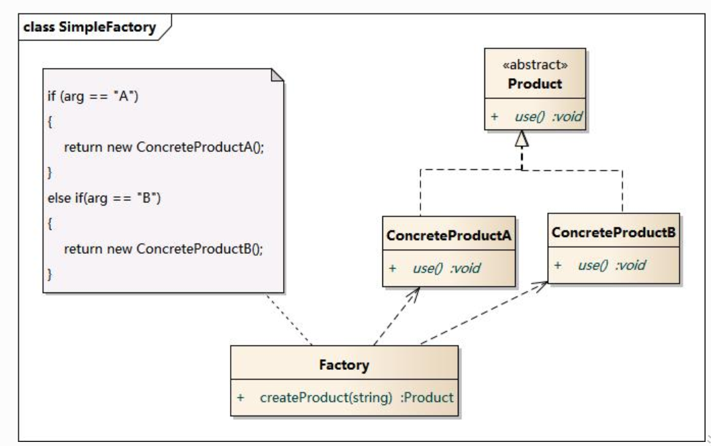

## 简单工厂模式

简单工厂模式(Simple Factory Pattern):又称为静态工厂方法(Static Factory Method)模式，它属于类创建型模式。在简单工厂模式中，可以根据参数的不同返回不同类的实例。简单工厂模式专门定义一个类来负责创建其他类的实例，被创建的实例通常都具有共同的父类

### 优点

* 简单工厂含有必要的判断逻辑，可以决定在什么时候创建哪一个产品类的实例，可以避免客户端直接创建对象实例

### 缺点

* 由于工厂类集中了所有产品创建逻辑，一旦不能正常工作，整个系统都要受到影响。
* 使用简单工厂模式将会增加系统中类的个数，在一定程序上增加了系统的复杂度和理解难度。
* 系统扩展困难，一旦添加新产品就不得不修改工厂逻辑，在产品类型较多时，有可能造成工厂逻辑过于复杂，不利于系统的扩展和维护。
* 简单工厂模式由于使用了静态工厂方法，造成工厂角色无法形成基于继承的等级结构。