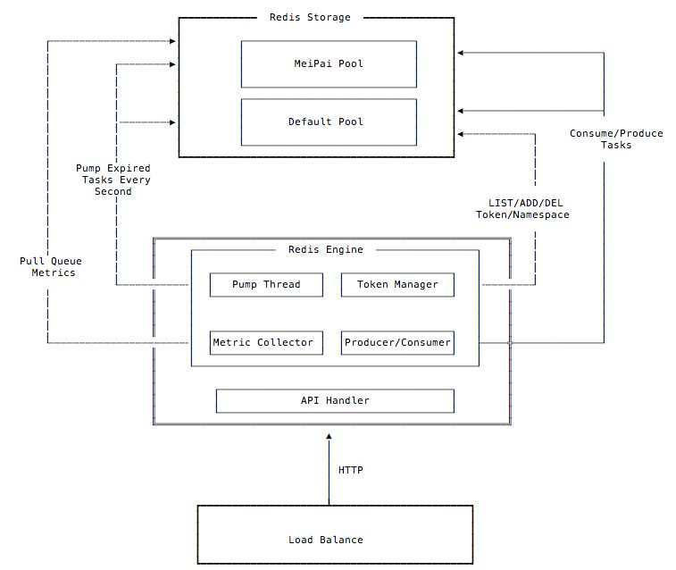
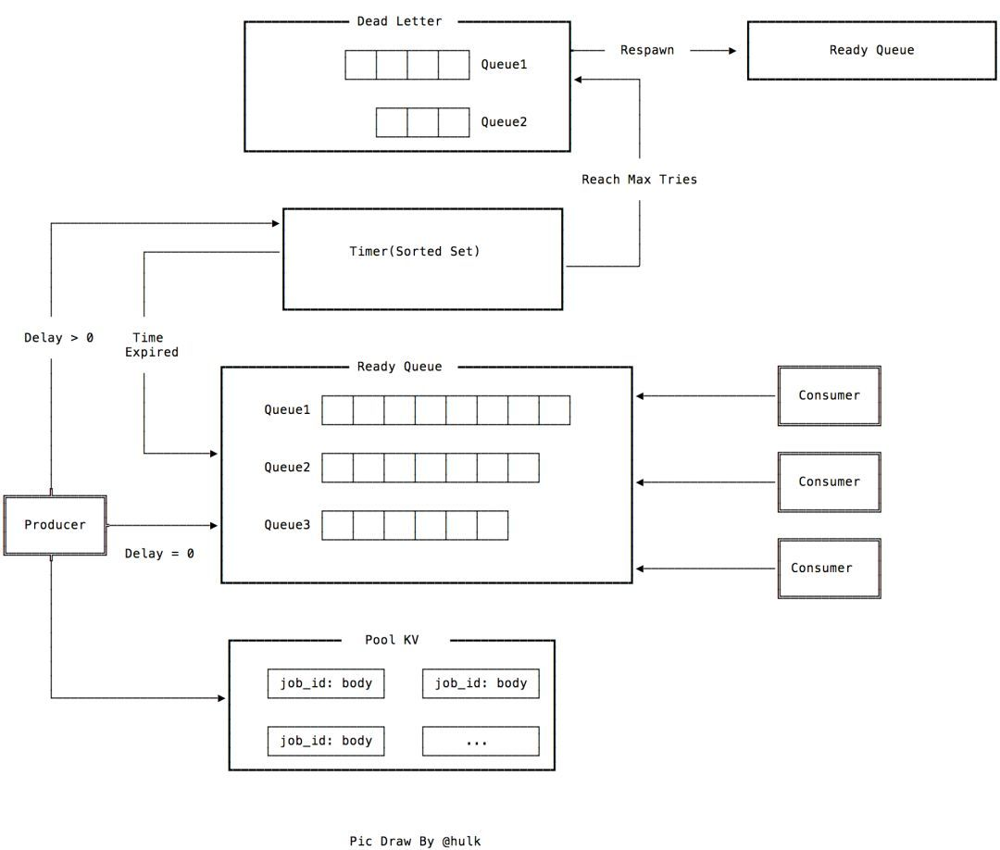
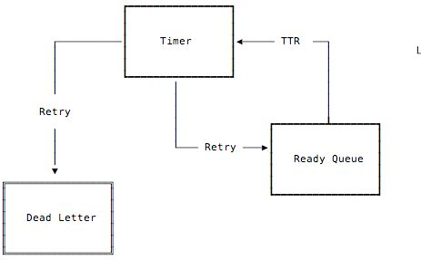

# 千万级延时任务队列如何实现，看美图开源的-LMSTFY

[原文](https://zhuanlan.zhihu.com/p/94082947)

[github](https://github.com/meitu/lmstfy)
## 整体设计

lmstfy 是 HTTP 协议的无状态服务，可以通过 4/L7 的 LB 来接入。内部主要由四个模块组成:

1. Pump Thread: 每秒轮询 Redis 将到期的任务迁移到就绪队列(ready queue)
2. Metric Collector, 定时收集队列相关统计数据到实例再通过 prometheus exporter 暴露给监控系统
3. Token Manager，用来管理 namespace 和 token 的模块，namespace 是用来做业务隔离的单位
4. Producer/Consumer，用来处理用户的任务和消费请求

>Default Pool 除了用来存储业务数据，namespace/token 这类元数据也会默认存储到 Default 这个 Redis 池子里面



## 基础概念

* namespace - 用来隔离业务，每个业务是独立的 namespace
* queue - 队列名称，用区分同一业务不同消息类型
* job - 业务定义的业务，主要包含以下几个属性:
* id: 任务 ID，全局唯一
* delay: 任务延时下发时间， 单位是秒
* tries: 任务最大重试次数，tries = N 表示任务会最多下发 N 次
* ttl(time to live): 任务最长有效期，超过之后任务自动消失
* ttr(time to run): 任务预期执行时间，超过 ttr 则认为任务消费失败，触发任务自动重试


## 数据存储

lmstfy 的 redis 存储由四部分组成:

1. timer(sorted set) - 用来实现延迟任务的排序，再由后台线程定期将到期的任务写入到 Ready Queue 里面
2. ready queue (list) - 无延时或者已到期任务的队列
3. deadletter (list) - 消费失败(重试次数到达上限)的任务，可以手动重新放回队列
4. job pool(string) - 存储消息内容的池子


支持延迟的任务队列本质上是两个数据结构的结合: FIFO 和 sorted set。sorted set 用来实现延时的部分，将任务按照到期时间戳升序存储，然后定期将到期的任务迁移至 FIFO(ready queue)。任务的具体内容只会存储一份在 job pool 里面，其他的像 ready queue，timer，deadletter 只是存储 job id，这样可以节省一些内存空间。

以下是整体设计:



## 任务写入
任务在写入时会先产生一个 job id，目前 job id (16bytes) 包含写入时间戳、 随机数和延迟秒数， 然后写入 key 为 j:{namespace}/{queue}/{ID} 的任务到任务池 (pool) 里面。之后根据延时时间来决定这个 job id 应该到 ready queue 还是 timer 里面:

* delay = 0，表示不需要延时则直接写到 ready queue(list)
* delay = n(n > 0)，表示需要延时，将延时加上当前系统时间作为绝对时间戳写到 timer(sorted set)
* timer 的实现是利用 zset 根据绝对时间戳进行排序，再由旁路线程定期轮询将到期的任务通过 redis lua script 来将数据原子地转移到 ready queue 里面。

## 任务消费
之前提到任务在消费失败之后预期能够重试，所以必须知道什么时候可认为任务消费失败？业务在消费时需要携带 ttr(time to run) 参数，用来表示业务预期任务最长执行时间，如果在 ttr 时间内没有收到业务主动回复 ACK 消息则会认为任务失败(类似 tcp 的重传 timer)。



消费时从 ready queue 中 (B)RPOP 出任务的 job id，然后根据 job id 从 pool 中将任务内容发送给消费者。同时对 tries 减1，根据消费的 ttr(time to run) 参数, 将任务放入 timer 中。如果 tries 为零, 在 ttr 时间到期后该 job id 会被放入 dead letter 队列中(表示任务执行失败)。

同步任务模型
lmstfy 除了可以用来实现异步和延时任务模型之外，因为 namespace 下面的队列是动态创建且 job id 全局唯一，还可以用来实现同步任务模型 (producer 等到任务执行成功之后返回)。大概如下:

1. producer 写入任务之后拿到 job id, 然后监听(consume)以 job id 为名的队列
2. consumer 消费任务成功后，写回复消息到同样以 job id 为名的队列中
3. producer 如果规定时间内能读到回复消息则认为消费成功，等待超时则认为任务失败

## 如何实现横向扩展
lmstfy 本身是无状态的服务可以很简单的实现横向扩展，这里的横向扩展主要是存储(目前只支持 Redis)的横向扩展。设计也比较简单，主要通过通过 namespace 对应的 token 路由来实现， 比如我们当前配置两组 Redis 资源: default 和 meipai:
```
[Pool]
[Pool.default]
Addr = "1.1.1.1:6379"
[Pool.meipai]
Addr = "2.2.2.2:6389"
```
在创建 namespace 时可以指定资源池，token 里面会携带资源池名字作为前缀。比指定美拍资源池，那么 token 类似: meipai:01DT8EZ1N6XT ，后续在处理请求时就可以根据 token 里面携带的资源池名称来进行路由数据。不过这种设计实现队列级别的扩展，如果单队列存储消息量超过 Redis 内存上限则需要其他手段来解决(后面会支持磁盘类型存储)。