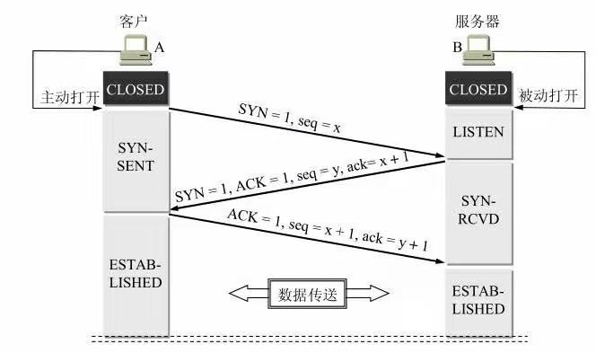

--摘自 <计算机网络 第6版>

三次握手(three-way handshake)
---

 
&emsp;&emsp;B的TCP服务器进程先创建传输控制块TCB，准备接受客户进程的连接请求。然后服务器进程就处于LISTEN（收听）状态，等待客户的连接请求。如有，即作出响应。

&emsp;&emsp;A的TCP客户进程也是首先创建传输控制模块TCB，然后向B发出连接请求报文段，这时首部中的同步位SYN = 1，同时选择一个初始序号seq = x。TCP规定，SYN报文段（即SYN = 1的报文段）不能携带数据，但要消耗掉一个序号。这时，TCP客户进程进入SYN-SENT（同步已发送）状态。
B收到连接请求报文段后，如同意建立连接，则向A发送确认。在确认报文段中应把SYN位和ACK位都置1，确认号是ack = x + 1，同时也为自己选择一个初始序号seq = y。请注意，这个报文段也不能携带数据，但同样要消耗掉一个序号。这时TCP服务器进程进入SYN-RCVD（同步收到）状态。

&emsp;&emsp;TCP客户进程收到B的确认后，还要向B给出确认。确认报文段的ACK置1，确认号ack = y + 1，而自己的序号seq = x + 1。TCP的标准规定，ACK报文段可以携带数据。但如果不携带数据则不消耗序号，在这种情况下，下一个数据报文段的序号仍是seq = x + 1。这时，TCP连接已经建立，A进入ESTABLISHED（已建立连接）状态。当B收到A的确认后，也进入STABLISHED状态。

## 为什么要进行三次握手

&emsp;&emsp;这主要是为了防止已失效的连接请求报文段突然又传送到了B，因而产生错误。

&emsp;&emsp;所谓“已失效的连接请求报文段”是这样产生的。考虑一种正常情况。A发出连接请求，但因连接请求报文丢失而未收到确认。于是A再重传一次连接请求。后来收到了确认，建立了连接。数据传输完毕后，就释放了连接。A共发送了两个连接请求报文段，其中第一个丢失，第二个到达了B。没有“已失效的连接请求报文段”。

&emsp;&emsp;现假定出现一种异常情况，即A发出的第一个连接请求报文段并没有丢失，而是在某些网络结点长时间滞留了，以致延误到连接释放以后的某个时间才到达B。本来这是一个早已失效的报文段。但B收到此失效的连接请求报文段后，就误认为是A又发出一次新的连接请求。于是就向A发出确认报文段，同意建立连接。假定不采用三次握手，那么只要B发出确认，新的连接就建立了。由于现在A并没有发出建立连接的请求，因此不会理睬B的确认，也不会向B发送数据。但B却以为新的运输连接已经建立了，并一直等待A发来数据。B的许多资源就这样白白浪费了。采用三次握手的办法可以防止上述现象的发生。例如在刚才的情况下，A不会向B的确认发出确认。B由于收不到确认，就知道A并没有要求建立连接。

