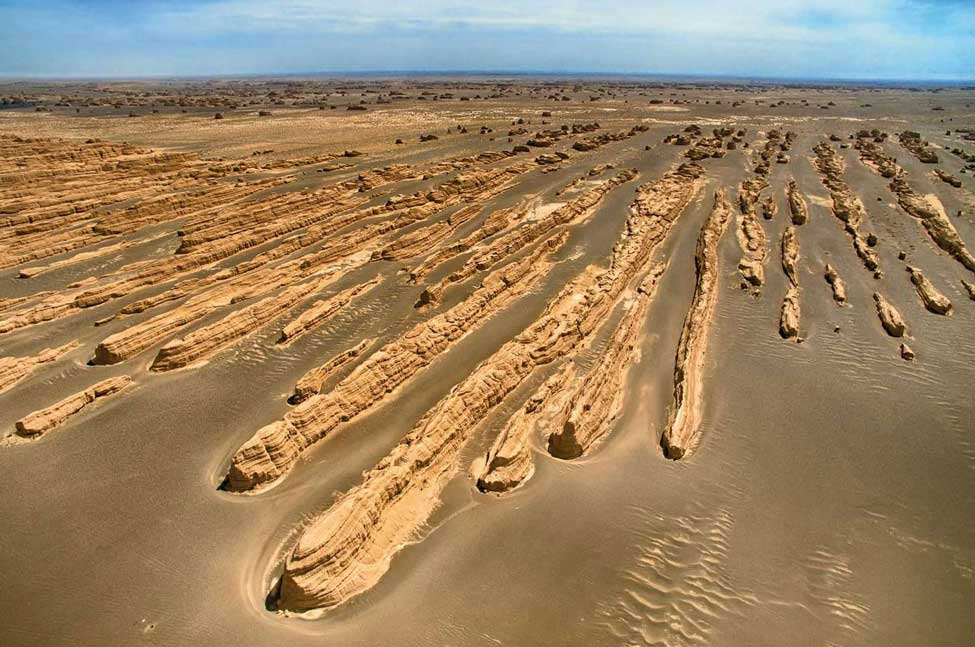

共商国是

“国事”与“国是”是近义同音词，二者都是名词，都指国家的政务、政事。“国事”既可以指对国家有重大影响的事情，也可以指一般的国家事务；而“国是”则专指国家决策、规划等重大事务。

雅丹地貌:“雅丹”原是我国维吾尔族语，意为陡峭的土丘。一种典型的风蚀性地貌，地面经风化、间歇性流水冲刷和风蚀作用，形成与风向平行、相间排列的土墩和凹地组合。

内陆河，是指由内陆山区降雨或高山融雪产生的不能流入海洋、只能流入内陆湖泊或在内陆消失的河流。这类河流大多处于大陆腹地，远离海洋，得不到充足的水汽补给，干旱少雨，水量不丰，而山峦环绕、丘陵起伏的地形又阻断了入海的通路，最终消失沙漠里或汇集于洼地形成尾闾湖。如俄罗斯的伏尔加河、我国新疆的塔里木河、中亚的阿姆河、锡尔河等。内陆河亦称内流河。

1915年回族人马保子制作出第一碗面。
牛肉拉面的面型宽细不等，分别叫大宽、二宽、韭叶、细的（毛细）、二细、三细等等。配料讲究“一清二白三红四绿”——汤清、萝卜白、辣椒红、蒜苗绿。