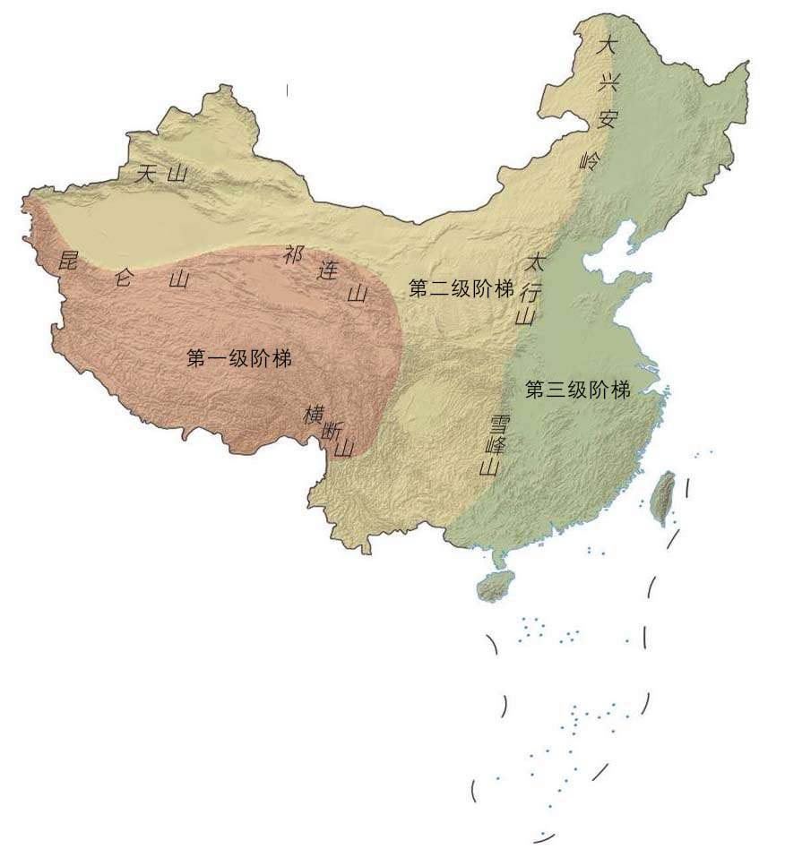
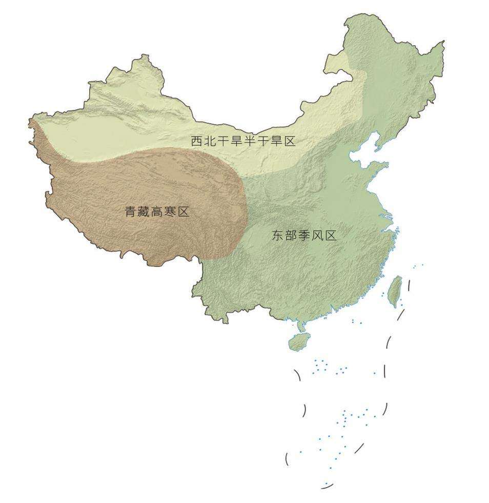
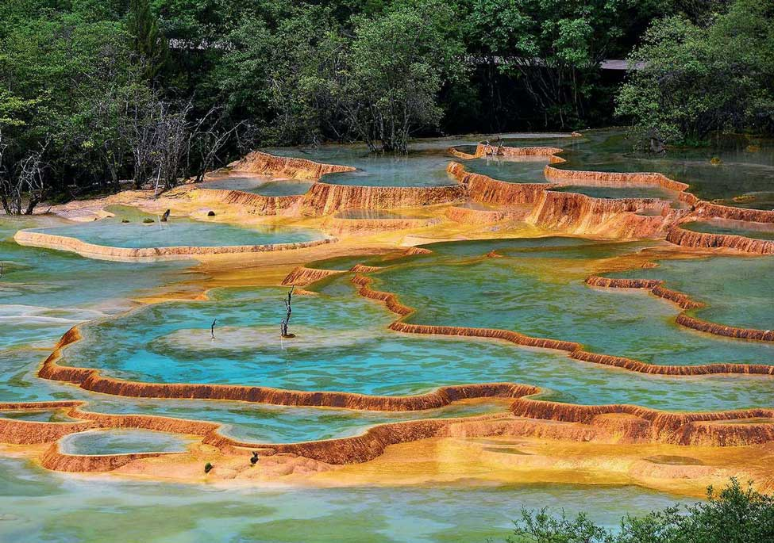
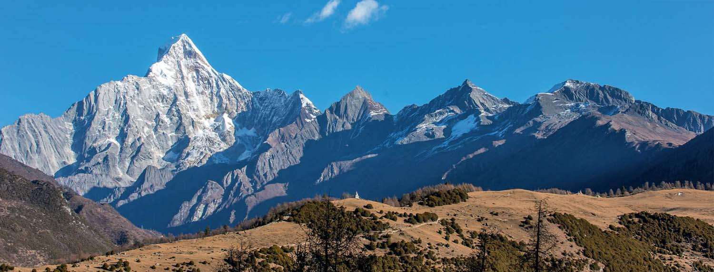

# 这里是中国

四大高原：青藏高原、黄土高原、云贵高原、内蒙古高原

中国四大高原无一不受到大碰撞的巨大影响。至此，中国大地上出现了显著的三级阶梯。青藏高原海拔最高，为第一级阶梯；海拔为1000~2000米的内蒙古高原、黄土高原、云贵高原等，构成了第二级阶梯；大兴安岭、太行山、雪峰山以东，大部分海拔在500米以下，为第三级阶梯。中国的地理格局就此定形。

中国的三大自然区—东部季风区、西北干旱半干旱区、青藏高寒区

在碳酸盐岩众多的山地，流水将岩石中的钙质溶解，不断在沿途沉积，形成钙华，钙华层层堆叠犹如梯田。于是，云南香格里拉的白水台诞生了。更为出众的则是黄龙、九寨沟，其钙华景观遍布数条沟谷，声名远播。根据生长在表面的微生物群落的不同，钙华会呈现出不同的颜色，配上周围植物的缤纷色彩，可以幻化出一个极为绚烂的世界。

过高的微量元素还会在水体中大量富集，干扰鱼类代谢，令其难以繁殖。四姑娘山的某些沟谷内几乎没有鱼类生长，就连人工放养的鱼类也无法存活。

四姑娘山的幺妹峰、三姑娘山（三峰）、二姑娘山（二峰）、大姑娘山（大峰）从左向右依次排开，海拔分别为6250米、5355米、5276米、5025米

