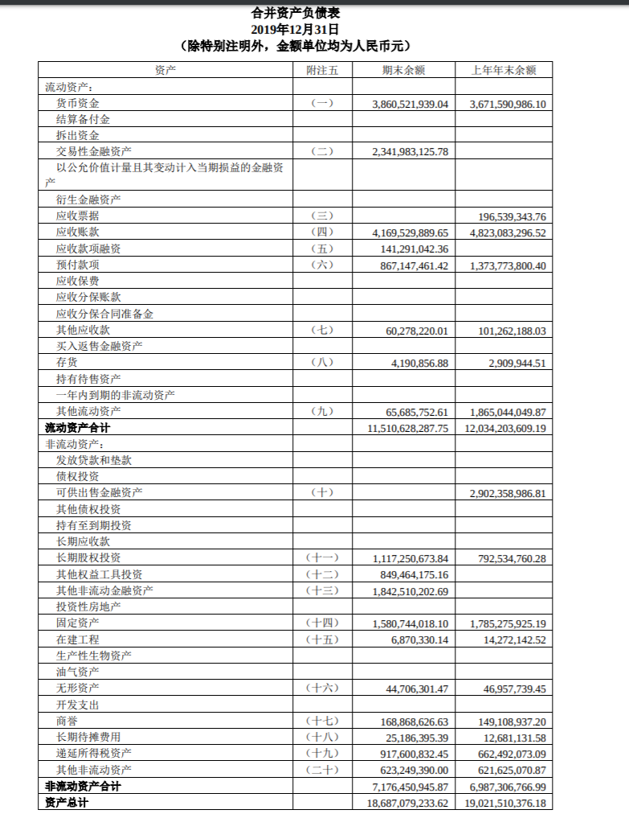
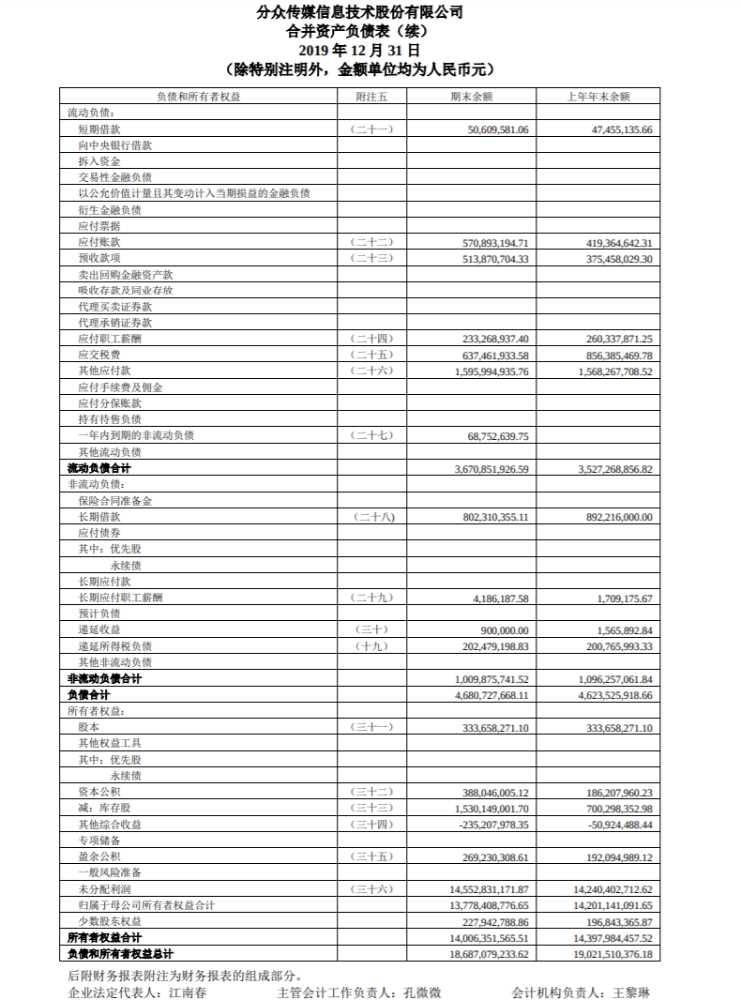
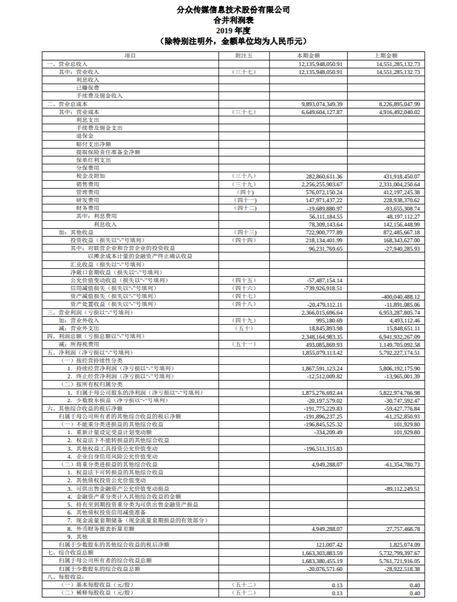
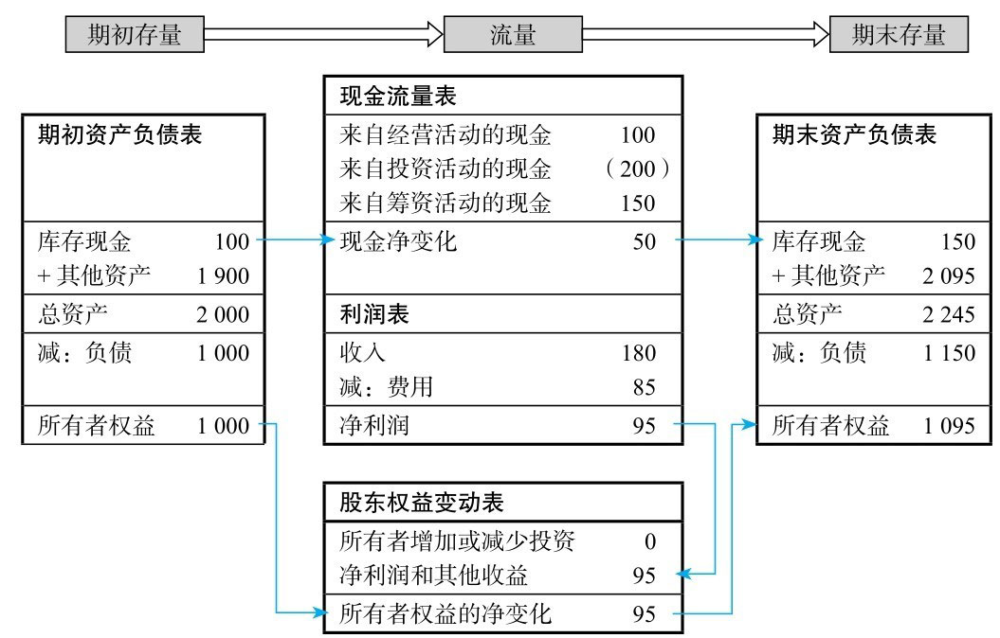

# 财报基础

><<财务报表分析与股票估值>>

内容最完整、最全面的上市公司年度报告包括：

* 审计报告、
* 财务报表
* 报表附注

## 审计报告

审计报告在整个年度财务报告的第一页，相当于后续财务报表和报表附注的质量鉴定书。一般来说，季度报告和半年度报告都无须审计报告。

在资本市场上，上市公司的所有权和经营权相互分离。股东委托董事会，董事会委托公司管理层，层层委托，形成了所谓的“委托—代理”关系。公司管理层负责公司的经营活动，需要向董事会和股东提交财务报告，以汇报经营管理责任的履行情况。但是自己汇报自己的履行情况，很容易形成财务舞弊，因此需要聘请独立的第三方—会计师事务所的注册会计师对财务报表的公允性进行审计，并出具审计报告。

>注册会计师，是指通过注册会计师执业资格考试并取得注册会计师证书在会计师事务所执业的人员，英文全称Certified Practising Accountant 、Certified Public Accountant，简称为CPA。

审计报告中的审计意见有五种类型：
1. 标准无保留意见
2. 带强调事项段的无保留意见
3. 保留意见
4. 无法表示意见
5. 否定意见

标准无保留意见就是表示财务报表和报表附注质量合格、数据可靠、信息真实。其他四种意见就是表示财务报表和报表附注的质量存在这样或那样的问题，其问题的严重程度由轻到重依次为带强调事项段的无保留意见、保留意见、无法表示意见、否定意见。

上市公司财务报表从内容来说包括资产负债表、利润表、现金流量表和所有者权益变动表，从范围来说包括合并财务报表和母公司财务报表。

## 财务报表

上市公司财务报表从内容来说包括
* 资产负债表
* 利润表
* 现金流量表
* 所有者权益变动表

从范围来说包括
* 合并财务报表
* 母公司财务报表

我们对上市公司的整体情况进行分析和判断，因此以合并财务报表为分析对象。

>合并财务报表是指由母公司编制的，将母子公司形成的企业集团作为一个会计主体，综合反映企业集团整体财务状况、经营成果和现金流量的报表。

>母公司是指有一个或一个以上子公司的企业;子公司是指被母公司控制的企业。母公司应当是依法登记，取得企业法人资格的控股企业

### 资产负债表

资产负债表是反映上市公司在某一特定日期财务状况的财务报表。资产负债表是时点报表，因此我们把资产负债表比喻为公司的“一张照片”。

资产负债表遵循“资产=负债+股东权益”这一等式。这一等式是永远成立的，因为公司的资产要么是属于债权人的，要么是属于股东的，或者说债权人和股东投入公司的资源都是公司的资产。

资产分为流动资产和非流动资产。流动资产一般预计在一年或者短期内变现、出售或者耗用；非流动资产则变现、出售或者耗用的周期比较长。

负债分为流动负债和非流动负债，其划分标准与资产相同。

股东权益是公司资产扣除负债后的剩余权益，归股东所有。

### 利润表

利润表是反映上市公司在某一期间内的经营成果的财务报表。

利润表反映上市公司经营业绩的主要来源和构成，帮助我们判断利润的连续性和稳定性、利润的质量和风险。上市公司的利润表根据“利润=收入-成本费用”的公式分三步编制，不同步骤下的数据反映利润的不同来源。

### 现金流量表

现金流量表是反映上市公司在某一期间内的现金和现金等价物流入和流出的财务报表，也会与利润表一样注明时间段。

现金流量表反映上市公司现金变动的原因和构成，帮助我们判断现金流入和现金流出的连续性和稳定性、现金来源的质量和风险。

现金流量表划分为三类:

* 经营活动现金流量
* 投资活动现金流量
* 筹资活动现金流量

通过这三类活动的现金流入和流出情况，帮助我们了解和评价公司获取现金的能力。

经营活动是指公司投资活动和筹资活动以外的所有交易和事项

>现金等价物是指公司持有的期限短、变现能力强，易于转换为已知金额的现金和价值变动风险很小的投资，比如银行理财产品、短期国债投资等，因此现金等价物跟现金的本质是一样的

### 所有者权益变动表

也称为股东权益变动表，是反映构成股东权益的各组成部分在某一期间的增减变动情况的财务报表。所有者权益与股东权益是同一个含义。

股东权益变动表可以根据资产负债表、利润表和现金流量表倒推计算得出。

利润表、现金流量表和股东权益变动表都是反映上市公司在一段期间内的财务情况的报表，我们通常把这些报表比喻为“一段录像”。

这些财务报表之间的项目存在着一定的逻辑和钩稽关系。期初资产负债表到期末资产负债表发生的财务状况变动，可以用利润表、现金流量表和股东权益变动表来解释。大家可以想象一下，电影就是由无数张照片组成，从开头的照片到结尾的照片的变动，可以用中间的录像来解释。对于这些报表之间的数据关系，我们可以用下图来表示。

## 报表附注

附注是财务报表不可或缺的组成部分，是对在资产负债表、利润表、现金流量表和所有者权益变动表等报表中列示项目的文字描述或明细资料，以及对未能在这些报表中列示项目的说明等。

财务报表中的数字是分类与汇总后的结果，是对企业发生的经济业务的高度简化和数字浓缩。如果没有形成这些数字所使用的会计政策、理解这些数字所必需的披露，财务报表就不可能充分发挥效用。因此，附注与资产负债表、利润表、现金流量表、所有者权益变动表等报表具有同等的重要性，是财务报表的重要组成部分。报表使用者想了解企业的财务状况、经营成果和现金流量，应当全面阅读附注。