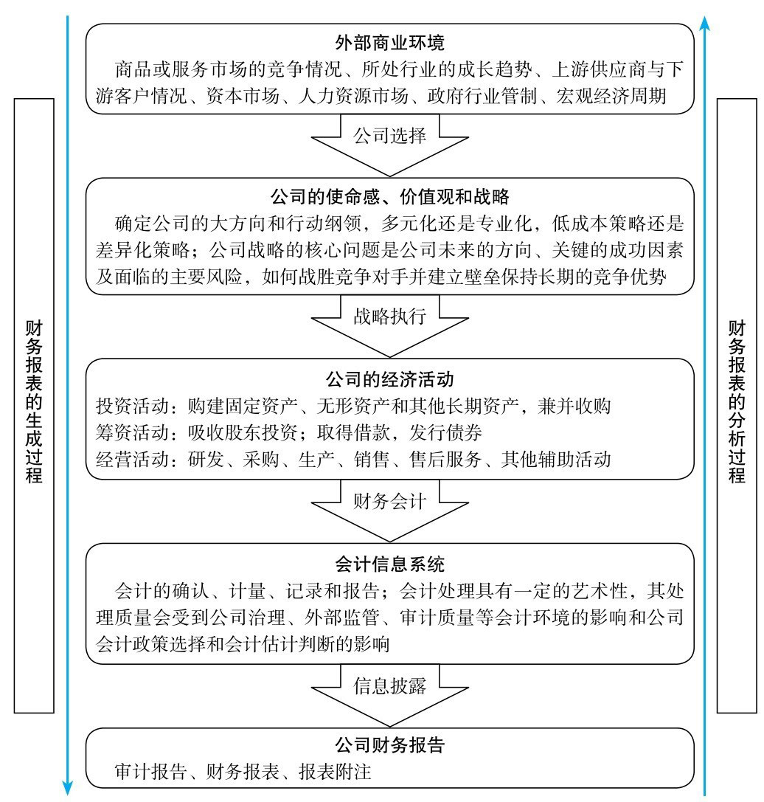

# 财报分析

公司的目标在于创造价值。公司价值是未来现金流按照一定贴现率贴现后的现值。

财报分析围绕价值展开。财务报表生成过程是一个从商业环境、公司战略到经济活动，再到数字结果的顺向过程，而财务报表分析过程是一个从数字结果反过来看会计处理质量、经济活动情况、公司战略和商业环境的逆向过程。

公司价值：该公司在其余下的寿命期内可以产生的现金的折现值。

价格是投资者所付出的，而价值是投资者所得到的。内在价值的判断有赖于公司的财报，股东分析的目的就在于判断价值并做出投资决策。

公司的经济活动从投资活动决策开始，在投资活动确定后再考虑怎么解决资金问题—募集股东资金还是银行借贷。筹资活动是为了满足投资活动的需求。在投资形成资产以后，就是日常的经营活动了，包括研发、采购、生产、销售、售后服务以及人事管理等辅助活动。

公司的经济活动经过财务会计处理形成财务数字结果。会计信息系统根据国家规定的企业会计准则，对经济活动进行确认、计量、记录和报告。不过，会计处理具有一定的灵活性，其处理质量会受到公司治理、外部监管、审计质量等会计环境的影响，以及公司会计政策选择和会计估计判断的影响。

公司战略+执行过程=财报结果

财务报表分析，就是要从财务数字看一个公司方方面面的情况。毫不夸张地说，财务报表是一个公司最综合的数字结果，可以反映公司所处的商业环境、行业格局及竞争、公司治理及战略、公司经济活动的效率以及财务会计处理的质量。这就像一个人的体检报告，综合反映了一个人的生活环境，甚至是呼吸的空气、日常作息及饮食等生活习惯方方面面的情况。概言之，“财务报表反映公司的一切”， “财务报表是世界上最美、最简练的商业语言”。

