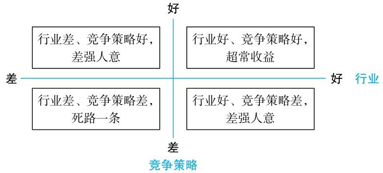
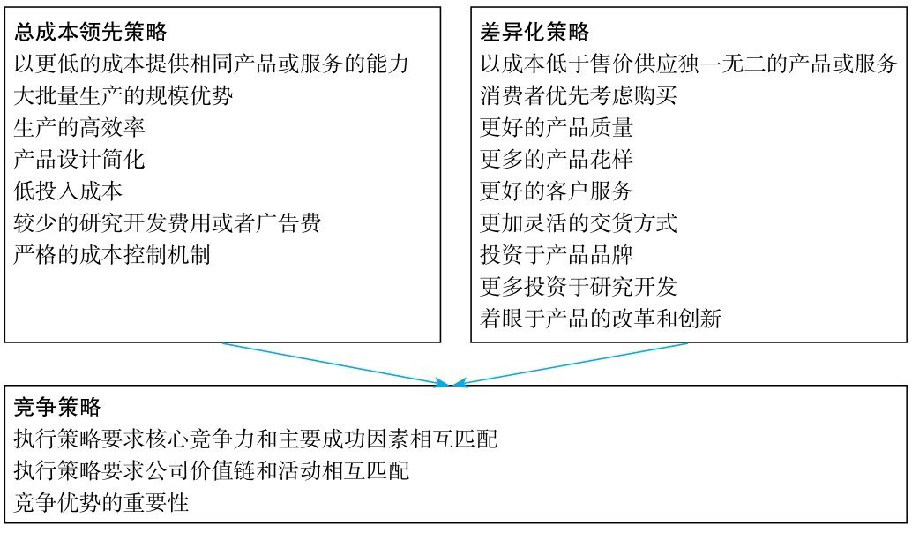

## 公司战略

战略决定一个公司的命。一个公司的利润水平不仅受所处行业的影响，而且受公司在行业中的竞争策略的影响。

由此，对企业的经营者提出了两个非常严峻的问题，即如何选择公司经营的行业，和如何选择公司在一个行业中的竞争策略。这也正是公司战略要解决的问题。

### 公司行业与公司财务报表之间的关系

公司所处的行业将在很大程度上决定公司财报的结构特征以及盈利水平。对于不同行业的公司，财报分析的重点往往也存在着差异。比如，重资产行业的公司在分析的时候，需要重点分析公司长期资产周转率，以判断长期资产的使用效率以及成本管理情况；轻资产行业的公司在分析的时候，需要重点分析公司的品牌、技术和研发投入，以及这些资源所带来的溢价能力和高毛利率是否可以持续；金融公司在分析的时候，重点分析公司风险管理的能力和信贷资产的质量。在对一家公司的财报进行分析之前，我们一定要了解公司所处的行业对财报数字的影响，并确定分析的重点。

### 竞争策略

行业吸引力部分地反映了一个公司几乎无法施加影响的那些外部因素，但通过竞争策略的选择，公司可以增强或削弱其在一个行业的吸引力；同样，一个公司也可以通过对其竞争策略的选择，显著地改善或减弱自己在行业内的地位。因此，竞争策略不仅是公司对环境做出的反应，而且是公司从对自己有利的角度去改变环境。

* 总成本领先策略
* 差异化策略    

通俗地来说，总成本领先策略是赚苦力钱、血汗钱，差异化策略是赚脑力钱、容易钱。中国号称世界工厂，更多的公司是通过制造环节的低人工成本、低环保成本等要素在全球取得竞争优势。但是，随着经济的发展，原先的低成本要素难以为继。因此，国家提出了调整经济结构和经济转型的任务。经济转型成功建立在企业转型成功的基础上。企业转型有两个方向：一是运用价值链、价值工程、作业管理等工具，从原来粗放式管理的低成本往精益管理的低成本转型；二是大力投入品牌建设、技术研发等，从总成本领先策略往差异化策略转型。

一般而言，总成本领先策略的公司与差异化策略的公司比较，财报上一个比较明显的区别是前者的毛利率要低于后者。

>毛利率=1-营业成本/营业收入×100%

一般来说，成本领先策略适用于具有如下特征的行业：

①现有竞争公司之间的价格竞争非常激烈。  
②公司所处产业的产品基本上是标准化或者同质化的。  
③实现产品差异化的途径很少。  
④多数顾客使用产品的方式相同。  
⑤消费者的转换成本很低，其购买意愿取决于价格。

采用成本领先策略的风险主要包括：

①降价过度引起利润率降低。  
②新加入者可能后来居上。  
③过于专注于成本的控制而丧失对市场变化的预见能力。  
④技术变化降低公司资源的效用。  
⑤容易受外部环境的影响。

采用成本领先策略的收益在于以下一个或者多个方面：

①抵挡住现有竞争对手的对抗。  
②降低了购买商讨价还价的能力。  
③更灵活地处理供应商的提价行为。  
④形成进入障碍。  
⑤树立相对于替代品的竞争优势。

总成本领先策略要求公司必须高效率地使用资产

公司要突出自己的产品和服务与竞争对手之间的差异性，主要有五种基本的途径：

* 产品差异化策略
* 服务差异化策略
* 技术差异化策略
* 品牌形象差异化策略
* 地域差异化策略

差异化策略主要适用于有如下特征的行业：

①可以有很多途径创造公司与竞争对手产品之间的差异，并且这种差异被顾客认为是有价值的。  
②顾客对产品的需求和使用要求是多种多样的，即顾客需求是有差异的。  
③采用类似差异化途径的竞争对手很少，即真正能够保证公司是“差异化”的。  
④技术变革很快，市场上的竞争主要集中在不断推出新的产品特色。

一家公司实施差异化策略的意义在于如下一个或者多个方面：  
①建立起顾客对公司的忠诚。  
②形成强有力的产业进入障碍。  
③增强了公司对供应商讨价还价的能力。这主要是由于差异化策略提高了公司的边际收益。  
④削弱客户讨价还价的能力。一方面，公司通过差异化策略，使得客户缺乏可与之比较的产品选择，降低了客户对价格的敏感度。

技术差异化公司的另一典型特征是在营业开支中，研发费用投入绝对金额占营业收入的比重比较高。

品牌形象差异化策略公司的财报特征与技术差异化策略公司在资产结构、资本结构以及毛利率方面存在相似之处。明显的不同之处在于营业开支方面，技术差异化策略公司的研发投入比较大，而品牌形象差异化策略公司在广告、销售渠道等方面的销售费用投入比较大，占营业收入的比重比较高。

公司核心竞争力指的就是公司无法被模仿、无法被超越的能力。分析一家公司的核心能力，对把握该公司是否具有可持续的竞争优势是很直观的，可从下述方面来考察：

①竞争优势的持续耐久性。其主要是指其作为利润源泉的持久程度，而不是指物理耐久性。只要公司的创新、多产和高质量等最基本的特点没有明显不利变化，其商誉就不会随时间流逝而受到侵蚀。  
②无法转移性。核心能力和资源越容易转移，公司竞争优势的可持续性就越差。真正的战略资产和核心能力的一个基本特征是它对公司的专有程度，即扎根于公司组织之中，融入公司的文化和管理模式之中。  
③无法复制性。其含义是如果某个公司的核心能力或资源虽不能轻易被转移，但竞争者经过适当的投资或者直接购置相同的资产，就可以形成几乎相同的生产能力，那么这个公司就不拥有真正持久的竞争优势。

不同行业的公司存在着不同财报数字特征。在同一行业里面，不同公司之间存在着竞争策略的差异。同一行业的不同公司可能处于行业价值链中的不同环节，从而也会导致财报数字特征存在着重大差异。

